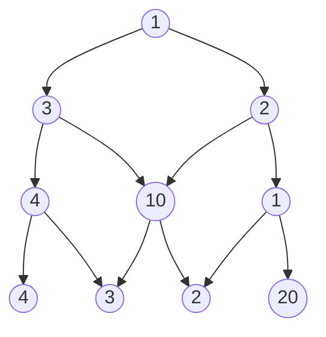
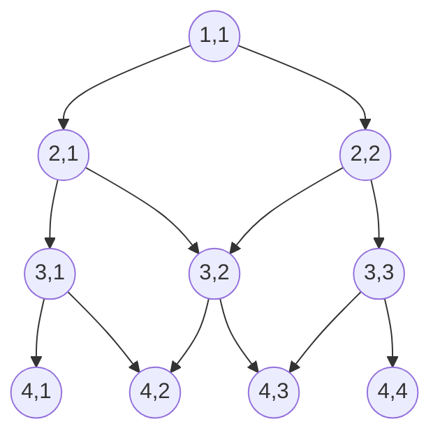
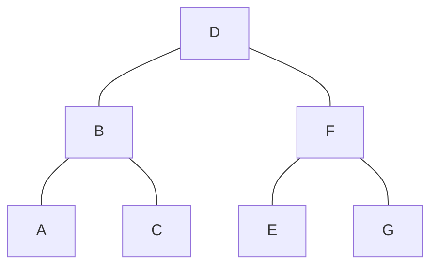
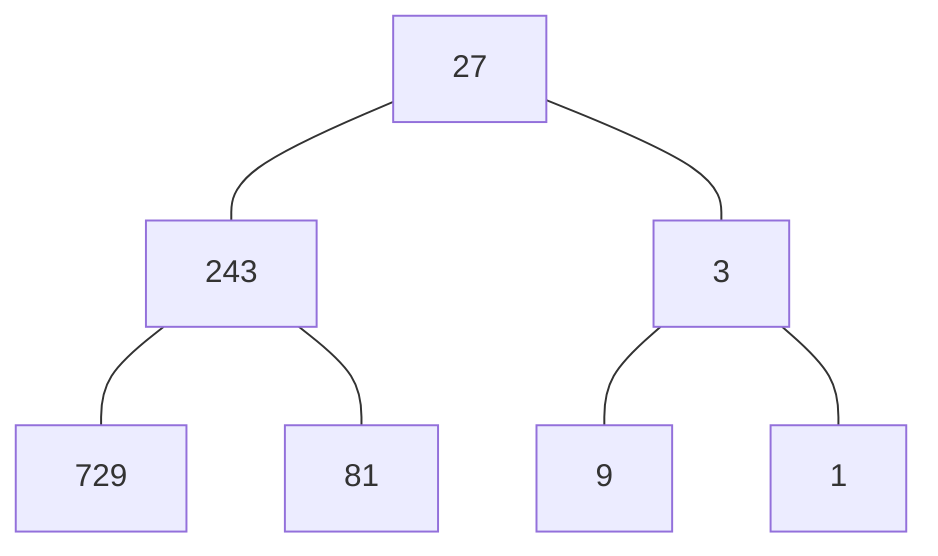
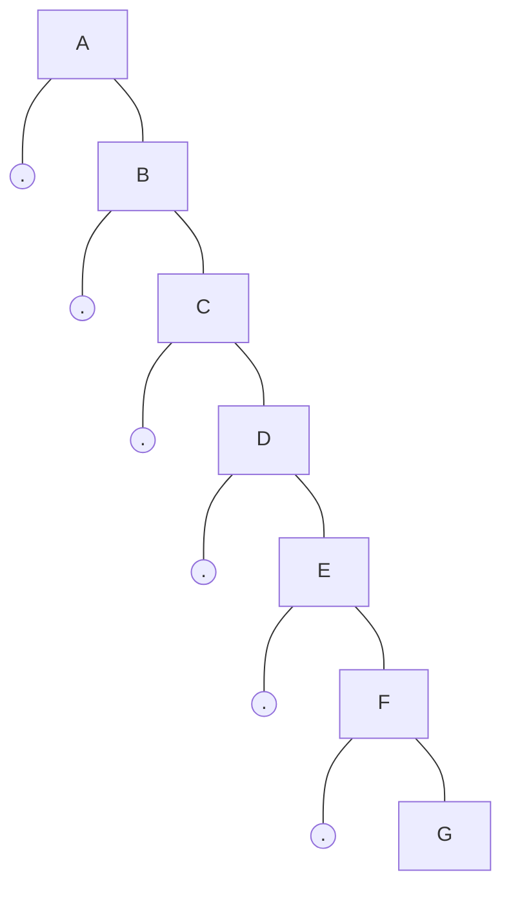
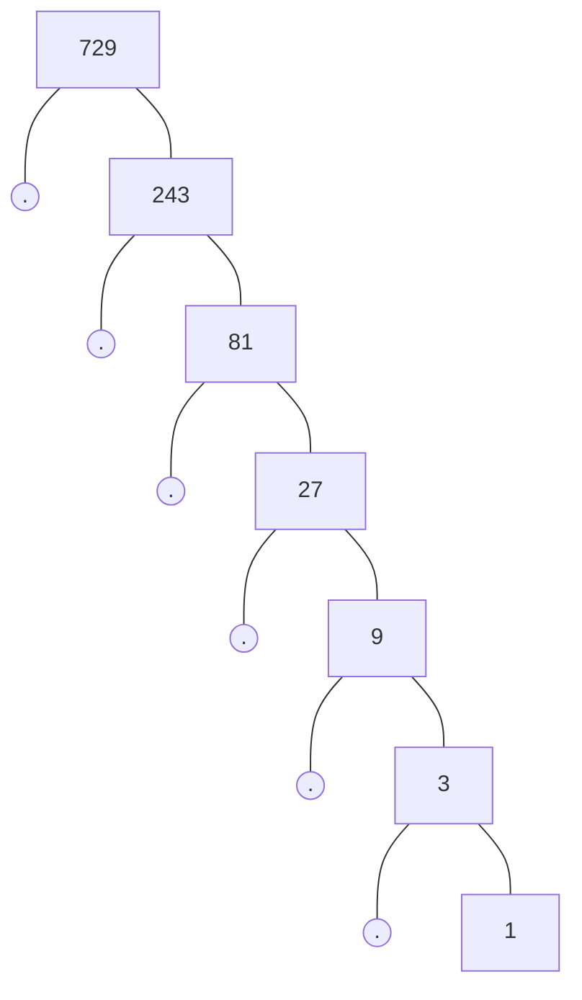
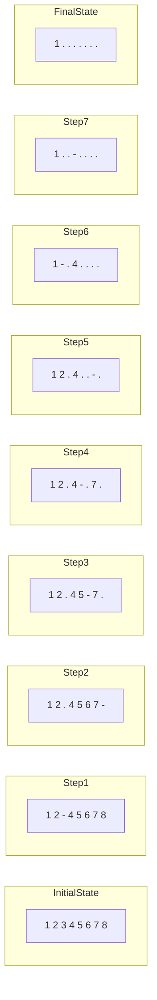

# 第一章 算法设计基础

## 1.1思维的体操

> 例题1 勇者斗恶龙 (The Dragon of Loowater,UVa11292)

* 【题目描述】
一条n个头的恶龙，雇佣其实砍掉所有头，有m个骑士可雇佣，一个能力值为x的骑士可以砍掉直径不超过x的头，且需要x个金币。如何雇佣骑士才能砍掉恶龙所有的头，且需要支付的金币最少？注：一个骑士只能砍一个头。

* 【输入格式】

输入包含多组数据。每组数据的第一行为正整数n和m(1<=n,m<=20000)：以下n行每行为一个整数，及恶龙每个头的直径；以下m行为一个整数，即每个骑士的能力。树入结束标志为n=m=0。

* 【输出格式】

对于每组数据输出最少花费，输出"Loowater is doomed！".

* 【样例输入】

略

* 【样例输出】

略

* 【分析】代码如下：

```
#include<cstdio>
#include<algorithm>
//#include<bits/stdc++.h>
using namespace std;

const int maxn=20000+5;
int A[maxn],B[maxn];
int main(){
  int n,m;
  while(scanf("%d%d",&n,&m) ==2 && n&& m){
	for(int i=0;i<n;i++) scanf("%d",&A[i]);
	for(int i=0;i<m;i++) scanf("%d",&B[i]);
	sort(A,A+n);
	sort(B,B+m);
	int cur=0;
	int cost=0;
	for(int i=0;i<m;i++)
	  if(B[i]>=A[cur]){
	    cost+=B[i];
		if(++cur==n) break;
	  }
    if(cur<n) printf("Loowater is doomed!\n");
	else printf("%d\n",cost);
  }
  return 0;
}
```

> 例题2 突击战（Commando War，UVa11729）

* 【题目描述】

你有n个部下，每个部下需要完成一项任务。第i个部下需要你花费B<sub>i</sub>分钟交代任务，然后他会立刻独立的，无间断的执行J<sub>i</sub>分钟后完成任务。你需要选择交代人物的顺序，使得所有人物尽早完毕（即最后一个执行完的任务应尽早结束）。注意，不能同时给两个部下交代任务，但部下们可以同时执行他们各自的任务。

* 【输入格式】

输入包含多组数据，每组数据的第一行为部下的个数N(1<=N<=1000);以下N行每行两个正数B和J（1<=B<=10000），即交代任务的时间和执行任务的时间。输入结束标志为N=0。

* 【输出格式】

对于每组数据，输出所有任务完成的最短时间。

* 【样例输入】

略

* 【样例输出】

略

* 【分析】代码如下：

```
#include<cstdio>
#include<vector>
#include<algorithm>
using namespace std;

struct Job{
	int j,b;
	bool operator<(const Job& x) const{
		return j>x.j;
	}
};
int main(){
	int n,b,j,kase=1;
	while(scanf("%d",&n) ==1 &&n){
		vector<Job> v;
		for(int i=0;i<n;i++){
			scanf("%d%d",&b,&j);v.push_back((Job){j,b});
		}
		sort(v.begin(),v.end());
		int s=0;
		int ans=0;
		for(int i=0;i<n;i++){
			s+=v[i].b;
			ans=max(ans,s+v[i].j);
		}
		printf("Case %d: %d\n",kase,ans);
	}
	return 0;
}
```

假设我们交换两个相邻的任务X和Y（交换前X在Y之前，交换后Y在X之前），不难发现其他任务的完成时间没有影响，那么这两个任务呢？<br>
情况一：交换之前，任务Y比X先结束，不难发现，交换之后X的结束时间延后，Y的结束时间提前，最终答案不会变好。<br>
情况二：交换之前，X比Y先结束，因此交换后答案不会变好的充要条件是：交换后X的结束时间不比交换前Y的结束时间早（交换后Y的结束时间肯定变早了），这个条件可以写成B[Y]+B[X]+J[X]>=B[X]+B[Y]+J[Y],化简得到J[X]>=J[Y]。这就是贪心的依据。

> 例题3 分金币（Spreading the Wealth,UVa11300）

* 【题目描述】

圆桌旁坐着n个人，每人有一定数量的金币，金币总数能被n整除。每个人可以给他左右相邻的人一些金币，最终使得每人的金币数目相等。你的任务是求出被转手的金币数量的最小值。比如，n=4,且4个人的金币数量分别为1,2,5,4时，只需转移4枚金币（第3个人给第2个人两枚金币，第2个人和第4个人分别给第1个人1枚金币）即可实现每人手中的金币数目相等。

* 【输入格式】

输入包含多组数据。每组数据第一行为整数n（N<=1000000），以下n行每行为一个整数，按逆时针顺序给出每个人拥有的金币数。输入结束标志为文件结束符（EOF）。

* 【输出格式】

对于每组数据，输出被转手金币数量的最小值。输入保证这个值在64位无符号整数范围内。

* 【样例输入】

略

* 【样例输出】

略

* 【分析】

首先，最终每个人的金币数量可以计算出来，他等于金币总数除以人数n。接下来用M来表示每人最终拥有的金币数量。<br>
假设有4个人，按顺序编号为1,2,3,4.假设1号给2号3枚金币，然后2号又给1号5枚金币，这实际上等价于2号给1号2枚金币，而1号什么也没给2号。这样，可以设x<sub>2</sub>表示2号给了1号多少个金币。如果x<sub>2</sub><0,说明实际上是1号给了2号-x<sub>2</sub>枚金币。x<sub>1</sub>,x<sub>3</sub>,x<sub>4</sub>的含义类似。注意，由于是环形，x<sub>1</sub>指的是1号给4号多少金币。<br>
现在假设编号为i的人初始有A<sub>i</sub>枚金币。对于1号来说，他给了4号x<sub>1</sub>枚金币，还剩下A<sub>1</sub>-x<sub>1</sub>枚；但因为2号给了他x<sub>2</sub>枚金币，所以最后还剩下A<sub>1</sub>-x<sub>1</sub>+x<sub>2</sub>枚金币。根据题设，该金币等于M。换句话说，我们得到一个方程：A<sub>1</sub>-x<sub>1</sub>+x<sub>2</sub>=M。<br>
同理，对于第2个人有A<sub>2</sub>-x<sub>2</sub>+x<sub>3</sub>=M。最终，我们可以得到n个方程，一共有n个变量，是不是可以直接解方程组了呢？很可惜，还不行，因为从前n-1个方程可以推导出最后一个方程（？）。所以，实际上只有n-1个方程是有用的。<br>
尽管无法直接解出答案，我们还是可以尝试用x<sub>1</sub>表示出其他的x<sub>i</sub>，则本题就变成了单变量的极值问题。<br>
对于第1个人，A<sub>1</sub>-x<sub>1</sub>+x<sub>2</sub>=M -> x<sub>2</sub> = M-A<sub>1</sub>+x<sub>1</sub>=x<sub>1</sub>-C<sub>1</sub>（规定C<sub>1</sub>=A<sub>1</sub>-M,以下类似）<br>
对于第2个人，A<sub>2</sub>-x<sub>2</sub>+x<sub>3</sub>=M -> x<sub>3</sub>=M-A<sub>2</sub>+x<sub>2</sub>=2M-A<sub>1</sub>-A<sub>2</sub>+x<sub>1</sub>=x<sub>1</sub>-C<sub>2</sub> <br>
对于第3个人，A<sub>3</sub>-x<sub>3</sub>+x<sub>4</sub>=M -> x4=M-A<sub>3</sub>+x<sub>3</sub>=3M-A<sub>1</sub>-A<sub>2</sub>-A<sub>3</sub>+x<sub>1</sub>=x<sub>1</sub>-C<sub>3</sub> <br>
...<br>
对于第n个人，A<sub>n</sub>-x<sub>n</sub>+x<sub>1</sub>=M。这是一个多余的等式，并不能给我们更多的信息（？）。<br>
我们希望所有x<sub>i</sub>的绝对值之和尽量小，即|x<sub>1</sub>|+|x<sub>1</sub>-C<sub>1</sub>|+|x<sub>1</sub>-C<sub>2</sub>|+...+|x<sub>1</sub>+C<sub>n-1</sub>|要最小。注意到|x<sub>1</sub>-C<sub>i</sub>| 的几何意义是数轴上点x<sub>1</sub>到C<sub>i</sub>的距离，所以问题变成了：给定数轴上的n个点，找出一个到他们的距离之和尽量小的点。<br>
下一步可能有些跳跃。不难猜到，这个最优的x<sub>1</sub>就是这些数的“中位数”（即排序以后位于中间的数），因此只需要排个序就可以了。性急的读者可能又想跳过证明了，但是笔者希望您这次能好好读一读，因为它实在是太优美，太巧秒了，而且不少其他题目也能用上（我们很快就会再见到一例）。<br>
注意我们要证明的是：给定数轴上的n个点，在数轴上的所有点中，中位数离所有顶点的距离之和最小。凡是能转化为这个模型的题目都可以用中位数求解，并不只适用于本题。<br>
让我们把数轴和上面的点画出来，任意找一个点，比如选定一个点，左边有4个输入点，右边有2个输入点。把这个点向左移动一点，不要移动的太多，一面碰到输入点。假设移动了d单位的距离，则这个点左边4个点到他的距离各减少了d，右边的两个点到大的距离各增加了d，但总的来说，距离之和减少了2d。<br>
如果这个点的左边各有2个点，右边4个点，类似的，应该向右移动。什么情况下左右的输入点一样多呢？如果输入点一共有奇数个，则这个点必须和中间的那个点重合（中位数）；如果有偶数个，则这个点可以位于最中间的两个点之间的任意位置（还是中位数）。代码如下：<br>

```
#include<cstdio>
#include<algorithm>
using namespace std;
const int maxn=1000000+10;
long long A[maxn],C[maxn],tot,M;
int main(){
	int n;
	while(scanf("%d",&n)==1){
	tot=0;
	for(int i=1;i<=n;i++){
		scanf("%lld",&A[i]);
		tot+=A[i];
	}
	M=tot/n;
	C[0]=0;
	for(int i=1;i<n;i++)
		C[i]=C[i-1]+A[i]-M;
		sort(C,C+n);
		long long x1=C[n/2],ans=0;
		for(int i=0;i<n;i++)
			ans+=abs(x1-C[i]);
		printf("%lld\n",ans);
	}
	return 0;
}
```
程序本身并没有太多技巧可言，但需要注意的是`long long` 的输入输出。 `%lld`这个占为副并不是跨平台的，比如，Windows下的mingw需要用 `%I64d`而不是‵%lld`。虽然 **cin/cout** 没有这个问题，但是本体输入量比较大， **cin/cout** 会很慢。有两个解决方案。一是自己编写输入输出函数（前面已经给过范例），二是使用`ios::sync_with_stdio(false)`,通过关闭 **ios** 和 **stdio** 之间的同步来加速。<br>
中位数可以在线性时间内求出，但不是本例题的重点（代数分析才是重点），可以搜索“快速选择”算法资料研究。

> 例题4 墓地雕塑（Graveyard，NEERC2006,LA3708）

* 【题目描述】

在一个周长为10000的圆上等距分布这n个雕塑。现在又有m个新雕塑加入（位置可以随意放），希望所有m+n个雕塑在圆周上均匀分布。这就需要移动其中一些原有的雕塑。要求n个雕塑移动的总距离尽量小。

* 【输入格式】

输入包括若干组数据。每组数据仅一行，包含两个整数n和m（2<=n<=1000,1<=m<=1000），即原始的雕塑数量和新加的雕塑数量。输入结束标志为文件结束符（EOF）。

* 【输出格式】

输出仅一行，为最小总距离，精确到10<sup>-4</sup>。

* 【样例输入】

略

* 【样例输出】

略

* 【分析】

在原雕塑中添加新雕塑，用不同的方法的样例中有一个共同的特点，其中总有一个雕塑可以不用移动。如果次特点在所有的情况下都成立，则所有的雕塑的最终位置（称为”目标点“）实际上已经确定。简单起见，我们把没有动的雕塑作为坐标原点，其他雕塑按照逆时针顺序标上到原点的距离标号，这里的距离并不是真实的距离，而是按比例缩小以后的距离。接下来，把每个雕塑移动到离它最近的位置，如果没有两个雕塑移动到相同的位置，那么这样的移动一定是最优的。代码如下:<br>

```
#include<cstdio>
#include<cmath>
using namespace std;
int main(){
	int n,m;
	while(scanf("%d%d",&n,&m) ==2){
		double ans=0.0;
		for(int i=1;i<n;i++){
			double pos=(double)i/n*(n+m);
			ans+=fabs(pos-floor(pos+0.5))/(n+m);
		}
		printf("%.4lf\n",ans*10000);
	}
	return 0;
}
```

注意在代码中，坐标为pos的雕塑移动到的目标位置是 `floor(pos+0.5)` ，也就是pos四舍五入的结果，这就是坐标缩小的好处。<br>
这个代码有两个小漏洞，第一个“漏洞”的修补需要证明我们的猜想，证明思路在例题3中我们已经展开过了，具体细节有待思考。<br>
第二个“漏洞”有两种修补方法，第一种相对较容易实施：由于题目中规定了n，m<=1000,我们只需要在程序里加入一个功能，纪律每座雕塑移动的目标位置，就可以告诉大家这样的情况确实不会出现，这样，即使无法从理论上证明，也可以确保在题目规定的范围内，我们的算法是严密的。<br>
第二种方法就是直接证明，在我们的程序中，当坐标系缩放之后，坐标为x的雕塑白移动到了x四舍五入后的位置。如果有两个坐标分别为x和y的雕塑被移动到了同一个位置，说明x和y四舍五入后的结果相同，即x和y“很接近”。至于有多接近？差距最大的情况不外乎类似于 x=0.5,y=1.49999...。即便是这样的情况，y-x仍然小于1（尽管接近1），但这是不可能的，因为新增雕塑之后，相邻雕塑的距离才等于1,之前的雕塑数目更少，距离应当更大才对。

> 例题5 蚂蚁（Piotr‘s Ants,Uva10881）

* 【题目描述】

一根长度为L厘米的木棍上有n只蚂蚁，每只蚂蚁要么朝左爬，要么往右爬，速度为1厘米/秒。当两只蚂蚁相撞时，二者同时掉头（掉头时间忽略不计）。给出每只蚂蚁的初始位置和朝向，计算T秒之后每只蚂蚁的位置。

* 【输入格式】

输入的第一行为数据组数。每组数据的第一行为3个正数L，T，n（0<=n<=10000）；以下n行每行描述一只蚂蚁的初始位置，其中，整数x为蚂蚁距离木棍左端的距离（单位：厘米），字母表示初始朝向（L表示朝左，R表示朝右）。

* 【输出格式】

对于每组数据，输出n行，按输入顺序输出每只蚂蚁的位置和朝向（Turning表示正在碰撞）。在第T秒之前已经掉下木棍的蚂蚁（正好爬到木棍边缘的不算）输出Fell off。

* 【样例输入】

略

* 【样例输出】

略

* 【分析】

假设在远处观察这些蚂蚁的运动，会看到什么？一群密密麻麻的小黑点在移动。由于黑点太小，所以当蚂蚁因碰撞而掉头时，看上去和两个点“对穿而过”没有任何区别，换句话说，如果把蚂蚁看成是没有区别的小店，那么秩序独立计算出每只蚂蚁在T时刻的位置即可。比如，有3只蚂蚁，蚂蚁1=（1,R），蚂蚁2=（3,L），蚂蚁3=（4,L），则两秒钟之后，3只蚂蚁分别为（3,R），（1,L）和（2,L）。<br>
注意，虽然从整体上讲，“掉头”等价于“对穿而过”，但对于每只蚂蚁而言并不是这样。蚂蚁1的初始状态为（1,R），因此一定有一只蚂蚁在两秒之后处于（3，R）的状态，但这只蚂蚁却不一定是蚂蚁1.换句话说，我们需要搞清楚目标状态中“谁是谁”。<br>
也许能发现其中的一点奥妙：所有蚂蚁的相对顺序是保持不变的，因此把所有目标位置从小到大排序，则从左到右的每个位置对应于初始状态下从左到右的每只蚂蚁。由于原题中蚂蚁不一定按照从左到右的顺序输入，还需要预处理计算机输入中的第i只蚂蚁的序号order[i]。完整代码如下：<br>

```
#include<cstdio>
#include<algorithm>
using namespace std;

const int maxn=10000+5;

struct Ant{
	int id;	//输入顺序
	int p;	//位置
	int d;	//朝向。-1：左；0：转身中；1：右
	bool operator<(const Ant& a) const{
		 return p<a.p;
	}
}before[maxn],after[maxn];
const char dirName[][10]={"L","Turning","R"};
int main(){
	int K;
	scanf("%d",&K);
	for(int kase=1;kase<=K;kase++){
		int L,T,n;
		printf("Case #%d:\n",kase);
		scanf("%d%d%d",&L,&T,&n);
		for(int i=0;i<n;i++){
			int p,d;
			char c;
			scanf("%d %c",&p,&c);
			d=(c=='L'? -1:1);
			before[i]=(Ant){i,p,d};
			after[i]=(Ant){0,p+T*d,d};
		}
		sort(before,fefore+n);
		for(int i=0;i<n;i++)
			order[before[i].id]=i;
		sort(after,after+n);
		for(int i=0;i<n-1;i++)
			if(after[i].p==after[i+1].p) after[i].d=after[i+1].d==0;
		for(int i=0;i<n;i++){
			int a=order[i];
			if(after[a].p<0 || after[a].p>L) printf("Fell off\n");
			else printf("%d %s\n",after[a].p,dirName[after[a].d+1]);
		}
		printf("\n");
	}
	return 0;
}
```

> 例题6 立方体成像（Image Is Everything,World Finals 2004,LA2996）

* 【题目描述】

有一个n*n*n 立方体，其中一些单位立方体已经缺失（剩下部分不一定连通）。每个单位立方体重量为1克，且被涂上单一的颜色（即6个面的颜色相同）。给出前，左，后，右，顶，底6个视图，你的任务是判断这个物体剩下的最大重量。

* 【输入格式】

输入包含多组数据，每组数据的第一行为一个整数n（1<=n<=10）；以下n行每行从左到右一次为前，左，后，右，顶，底6个视图，每个视图占n列，相邻视图中间以一个空格隔开。顶视图的下边界对应于前视图的上边界；底视图的上边界对应于前视图的下边界。在视图中，大写字母表示颜色（不同字母表示不同颜色），句号（.）表示该位置可以看穿（即没有任何立方体）。输入结束标志为n=0.

* 【输出格式】

对于每组数据，输出一行，即物体的最大重量（单位：克）。

* 【样例输入】

3
.R. YYR .Y. RYY .Y. .R.
GRB YGR BYG RBY GYB GRB
.R. YRR .Y. RRY .R. .Y.
2
ZZ ZZ ZZ ZZ ZZ ZZ
ZZ ZZ ZZ ZZ ZZ ZZ
0

* 【样例输出】

Maximum weight: 11 gram（s）
Maximum weight： 8gram（s）

* 【分析】

这个问题看上去有点棘手，不过人然可以找到突破口。比如，能“看穿”的位置所对应的所有单位立方体一定都不存在。在比如，如果前视图的右上角颜色A和顶视图的右下角颜色B不同，那么对应的格子一定不存在。<br>
在删除这个立方体之后，我们可能会有新发现：C和D的颜色不同。这样我们又能删除一个新的立方体，并暴露出新的表面。当无法继续删除的时候，剩下的立方体就是重量最大的物体。<br>
可能有读者会对上述算法心存疑惑。解释如下：首先不难证明第一次删除是必要的（即被删除的那个立方体不可能存在于人一可行解中），因为只要不删除这个立方体，对应两个视图的“矛盾”将一直存在；接下来，我们用数学归纳法，假设算法的前k次删除都是必要的，那么第k+1次删除是否也是必要的呢？由刚才的推理，我们不能通过继续删除立方体来消除矛盾，而由归纳假设，已经删除的立方体也不能恢复，因此矛盾无法消除。代码如下：<br>

```
#include<cstdio>
#include<cstring>
#include<cmath>
#include<algorithm>
using namespace std;
#define REP(i,n) for(int i=0;i<(n);i++)
const int maxn =10;
int n;
char pos[maxn][maxn][maxn];
char view[6][maxn][maxn];
char read_char(){
	char ch;
	for(;;){
		ch=getchar();
		if((ch>='A' && ch<='Z') || ch=='.') return ch;
	}
}
void get(int k,int i,int j,int len,int &x,int &y,int &z){
	 if(k==0){x=len;y=j;z=i;}
	 if(k==1){x=n-1-j;y=len;z=i;}
	 if(k==2){x=n-1-len;y=n-1-j;z=i;}
	 if(k==3){x=j;y=n-1-len;z=i;}
	 if(k==4){x=n-1-i;y=j;z=len;}
	 if(k==5){x=i;y=j;z=n-1-len;}
}
int main(){
	while(scanf("%d",&n)==1 && n){
		REP(i,n) REP(k,6) REP(j,n) view[k][i][j]=reak_char();
		REP(i,n) REP(j,n) REP(k,n) pos[i][j][k]='#';
		REP(k,6) REP(i,n) REP(j,n) if(view[k][i][j]=='.')
			REP(p,n){
				int x,y,z;
				get(k,i,j,p,x,y,z);
				pos[x][y][z]='.';
			}
		for(;;){
			bool done=true;
			REP(k,6) REP(i,n) REP(j,n) if(view[k][i][j]!='.'){
				REP(p,n){
					int x,y,z;
					get(k,i,j,p,x,y,z);
					if(pos[x][y][z]=='.') continue;
					if(pos[x][y][z]=='#‘){
						pos[x][y][z]=view[k][i][j];
						break;
					}
					if(pos[x][y][z]==view[k][i][j]) break;
					pos[x][y][z]='.';
					done=false;
				}
			}
			if(done) break;
		}
		int ans=0;
		REP(i,n) REP(j,n) REP(k,n)
			if(pos[i][j][k]!='.') ans++;
		printf("Maximum weight: %d gram(s)\n",ans);
	}
	return 0;
}
```

程序用了**get**函数来表示第k个视图中，第i行j列，深度为len的单位立方体在原立方体中的坐标(x,y,z)，另外还使用了宏REP精简程序。尽管用宏缩短代码在很多时候会降低程序可读性，但本题却不会（如果到处都是for循环，反而容易令人范晕）。

## 1.2问题求解常见策略

> 例题7 偶数矩阵（Even Parity，UVa11464）

* 【题目描述】

给你一个n*n的01矩阵（每个元素非0即1），你的任务是把尽量少的0变成1,使得每个元素的上，下，左，右的元素（如果存在的话）之和均为偶数。则此矩阵至少要把3个0变成1,最终才能保证其为偶数矩阵。

* 【输入格式】

输入的第一行为数组数T(T<=30)。每组数据的第一行为正整数n(1<=n<=15)；接下来的n行每行包含n个非0即1的整数，相邻的整数间用一个空格隔开。

* 【输出格式】

对于每组数据，输出被改变的元素的最小个数。如果无解，应该输出-1.

* 【分析】

也许最容易想到的方法就是枚举每个数字“变”还是“不变”，最后判断整个矩阵是否满足条件。遗憾的是这样左最多需要枚举2<sup>255</sup>~5*10<sup>67</sup>种情况，实在难以承受。<br>
注意到n只有15,第一行只有不超过2<sup>15</sup>=32678种可能，所以第一行的情况是可以枚举的。接下来根据第一行可以完全计算出第二行，根据第二行又能计算出第三行（？），以此类推，总时间复杂度即可降为O(2<sup>n</sup>*n<sup>2</sup>)。代码如下：

```
#include<cstdio>
#include<cstring>
#include<algorithm>
using namespace std;
const int maxn=20;
const int INF=1000000000;
int n,A[maxn][maxn],B[maxn][maxn];

int check(int s){
	memset(B,0,sizeof(B));
	for(int c=0;c<n;c++){
		if(s& (1<<c)) B[0][c]=1;
		else if(A[0][c]==1) return INF;
	}
	for(int r=1;r<n;r++)
		for(int c=0;c<n;c++){
			int sum=0;
			if(r>1) sum+=B[r-2][c];
			if(c>0) sum+=B[r-1][c-1];
			if(c<n-1) sum+=B[r-1][c+1];
			B[r][c]=sum%2;
			if(A[r][c]==1 && B[r][c]==0) return INF;
		}
	int cnt=0;
	for(int r=0;r<n;r++)
		for(int c=0;c<n;c++) if(A[r][c]!=B[r][c]) cnt++;
	return cnt;
}
int main(){
	int T;
	scanf("%d",&T);
	for(int kase=1;kase<=T;kase++){
		scanf("%d",&n);
		for(int r=0;r<n;r++)
			for(int c=0;c<n;c++) scanf("%d",&A[r][c]);
		int ans=INF;
		for(int s=0;s<(1<<n);s++)
			ans=min(ans,check(s));
		if(ans==INF) ans=-1;
		printf("Case %d: %d\n",kase,ans);
	}
	return 0;
}
```

> 例题8 彩色立方体（Colored Cubes，Tokyo 2005,LA3401）

* 【题目描述】

有n个带颜色的立方体，每个面都涂有一种颜色。要求重新涂尽量少的面，使得所有立方体完全相同。两个立方体相同的含义是：存在一种旋转方式，使得两个立方体对应面的颜色相同。

* 【输入格式】

输入包含多组数据，每组数据的第一行为正整数n（1<=n<=4）；以下n行每行6个字符串，分别为立方体编号为1～6的面的颜色（由小写字母和减号组成，不超过24个字符）。输入结束标志为n=0.立方体的6个面的编号。

* 【输出格式】

对于每组数据，输出重新涂色的面数的最小值。

* 【分析】

立方体只有4个，暴力法应该可行。不过不管怎样“暴力”，首先得搞清楚一个立方体究竟有几种不同的旋转方式。<br>
为了清晰起见，我们借用机器人学中的术语，用姿态（pose）来代替口语中的旋转方法。假设6个面的编号为1～6,从中选一个面作为“顶面”，然后剩下的4个面中选一个作为“正面”，则其他面都可以唯一的确定，因此有6*4=24种姿态。<br>
在代码中，每种姿态对应一个全排列P。其中，P[i]表示编号i所在的位置（1表示正面，2表示右面，3表示顶面等）。用排列{1,2,3,4,5,6}表示，因为1在正面，2在右面，3在顶面。<br>
向左旋转后得到的排列是{5,1,3,4,6,2}。<br>
接下来有两种方法，一种方法是手工找出24中姿态对应的排列，编写到代码中，显然，这种方法比较耗时，容易出错，不推荐。下面的方法可以用程序找出这24中排列，而且不容易出错，除了刚才写的标准姿态向左翻之外，在写出标准姿态向上翻所对应的排列：{3,2,6,1,5,4}。<br>
注意到旋转是可以组合的，标准姿态先向左转再向上翻就是5->5,1->3,3->6,4->1,6->4,2->2,即{5,3,6,1,4,2}。因此，有了这两种旋转方式，我们就可以构造出所有24种姿态了（均为从标准姿态开始旋转）。<br>
1在顶面的姿态：向上翻1次（此时1在顶面），然后向左转0～3次。<br>
2在顶面的姿态：向左转1次（此时2在顶面），向上翻1次，然后向左转0～3次。<br>
3在顶面的姿态：（3本来就在顶面）向左转0～3次。<br>
4在顶面的姿态：向上翻2次（此时4在顶面），然后向左转0～3次。<br>
5在顶面的姿态：向左转3次，向上翻一次（此时5在顶面），然后向左转0～3次。<br>
6在顶面的姿态：向左转2次，向上翻一次（此时6在顶面），然后向左转0～3次。<br>
这段代码应该写在哪里呢？一种方法是直接手写在最终的程序中，但是一旦这部分代码出错，非常难调；另一种方法是写道一个独立程序中，用它生成24中姿态对应的排列，而在最终程序中直接使用常量表。生成排列表的程序如下。<br>

```
#include<cstdio>
#include<cstring>

int left[]={4,0,2,3,5,1};
int up[]={2,1,5,0,4,3};
void rot(int* T,int* p){
	int q[6];
	memcpy(q,p,sizeof(q));
	for(int i=0;i<6;i++) p[i]=T[q[i]];
}
void enumerate_permutations(){
	int p0[6]={0,1,2,3,4,5};
	printf("int dice24[24][6]={\n");
	for(int i=0;i<6;i++){
		int p[6];
		memcpy(p,p0,sizeof(p0));
		if(i==0) rot(up,p);
		if(i==1){rot(left,p);rot(up,p);}
		if(i==3){rot(up,p);rot(up,p);}
		if(i==4){rot(left,p);rot(left,p);rot(left,p);rot(up,p);}
		if(i==5){rot(left,p);rot(left,p);rot(up,p);}
		for(int j=0;j<4;j++){
			printf("{%d,%d,%d,%d,%d,%d},\n",p[0],p[1],p[2],p[3],p[4],p[5]);
			rot(left,p);
		}
	}
	printf("};\n");
}
int main(){
	enumerate_permutations();
	return 0;
}
```

下面让我们来看看如何“暴力”。一种方法是枚举最后那个“相同的立方体”的每个面是什么，让后对于每个立方体，看看那种姿态需要重新涂色的面最少。但是由于4个立方体最多可能会有24中不同的颜色，最多需要枚举24<sup>6</sub>种“最后的立方体”，情况有点多。<br>
另一种方法是先枚举每个立方体的姿态（第一个作为“参考系”，不用旋转），然后对于6个面，分别选一个出现次数最多的颜色作为“标准”，和他不同的颜色一律重涂。由于每个立方体的姿态有24种，3个立方体（别忘了第一个不用旋转）的姿态组合一共有24<sup>3</sup>种，比第一种方法要好。程序如下：

```
int dice24[24][6]={
	{2,1,5,0,4,3},{2,0,1,4,5,3},{2,4,0,5,1,3},{2,5,4,1,0,3},{4,2,5,0,3,1},
	{5,2,1,4,3,0},{1,2,0,5,3,4},{0,2,4,1,3,5},{0,1,2,3,4,5},{4,0,2,3,5,1},
	{5,4,2,3,1,0},{1,5,2,3,0,4},{5,1,2,3,4,0},{1,0,3,2,5,4},{0,4,3,2,1,5},
	{4,5,3,2,0,1},{1,3,5,0,2,4},{0,3,1,4,2,5},{4,3,0,5,2,1},{5,3,4,1,2,0},
	{3,4,5,0,1,2},{3,5,1,4,0,2},{3,1,0,5,4,2},{3,0,4,1,5,2}
};
#include<cstdio>
#include<cstring>
#include<string>
#include<vector>
#include<algorithm>

const int maxn=4;
int n,dice[maxn][6],ans;
vector<string> names;
int ID(const char* name){
	string s(name);
	int n=names.size();
	for(int i=0;i<n;i++)
		if(names[i]==s) return i;
	names.push_back(s);
	return n;
}
int r[maxn],color[maxn][6];
void check(){
	for(int i=0;i<n;i++)
	 	for(int j=0;j<6;j++) color[i][dice24[r[i]][j]]=dice[i][j];
	int tot=0;
	for(int j=0;j<6;j++){
		int cnt[maxn*6];
		memset(cnt,0,sizeof(cnt));
		int maxface=0;
		for(int i=0;i<n;i++)
			maxface=max(maxface,++cnt[color[i][j]]);
		tot+=n-maxface;
	}
	ans=min(ans,tot);
}
void dfs(int d){
	if(d==n) check();
	else
		for(int i=0;i<24;i++){
			r[d]=i;
			dfs(d+1);
		}
}
int main(){
	while(scanf("%d",&n)==1 && n){
		names.clear();
		for(int i=0;i<n;i++)
			for(int j=0;j<6;j++){
				char name[30];
				scanf("%s",name);
				dice[i][j]=ID(name);
			}
		ans=n*6;
		r[0]=0;
		dfs(1);
		printf("%d\n",ans);
	}
	return 0;
}	
```

> 例题9 中国麻将（chinese Mahjong，UVa11210）

* 【题目描述】

麻将是一个中国原创的4人玩的游戏。这个游戏有很多变种，但是本题只考虑一种有136张牌的玩法。这136张牌所包含的内容如下。<br>
饼牌：1T，2T，3T，4T，5T，6T，7T，8T，9T<br>
索（条）牌：1S，2S，3S，4S，5S，6S，7S，8S，9S<br>
万牌：1W，2W，3W，4W，5W，6W，7W，8W，9W<br>
风牌：东西南北风，DONG，XI，NAN，BEI<br>
箭牌：中发白，ZHONG，FA，BAI<br>
（花牌：8张，春夏秋冬，梅兰竹菊）<br>
手牌13张，包括一个将（2张相同的牌），0个或多个刻子（3张相同的牌），0个或多个顺子（3张同花色相连的牌），四张相同的花色牌称为杠，注意，风牌和箭牌不能形成顺子）。<br>

* 【输入格式】

输入数据最多50组，每组数据由一行13张牌给出，输入保证给出的牌是合法的，输入结束标志一行单个0。

* 【输出格式】

对于每组数据，输出所有“听”的牌，按照描述种的顺序列出（1T-9T，1S-9S，1W-9W，DONG，NAN，XI，BEI，ZHONG，FA，BAI）。每张牌最多被列出一次。如果没有“听”牌，输出Not ready。

* 【分析】

为了快速选出将，刻子，顺子，采用34维向量来表示状态，籍没种牌所剩的张数，除了第一次直接枚举将牌之外，每次只需要考虑编号最小的牌，看他能否形成刻子或者顺子（一定是以它作为最小牌），并且递归判断。本题唯一的陷阱是：每一种牌都只有4张，所以1S1S1S1S是不“听”任何牌的。

```
#include<stdio.h>
#include<string.h>

const char* mahjong[]={
	"1T","2T","3T","4T","5T","6T","7T","8T","9T",
	"1S","2S","3S","4S","5S","6S","7S","8S","9S",
	"1W","2W","3W","4W","5W","6W","7W","8W","9W",
	"DONG","XI","NAN","BEI",
	"ZHONG","FA","BAI"
};

int convert(char *s){
	for(int i=0;i<34;i++)
		if(strcmp(mahjong[i],s)==0) return i;
	return -1;
}
int c[34];
bool search(int dep){
	 int i;
	 for(i=0;i<34;i++)
		if(c[i]>=3){
			if(dep==3) return true;
			c[i]==3;
			if(search(dep+1)) return true;
			c[i]+=3;
		}
	for(i=0;i<=24;i++)
		if(i%9<=6 && c[i]>=1 && c[i+1]>=1 && c[i+2]>=1){
			if(dep==3) return true;
			c[i]--;c[i+1]--;c[i+2]--;
			if(search(dep+1)) return true;
			c[i]++;c[i+1]++;c[i+2]++;
		}
	return false;
}
bool check(){
	 int i;
	 for(i=0;i<34;i++)
		if(c[i]>=2){
			c[i]-=2;
			if(search(0)) return true;
			c[i]+=2;
		}
	return false;
}
int main(){
	int caseno=0,i,j;
	bool ok;
	char s[100];
	int mj[15];
	while(scanf("%s",&s)==1){
		if(s[0]=='0') break;
		printf("Case %d:",++caseno);
		mj[0]=convert(s);
		for(i=1;i<13;i++){
			scanf("%s",&s);
			mj[i]=convert(s);
		}
		ok=false;
		for(i=0;i<34;i++){
			memset(c,0,sizeof(c));
			for(j=0;j<13;j++) c[mj[j]]++;
			if(c[i]>=4) continue;
			c[i]++;
			if(check()){
				ok=true;
				printf(" %s",mahjong[i]);
			}
			c[i]--;
		}
		if(!ok) printf(" Not ready");
		printf("\n");
	}
	return 0;
}	 				   
```

> 例题10 正整数序列（Help is needed for Dexter,UVa11384）

* 【题目描述】

给定正整数n，你的任务是用最少的操作次数把序列1,2,...,n种的所有数都变成0.每次操作可从序列种选择一个或多个整数，同时减去一个相同的正整数。比如，1,2,3可以把2和3同时减小2,得到1,0,1。

* 【输入格式】

输入包含多组数据。每组仅一行，为正整数n（n<=10<sup>9</sup>）。输入结束标志为文件结束符（EOF）。

* 【输出格式】

对于每组数据，输出最少操作次数。

* 【分析】

最好的方式是自己试一试，经过若干次尝试和总结后，不难发现第一步的最好方式。<br>
序列：1,2,3,4,5,6，当n=6的时候留下1,2,3，而把4,5,6同时减去min{4,5,6}=4得到序列1,2,3,0,1,2，等价于1,2,3（？）。即f(6)=f(3)+1。一般的为了平衡，保留1～n/2,把剩下的数同时减去n/2+1,得到序列1,2,...,n/2，1,2,...,(n-1)/2，等价于1,2,...,n/2，因此f(n)=f(n/2)+1。边界是f(1)=1。代码如下：

```
#include<cstdio>
int f(int n){
	return n==1?1:f(n/2)+1;
}
int mian(){
	int n;
	while(scanf("%d",&n)==1)
		printf("%d\n",f(n));
	return 0;
}
```

> 例题11 新汉诺塔问题（A Different Task，UVa10795）

* 【题目描述】

标准的汉诺他上有n个大小各异的盘子。盖顶一个初始局面，求它到给定目标局面至少需要多少步。移动规则：一次只能移动一个盘子；在移动一个盘子之前，必须把压在上面的其他盘子先移走；编号大的盘子不得压在编号小的盘子上。

* 【输入格式】

输入包含不超过100组数据。每组数据的第一行为正整数n（1<=n<=60）；第二行包含n个1～3的整数，即初始局面种每个盘子所在的柱子编号；第三行和第二行格式相同，为目标局面。输入结束标志为n=0.

* 【输出格式】

对于每组数据，输出最少步数。

* 【分析】

考虑编号最大的盘子。如果这个盘子在初始局面和目标局面中位于统一根柱子上，那么根本不需要移动它，而如果移动了，反而不可能是最优解（？）。这样，可以在初始局面和目标局面中，找出所在柱子不同的盘子中编号最大的一个，设为k，那么k必须移动。<br>
设想一下，移动k之前的瞬间，柱子上的情况。假设盘子k需要从柱子1移动到柱子2.由于编号比k大的盘子不需要移动，而且也不会碍事，所以我们直接把他们堪称不存在；编号比k小的盘子既不能在柱子1上，也不能在柱子2山，一次只能在柱子3上。这是柱子1只有盘子k，柱子2为空，柱子3从上到下一次是盘子1,2,3,...,k-1(忽略编号大于k的盘子)。这个局面成为参考局面。<br>
由于盘子的移动是可你的，根据对称性，我们只需要求出初始局面和目标局面移动成参考局面的步数之和，然后加1（移动盘子k）即可。我们需要写一个函数f(P,i,final),表示一直个盘子的初始柱子编号数组为P（P[i]代表盘子i的柱子编号），把盘子1,2,3,...,i全部移到柱子final所需的步数，则答案就是f(start,k-1,6-start[k]-finish[k])+f(finish,k-1,6-start[k]-finish[k])+1。其中，start[i]和finish[i]是本题输入中盘子i的初始柱子和目标柱子，k是上面所说“必须移动的编号最大的盘子”的编号。把柱子编号1,2,3,所以“除了柱子x和柱子y之外的那个柱子”编号为6-x-y。<br>
如何计算f(P,i,final)呢？推理和刚才类似。假设P[i]=final,那么f(P,i,final)=f(P,i-1,final);否则需要先把前i-1个盘子从中转的柱子移到6-P[i]-final这个盘子做中转，然后把盘子i移动到柱子final，最后把前i-1个盘子从中转的柱子移动到目标柱子final。注意，最有一个步骤是把i-1个盘子从一个柱子整体移动到另一个柱子，根据汉诺塔问题的经典结论，这个步骤需要2<sup>i-1</sup>-1步，加上移动盘子i的那一步，一共需要2<sup>i-1</sup>步。当P[i]不等于final的时候，f(P,i,final)=f(P,i-1,6-P[i]-final)+2<sup>i-1</sup>。最后，注意答案需要用long long 保存（？）。代码如下：<br>
```
#include<cstdio>

long long f(int* P,int i,int final){
	if(i==0) return 0;
	if(P[i]==final) return f(P,i-1,final);
	return f(P,i-1,6-P[i]-final)+(1LL<<(i-1));
}
const int maxn=60+10;
int n,start[maxn],finish[maxn];
int main(){
	int kase=0;
	while(scanf("%d",&n)==1 && n){
		for(int i=1;i<=n;i++) scanf("%d",&start[i]);
		for(int i=1;i<=n;i++) scanf("%d",&finish[i]);
		int k=n;
		while(k>=1 && start[k]==finish[k]) k--;
		long long ans=0;
		if(k>=1){
			int other=6-start[k]-finish[k];
			ans=f(start,k-1,other)+f(finish,k-1,other)+1;
		}
		printf("Case %d: %lld\n",++kase,ans);
	}
	return 0;
}
```

> 例题12 组装电脑(Assemble，NWERC2007,LA3971)

* 【题目描述】

你有b块钱，想要组装一台电脑。给出n个配件各自的种类、品质因子和价格，要求每种类型的配件各买一个，总价格不超过b，且“品质最差配件”的品质因子应尽量大。

* 【输入格式】

输入的第一行为测试数据组数T（T<=100）。每组数据的第一行为两个正整数n(1<=n<=100)和b(1<=b<=10<sup>9</sup>),即配件的数目和预算；以下n行每行描述一个配件，以此为种类、名称、价格和品质因子。其中，价格为不超过10<sup>6</sup>的非负整数；品质因子是不超过10<sup>9</sup>的非负整数（越大越好）；种类和名称则有不超过20个字母、数字和下划线组成。输入保证总是有解。

* 【输出格式】

对于每组数据，输出配件最小品质因子的最大值。

* 【分析】

在这里，我们曾经提到过解决“最小值最大”的常用方法是二分答案。假设答案x，如何判断这个x是最小还是最大？删除品质因子小于x的所有配件，如果可以组装出一台不超过b的电脑，那么标准答案ans>=x,否则ans<x。<br>
如何判断是否可以组装出满足预算约束的电脑呢？很简单，每一类配件选择最便宜的一个即可。如果这样选都还超预算的话，就不可能有解了。

```
#include<cstdio>
#include<string>
#include<vector>
#include<map>
using namespace std;

int cnt;
map<string ,int> id;
int ID(string s){
	if(!id.count(s)) id[s]=cnt++;
	return id[s];
}
const int maxn=1000+5;

struct Component{
int price;
int quality;
};
int n,b;
vector<Component> comp[maxn];

bool ok(int q){
	int sum=0;
	for(int i=0;i<cnt;i++){
		int cheapest=b+1,m=comp[i].size();
		for(int j=0;j<m;j++)
			if(comp[i][j].quality>=q) cheapest=min(cheapest,comp[i][j].price);
		if(cheapest==b+1) return false;
		sum+=cheapest;
		if(sum>b) return false;
	}
	return true;
}
int main(){
	int T;
	scanf("%d",&T);
	while(T--){
		scanf("%d%d",&n,&b);
		cnt=0;
		for(int i=0;i<n;i++) comp[i].clear();
		id.clear();
		int maxq=0;
		for(int i=0;i<n;i++){
			char type[30],name[30];
			int p,q;
			scanf("%s%s%d%d",type,name,&p,&q);
			maxq=max(maxq,q);
			comp[ID(type)].push_back((Component){p,q});
		}
		int L=0,R=maxq;
		while(L<R){
			int M=L+(R-L+1)/2;
			if(ok(M)) L=M;else R=M-1;
		}
		printf("%d\n",L);
	}
	return 0;
}
```

> 例题13 派(Pie，NWERC2006,LA3635)

* 【题目描述】

有F+1个人来分N个圆形派，每个人得到的必须是一整块派，而不是几块拼在一起，而且面积要相同。求每个人最多能得到多大面积的派（不必是圆形）。

* 【输入格式】

输入的第一行为数据组数T。每组数据的第一行为两个整数N和F(1<=N,F<=10000);第二行为N个整数r1(1<=r1<=10000)，即各个派的半经。

* 【输出格式】

对于每组数据，输出每人得到的派的面积的最大值，精确到10<sup>-3</sup>。

* 【分析】

这个问题并不是“最小值最大”问题，但仍然可以采用二分答案方法，把问题转化为“是否可以让每人得到一块面积为x的派”。这样的转化相当于多了一个条件，然后求解目标变成了“看看这些条件是否相互矛盾”。<br>
会有怎么样的矛盾呢？只有一种矛盾：x太大，满足不料所有的F+1个人。这样，我们只需要算算一共可以切多少份面积为x的派，然后看看这个数目够不够F+1即可。因为派是不可以拼起来的，所以一个半径为r的派只能切出[PI*r<sup>2</sup>/2]个派（其他部分就浪费了），把所有圆形派能切出的份数加起来即可。代码如下：

```
#include<cstdio>
#include<cmath>
#include<algorithm>
using namespace std;
const double PI=acos(-1.0);
const int maxn=10000+5;
int n,f;
double A[maxn];
bool ok(double area){
	int sum=0;
	for(int i=0;i<n;i++) sum+=floor(A[i]/area);
	return sum>=f+1;
}
int main(){
	int T;
	scanf("%d",&T);
	while(T--){
		scanf("%d%d",&n,&f);
		double maxa=-1;
		for(int i=0;i<n;i++){
			int r;
			scanf("%d",&r);
			A[i]=PI*r*r； maxa=max(maxa,A[i]);
		}
		double L=0,R=maxa;
		while(R-L>1e-5){
			double M=(L+R)/2;
			if(ok(M)) L=M; else R=M;
		}
		printf("%.5lf\n",L);
	}
	return 0;
}
```

> 例题14 填充正方形（Fill the Square，UVa11520）

* 【题目描述】

在一个n*n网格中填了一些大写字母，你的任务是把剩下的格子中也填满大写字母，使得任意两个相邻格子（即有公共边的格子）中的字母不同。如果有多种填法，则要求按照从上到下、从左到右的顺序把所有格子连接起来得到的字符串的字典序应该尽量小。

* 【输入格式】

输入的第一行为测试数据组数T。每组数据的第一行为整数n(n<=10)，即网格的行数和列数；以下n行每行n个字符，表示整个网格。为了清晰起见。为了清晰起见，本题用小数点表示没有填字母的格子。

* 【输出格式】

对于每组数据，输出填满子母后的网格。

* 【样例输入】

```
2
3
...
...
...
3
...
A..
...
```
* 【样例输出】
```
Case 1：
ABA
BAB
ABA
case 2：
BAB
ABA
BAB
```

* 【分析】

题外话：一道题当可能有多个解的时候，为了确保答案唯一（比如，命题者不想写“输出检查器”，或者为了加大难度），题目通常会加上一些限制条件，其中“字典序最小“就是一个常见的要求。<br>
所谓字典序，就是“在字典中的顺序”。字典中的单词是如何排序的呢？首先按照第一个字母排序，即所有以a开头的单词排在以b开头的单词前面，而以b开头的单词排在以c开头的单词前面，以此类推。把这种方法扩展一下：对于任意两个序列，我们先比较第一个元素，在比较第二个元素......直到有一个元素不同，那么此元素小的序列，其字典序也小。剩下的元素全部不比较。注意，如果比较过程中恰好有一个序类结束，那么该序列较小。如果两个序列同时结束，说明两个序列完全相等，字典序自然也相等。下面是比较两个整数序列字典序的代码。
```
bool lexicographicallySmaller(vector<int>a,vector<int >b){
	 int n=a.size();
	 int m=b.size();
	 int i;
	 for(i=0;i<n&& i<m;i++)
	 	  if(a[i]<b[i]) return true;
		  else if(b[i]<a[i]) return false;
     return (i==n && i<m);
}
```
不难发现，对于定义了“小于”运算符的任意数据类型，有该类型元素组成的序列的字典序的比较方法是完全一样的。这样我们可以把上述函数模板化。
```
template <class T>
bool lexicographicallySmaller(vector<T> a,vector<T> b){
	 int n=a.size();
	 int m=b.size();
	 int i;
	 for(i=0;i<n&&i<m;i++)
		if(a[i]<b[i]) return true;
		else if(b[i]<a[i]) return false;
	return (i==n && i<m);
}
```
除了多了`template<T>`之外，这份代码和前面的代码完全一样。有了模板函数，不管你定义的是`vector<int> a, b`还是`vector<string> a,b`，甚至是`vector<vector<int>>x ,y，全部都可以用`if(lexicographicallySmaller(a,b))`...的方式直接使用上述函数，而不必针对各种类型各写一个函数。<br>
既然只有序列才有字典序，题目中的这句“从上到下、从左到右“就不难理解了。他的意思是首先把每行堪称一个字符串，然后从上到下顺次连接，要求得到的这个长长的字符串的字典序最小。<br>
根据字典序的定义，我们可以从上到下、从左到右一位一位的求：先满足第一个元素最小，再满足第二个元素最小，以此类推。落实到本题中，我们只需从左到右、从上到下一次给所有的空格填上最小可能的字母即可，代码如下所示。
```
#include<cstdio>
#include<cstring>
const int maxn=10+5;
char grid[maxn][maxn];
int n;
int main(){
	int T;
	scanf("%d",&T);
	for(int kase=1;kase<=T;kase++){
		scanf("%d",&n);
		for(int i=0;i<n;i++) scanf("%s",grid[i]);
		for(int i=0;i<n;i++)
			for(int j=0;j<n;j++) if(grid[i][j]=='.'){
				for(char ch='A';ch<='Z';ch++){
					bool ok=true;
					if(i>0 && grid[i-1][j]==ch) ok=false;
					if(i<n-1 && grid[i+1][j]==ch) ok=false;
					if(j>0 && grid[i][j-1]==ch) ok=false;
					if(j<n-1 && grid[i][j+1]==ch) ok=false;
					if(ok){grid[i][j]=ch;break;}
				}
			}
		printf("Case %d:\n",kase);
		for(int i=0;i<n;i++) printf("%s\n",grid[i]);
	}
	return 0;
}
```
严谨的读者可能又要发问了，如果上述代码顺利执行完毕，即每个格子都有得填，得到的解自然是字典序最小的，但如果某个格子把A～Z的所有字母都尝试完，一个都填不了，该怎么办？这意味着必须推翻以前的决策，一下子让情况变得复杂起来。<br>
幸运的是，这种情况不会发生，因为一个格子的上下左右只有4个格子，不可能包含A～Z这26个字母。因此，每个空格都能填上字母。

> 例题15 网格（Network，Seoul 2007,LA3902）

n台机器连成一个树状网络，其中叶节点是客户端，其他节点是服务器。目前有一台服务器正在提供VOD（Vedio On Demand）服务，虽然视频质量本身很不错，但对于那些离它很远的客户端来说，网络延迟却难以忍受。你的任务是在一些其他服务器上也安装同样的服务，使得每台客户端到最近服务器的距离不超过一个给定的整数k。为了节约成本，安装服务的服务器台数应尽量少，当k=2时还要在节点4处方一台服务器。

* 【输入格式】

输入的第一行为数据组数T。每组数据的第一行为树中的节点数n(3<=n<=1000)；下一行包含两个整数s和k(1<=s<=n,1<=k<=n)，其中s是已经放置好的VOD服务器的节点编号，k是叶子和服务器的距离上限；以下n-1行每行包含两个整数，即树中的一条边。

* 【输出格式】

对于每组数据，输出一个整数，即还需要放置的VOD服务器的个数的最小值。

* 【分析】

通常来说，把无根树变成有根树会有助于解题。何况在本题中，已经有了一个天然的根节点：原始VOD服务器。对于那些已经满足条件（即到原始VOD服务器的距离不超过k）的客户端，直接当他们不存在就可以了。<br>
接下来，我们考虑深度最大的节点。比如其中一个节点，应该在哪里放新的服务器来覆盖（“覆盖”一个叶子是指到该叶子的距离不超过k）他呢？只有节点5和节点4满足条件。显然，节点4比节点5划算，因为节点5所覆盖的叶子（6,7,8）都能被节点4所覆盖。一般的，对于深度最大的节点u，选择u的k级祖先是最划算的（父亲是1级祖先，父亲的父亲是2级祖先，以此类推）。证明过程留给读者自行思考。<br>
下面给出上述算法的一种实现方法：美方一个新服务器，进行一次DFS，覆盖与它距离不超过k的所有节点。注意，本题只需要覆盖叶子，而不需要覆盖中间节点，而且深度不超过k的叶子已经被原始服务器覆盖，所以我们只需要处理深度大于k的叶子节点即可。为了让程序更简单，我们可用nodes表避开“按深度排序”的操作，代码如下：
```
#include<cstdio>
#include<cstring>
#include<vector>
#include<algorithm>
using namespace std;

const int maxn=1000+10;
vector<int> gr[maxn],nodes[maxn];
int n,s,k,fa[maxn];
bool covered[maxn];
void dfs(int u,int f,int d){
	 fa[u]=f;
	 int nc=gr[u].size();
	 if(nc==1 && d>k) nodes[d].push_back(u);
	 for(int i=0;i<nc;i++){
	 	int v=gr[u][i];
		if(v!=)dfs(v,u,d+1);
	}
}
void dfs2(int u,int f,int d){
	 covered[u]=true;
	 int nc=gr[u].size();
	 for(int i=0;i<nc;i++){
	 	int v=gr[u][i];
		if(v!=f && d<k) dfs2(v,u,d+1);
	}
}
int solve(){
	int ans=0;
	memset(covered,0,sizeof(covered));
	for(int d=n-1;d>k;d--)
		for(int i=0;i<nodes.size();i++){
			int u=nodes[d][i];
			if(covered[u]) continue;
			int v=u;
			for(int j=0;u<k;j++) v=fa[v];
			dfs2(v,-1,0);
			ans++;
		}
	return ans;
}
int main(){
	int T;
	scanf("%d",&T);
	while(T--){
		scanf("%d%d%d",&n,&s,&k);
		for(int i=1;i<=n;i++) {gr[i].clear();nodes[i].clear();}
		for(int i=0;i<n-1;i++){
			int a,b;
			scanf("%d%d",&a,&b);
			gr[a].push_back(b);
			gr[b].push_back(a);
		}
		dfs(s,-1,0);
		printf("%d\n",solve());
	}
	return 0;
}
```
> 例题16 长城守卫（Bejing Guards，CERC2004,LA 3177）

有n个人围成一个圈，其中第i个人想要r<sub>i</sub>个不同的礼物。相邻的两个人可以聊天，炫耀自己的礼物。如果两个相邻的人拥有同一种礼物，则双方都会很不高兴。问：一共需要多少种礼物才能满足所有人的需要？假设每种礼物有无穷多个，不相邻的两个人不会一起聊天，所以即使拿到相同的礼物也没关系。<br>
比如，一共有5个人，每个人都要一个礼物，则至少要3中礼物。如果把这3种礼物编号为1,2,3，则5个人拿到的礼物应分别是：1,2,1,2,3。如果每个人要两个礼物，则至少要5种礼物，且5个人拿到的礼物集合应该是：{1,2},{3,4},{1,5},{2,3},{4,5}。<br>

* 【输入格式】

输入包含多组数据。每组数据的第一行为一个整数n(1<=n<=100000)；以下n行按照圈上的顺序描述每个人的需求，其中每行为一个整数r<sub>i</sub>(1<=r<sub>i</sub><100000)，表示第i个人想要r<sub>i</sub>个不同礼物。输入结束标志为n=0。

* 【输出格式】

对于每组数据，输出所需礼物的种类数。

* 【分析】

如果n为偶数，那么答案为相邻的两个人的r值之和的最大值，即p=max{r<sub>i</sub>+r<sub>i+1</sub>}(i=1,2,...,n)，规定r<sub>n+1</sub>=r<sub>1</sub>。不难看出，这个数值是答案的下限，而且还可以构造只用p种礼物的方案：对于一个编号为i的人，如果i为奇数，发编号为1～r的礼物r<sub>i</sub>；如果i为偶数，法礼物p-r<sub>i</sub>+1~p，请读者自己验证它是否符合要求。<br>
n为奇数的情况比较棘手，因为上述方法不再奏效。这个时候需要二分答案：假设已知共有p种礼物，该如何分配呢？设第1个人的礼物是1～r<sub>1</sub>，不难发现最优的分配策略一定是这样的：编号为偶数的人尽量往前取，编号为奇数的人尽量往后取。这样，编号为n的人在不冲突的前提下，尽可能的往后取了r<sub>n</sub>样东西，最后判定编号为1的人和编号为n的人是否冲突即可。比如，n=5,A={2,2,5,2,5}，p=8时，则第1个人取{1,2}，第二个人取{3,4}，第三个人取{8,7,6,5,2}，第4个人取{1,3}，第5个人取{8,7,6,5,4}，由于第1个人与第5个人不冲突，所以p=8是可行的。<br>
程序实现上，由于题目并不要求输出方案，因此，只需记录每个人在[1~r<sub>1</sub>]的范围内取了几个，在[r<sub>1</sub>+1~n]的范围里取了几个（在程序中分别用left[i]和right[i]表示，最后判断出第n个人在[1~r<sub>1</sub>]里面是否有取东西即可。代码如下：
```
#include<cstdio>
#include<algorithm>
using namespace std;

int const maxn=100000+10;
int n,r[maxn],left[maxn],right[maxn];

bool test(int p){
	 int =r[1],y=p-r[1];
	 left[1]=x;right[1]=0
	 for(int i=2;i<=n;i++){
	 	if(i%2==1){
			right[i]=min(y-right[i-1],r[i]);
			left[i]=r[i]-right[i];
		}else{
			left[i]=min(x-left[i-1],r[i]);
			right[i]=r[i]-left[i];
		}
	}
	return left[n]==0;
}
int main(){
	while(scanf("%d",&n)==1 && n){
		for(int i=1;i<=n;i++) scanf("%d",&r[i]);
		if(n==1){printf("%d\n",r[1]);continue;}
		r[n+1]=r[1];
		int L=0,R=0;
		for(int i=1;i<=n;i++) L=max(L,r[i]+r[i+1]);
		if(n%2==1){
			for(int i=1;i<=n;i++) R=max(R,r[i]*3);
			while(L<R){
				int M=L+(R-L)/2;
				if(test(M)) R=M;else L=M+1;
			}
		}
		printf("%d\n",L);
	}
	return 0;
}
```

## 1.3高效算法设计举例

> 例题17 年龄排序（Age Sort，UVa11462）

* 【问题描述】

给定若干居民的年龄（都是1～100之间的整数），把它们按照从小到大的顺序输出。

* 【输入格式】

输入包含多组测试数据。每组数据的第一行为整数n（0<n<=2000000），即居民总数：下一行包含n个不小于1、不大于100的整数，即各居民的年龄。输入结束标志为n=0。输入文件约有25MB，而内存限制只有2MB。

* 【输出格式】

对于每组数据，按照从小到大的顺序输出各居民的年龄，相邻年龄用但个空格隔开。

* 【分析】

由于数据太大，内存限制太紧（甚至都不能把它们全读进内存），因此无法使用快速排序方法。但整数范围很小，可以用计数排序方法。代码如下：

```
#include<cstdio>
#include<cstring>
int main(){
	int n,x,c[101];
	while(scanf("%d",&n) ==1 && n){
		memset(c,0,sizeof(c));
		for(int i=0;i<n;i++){
			scanf("%d",&x);
			c[x]++;
		}
		int first=1;
		for(int i=1;i<=100;i++)
			for(int j=0;j<c[i];j++){
				if(!first) printf(" ");
				first =0;
				printf("%d",i);
			}
		printf("\n");
	}
	return 0;
}
```
如果还要精益求精，可以优化输入输出，进一步降低运行时间。程序如下：
```
#include<cstdio>
#include<cstring>
#include<cctype>

inline int readint(){
	char c=getchar();
	while(!isdigit(c)) c=getchar();
	int x=0;
	while(isdigit(c)){
		x=x*10+c-'0';
		c=getchar();
	}
	return x;
}
int buf[10];
inline void writeint(int i){
	int p=0;
	if(i==0) p++;
	else while(i){
		 buf[p+1]=i%10;
		 i/=10;
	}
	for(int j=p-1;j>=0;j--) putchar('0'+buf[j]);
}
int main(){
	int n,x,c[101];
	while(n-readint()){
		memset(c,0,sizeof(c));
		for(int i=0;i<n;i++) c[readint()]++;
		int first=1;
		for(int i=1;i<=100;i++)
			for(int j=0;j<c[i];j++){
				if(!first) putchar('  ');
				first=0;
				writeint(i);
			}
		putchar('\n');
	}
	return 0;
}
```
上述优化使得运行时间缩短了约2/3.一般情况下，当输入输出数据量很大时，应尽量用`scanf`和`printf`函数；如果时间效率还不够高，应逐字符输入输出，就像上面的`readint`和`writeint`函数。不管怎样，在确信I/O时间成为整个程序性能瓶颈之前，不要盲目优化。测试方法也很简单：输入之后不执行主算法，直接输出一个任意的结果，看看运行时间是否过长。

> 例题18 开放式学分制（Open Credit System，UVa11078）

* 【问题描述】

给一个长度为n的整数序列A<sub>0</sub>,A<sub>1</sub>,...,A<sub>n-1</sub>，找出两个整数A<sub>i</sub>和A<sub>j</sub>(i<j)，使得A<sub>i</sub>-A<sub>j</sub>尽量大。

* 【输入格式】

输入第一行为数据组数T(T<=20)。每组数据的第一行为整数的个数n(2<=n<=100000)；以下n行，每行为一个绝对值不超过150000的整数。

* 【输出格式】

对于每组数据，输出A<sub>i</sub>-A<sub>j</sub>的最大值。

* 【分析】

最简单的一种方法是用二重循环，代码如下：
```
#include<cstdio>
#include<algorithm>
using namespace std;
int A[100000],n;
int main(){
	int T;
	scanf("%d",&T);
	while(T--){
		scanf("%d",&n);
		for(int i=0;i<n;i++) scanf("%d",&A[i]);
		int ans=A[0]-A[i];
		for(int i=0;i<n;i++)
			for(int j=i+1;j<n;j++)
				ans=max(ans,A[i]-A[j]);
		printf("%d\n",ans);
	}
	return 0;
}
```
可惜上述算法的时间复杂度是O(n<sup>2</sup>)，在n=100000的规模面前无能为力。怎么办呢？对于每个固定的j，我们应该选择的是小于j且A<sub>i</sub>最大的i，而和A<sub>j</sub>的具体数值无关。这样从小到大枚举j，顺便维护A<sub>i</sub>的最大值即可。代码如下：
```
#include<cstdio>
#include<algorithm>
using namespace std;
int A[100000],n;
int main(){
	int T;
	scanf("%d",&T);
	while(T--){
		scanf("%d",&n);
		for(int i=0;i<n;i++) scanf("%d",&A[i]);
		int ans=A[0]-A[1];
		int MaxAi=A[0];
		for(int j=1;j<n;j++){
			ans=max(ans,MaxAi-A[j]);
			MaxAi=max(A[j],MaxAi);
		}
		printf("%d\n",ans);
	}
	return 0;
}
```
不难发现，上述程序的时间复杂度O(n)。和刚才的平方算法相比，这个算法快就快在每次用O(1)时间更新了MaxAi，而不是重新计算。<br>
如果你已经理解了这个算法，不妨思考一下，如果题目要求输出对应的i和j，应该怎么办？另外，你能不用A数组实现边读边计算么？这样可以让附加空间从O(n)降低到O(1)。

> 例题19 计算器谜题（Calculator Conundrum，UVa11549）

* 【问题描述】

有一个老式计算器，只能显示n位数字。有一天，你无聊了，于是输入一个整数k，然后反复平方，直到溢出。每次溢出时，计算器会显示出结果的最高n位和一个错误标记。然后清除错误标记，继续平方。如果一直这样下去，能得到的最大数是多少？比如，当n=1,k=6时，计算器将一次显示6,3（36的最高位），9,8（81的最高位），6（64的最高位），3......

* 【输入格式】

输入的第一行为一个整数T(1<=T<=200)，即测试数据的数量。以下T行，每行包含两个整数n和k(1<=n<9,0<=k<10<sup>n</sup>)。

* 【输出格式】

对于每组数据，输出你能得到的最大数。

* 【分析】

题目已经暗示了计算器显示出的数将出现循环（想一想，为什么），所以不妨一个一个的模拟，每次判断新得到的数是否以前出现过。如何判断？一种方法是把所有计算出来的数放到一个数组里，然后一一进行比较。不难发现，这样每次判断需要花费非常多的时间相当慢。能否开一个数组vis，直接读vis[k]判断整数k是否出现过？很遗憾，k的范围太大了，开不下。在这种情况下，一个渐变的方法是利用STL的集合，代码如下：
```
#include<set>
#include<iostream>
#include<sstream>
using namespace std;

int next(int ,int k){
	stringstream ss;
	ss<<(long long )k*k;
	string s=ss.str();
	if(s.length()>n) s=s.substr(0,n);
	int ans;
	stringstream ss2(s);
	ss2>>ans;
	return ans;
}
int main(){
	int T;
	cin>>T;
	while(T--){
		int n,k;
		cin>>n>>k;
		set<int> s;
		int ans=k;
		while(!s.count(k)){
			s.insert(k);
			if(k>ans) ans=k;
			k=next(n,k);
		}
		cout<<ans<<endl;
	}
	return 0;
}
```
上述程序在UVa OJ上的运行时间为4.5秒。有经验的读者应该知道，STL的string很慢，stringstream更慢，所以需要考虑把它们换掉。

```
int buf[100];
int next(int n,int k){
	if(!k) return 0;
	long long k2=(long long )k*k;
	int L=0;
	while(k2>0){buf[L++]=k2%10;k2/=10;}
	if(n>L)n=L;
	int ans=0;
	for(int i=0;i<n;i++)
		ans=ans*10+buf[--L];
	return ans;
}
```
上述程序的运行时间降为1秒。<br>
当然，也可以用哈希表（详见《入门经典》的相关部分），但和set一样，空间开销比较大。有没有空间开销比较小且速度也不错的方法呢？答案肯定的。<br>
想象以下，假设有两个小孩子在一个“可以无限向前跑”的跑道上赛跑，同时处发，但其中一个小孩的速度是另一个的两倍。如果跑道是真的，跑得快的小孩永远在前面：但如果跑道有环，则跑得快的小孩将“追上”跑得慢的小孩。<br>
这个算法称为Floyd判圈法，不仅空间复杂度将将为O(1)，运行时间也将缩短到0.5秒。主程序如下：
```
int main(){
	int T;
	cin>>T;
	while(T--){
		int n,k;
		cin>>n>>k;
		int ans=k;
		int k1=k2,k2=k;
		do{
			k1=next(n,k1);
			k2=next(n,k2);if(k2>ans) ans=k2;
			k2=next(n,k2);if(k2>ans) ans=k2;
		}while(k1!=k2);
		cout<<ans<<endl;
	}
	return 0;
}
```

> 例题20 流星（Meteor ，Seoul 2007,LA3905）

* 【问题描述】

给你一个矩型照相机，还有n个流星的初始位置和速度，求能照到流星最多的时刻。注意，在相机边界上的点不会被照到。流星2,3,4,5将不会被照到，因为他们从来没有经过矩形的内部。

相机的左下角为(0,0)，右上角为(w,h)，每个流星用两个向量p和v表示，其中，p为初始(t=0时)位置，v为速度。在时刻t(t>=0)的位置是p+tv。比如，若p=(1,3),v=(-2,5)，则t=0.5时该流星的位置为(1,3)+0.5*(-2.5)=(0,5.5)。

* 【输入格式】

输入的第一行为测试数据组数T。每组数据的第一行为两个整数w和h(1<=w,h<=100000)；第二行为流星个数n(1<=n<=100000)；以下n行每行用4个整数x<sub>i</sub>,y<sub>i</sub>,a<sub>i</sub>,b<sub>i</sub>(-200000<=x<sub>i</sub>,y<sub>i</sub><=200000,-10<=a<sub>i</sub>,b<sub>i</sub><=10)描述一个流星，其中(x<sub>i</sub>,y<sub>i</sub>)是初始位置，(a<sub>i</sub>,b<sub>i</sub>)是速度。a<sub>i</sub>和b<sub>i</sub>不同时为0。不同流星的初始位置不同。

* 【输出格式】

对于每组数据，输出能照到的流星个数的最大值。

* 【分析】

不难发现，流星的轨迹时没有直接意义的，有意义的只是每个流星在照相机视野内出现的时间段。换句话说，把本题抽象为这样一个问题：给出n个开区间(L<sub>i</sub>,R<sub>i</sub>)，你的任务是求出一个数t，使得包含它的区间数最多（为什么是开区间呢？思考）。开区间(L<sub>i</sub>,R<sub>i</sub>)是指所有满足L<sub>i</sub><x<R<sub>i</sub>的实数集合。<br>
把所有区间画到平行于数轴的直线上（免得相互遮挡，看不清），然后想象有一条竖直线从左到右进行扫描，则问题可以转化为：求扫描线在哪个位置时与最多的开区间相交。<br>

```mermaid

```
不难发现当扫描线移动到某个区间左端点的“右边一点点”时最有希望和最多的开区间相交（为何？）。为了快速得知在这些位置时扫描线与多少条线段相交，我们在一次使用前面提到的技巧：维护信息，而不是重新计算。<br>
我们把“扫描线碰到一个左端点“和”扫描线碰到一个右端点“看成是事件（event），则扫描线移动的过程就是从左到右处理各个事件的过程。每遇到一个”左端点事件“，计数器加1；每遇到一个”右端点事件“，计数器减1.这里的计数器保存的正式我们要维护的信息：扫描线和多少个开区间相交。<br>
这样我们可以写出这样一段伪代码：
```
将所有事件按照从左到右排序
while(还有未处理的事件){
	选择最左边的事件E
	if(E是”左端点事件“){cnt++;if(cnt>ans) ans=cnt;}
	else cnt--;
}
```
这段伪代码看上去挺有道理，但实际上暗藏危险，如果不同事件的端点相同，那么哪个排在前面呢？考虑这样一种情况——输入是两个没有公共元素的开区间，且左边那个区间的右端点和右边那个区间的左端点重合。在这种情况下，两种排法的结果截然不同：如果先处理左端点事件，执行结果是2；如果先处理右端点事件，执行结果是1。这才是正确答案。<br>
这样，我们得到了一个完整的扫描算法：先按照从左到右的顺序给事件排序，对于位置相同的事件，把右端点事件排在前面，然后执行上述伪代码的循环部分。如果你对这个冲突解决方法心存疑虑，不妨把它理解成把所有区间的右端点往左移动了一个极小（但大于0）的距离。代码如下：
```
#include<cstdio>
#include<algorithm>
using namespace std;

void update(int x,int a,int w,double L,double R){
	 if(a==0){
		if(x<=0 || x>=w) R=L-1;
	}else if(a>0){
		  L=max(L,-(double)x/a);
		  R=min(R,(double)(w-x)/a);
	}else{
		L=max(L,(double)(w-x)/a);
		R=min(R,-(double)x/a);
	}
}
const int maxn =100000+10;

struct Event{
	   double x;
	   int type;
	   bool operator<(const Event& a) const{
	   		return x<a.x || (x==a.x && type>a.type);
		}
}events[maxn*2];
int main(){
	int T;
	scanf("%d",&T);
	while(T--){
		int w,h,n,e=0;
		scanf("%d%d%d",&w,&h,&n);
		for(int i=0;i<n;i++){
			int x,y,a,b;
			scanf("%d%d%d%d",&x,&y,&a,&b);
			double L=0,R=1e9;
			update(x,a,w,L,R);
			update(y,b,h,L,R);
			if(R>L){
				events[e++]=(Event){L,0};
				events[e++]=(Event){R,1};
			}
		}
		sort(events,enents+e);
		int cnt=0,ans=0;
		for(int i=0;i<e;i++){
			if(events[i].type==0) ans=max(ans,++cnt);
			else cnt--;
		}
		printf("%d\n",ans);
	}
	return 0;
}	
```
另外，本题还可以完全避免实数运算，全部采用整数：只需要把代码中的`double`全部改成`int`，然后在`update`函数中把所有返回值乘以`lcm(1,2,...,10)=2520即可（？）。

```
void update(int x,int a,int w,int& L,int& R){
	 if(a==0){
		if(x<=0 || x>=w) R=L-1;
	}else if(a>0){
		  L=max(L,-x*2520/a);
		  R=min(R,(w-x)*2520/a);
	}else{
		L=max(L,(w-x)*2520/a);
		R=min(R,-x*2520/a);
	}
}
```

> 例题21 子序列（Subsequence，SEERC 2006,LA2678）

* 【问题描述】

有n个正整数组成一个序列。给定整数S，求长度最短的连续序列，使他们的和大于或等于S。

* 【输入格式】

输入包含多组数据。每组数据的第一行为整数n和S(10<n<=100000,S<10<sup>9</sup>);第二行为n个正整数，均不超过10000。输入结束标志为文件结束符（EOF）。

* 【输出格式】

对于每组数据，输出满足条件的最短序列的长度。如果不存在，输出0。

* 【分析】

和《开放式学分制》一样，本题最直接的思路是二重循环，枚举子序列的起点和终点。代码如下：

```
int ans=n+1;
for(int i=1;i<=n;i++)
	for(int j=1;j<=n;j++){
		int sum=0;
		for(int k=1;k<=j;k++) sum+=A[k];
		if(sum>=S) ans=min(ans,j-i+1);
	}
printf("%d\n",ans=n+1 ? 0:ans);
```
很可惜，上述程序的事件复杂度是O(n<sup>3</sup>)的，因此，当n达到100000的规模后，程序将无能为力。有一个方法可以降低时间复杂度，即常见的前缀和技巧。令B<sub>i</sub>=A<sub>1</sub>+A<sub>2</sub>+...+A<sub>i</sub>，规定B<sub>0</sub>=0，则可以在O(1)时间内求出自序列的值：A<sub>i</sub>+A<sub>i+1</sub>+...+A<sub>j</sub>=B<sub>j</sub>-B<sub>i-1</sub>。这样，事件复杂度降为O(n<sup>2</sub>)，代码如下：

```
B[0]=0;
for(int i=1;i<=n;i++) B[i]=B[i-1]+A[i];
int ans=n+1;
for(int i=1;i<=n;i++)
	for(int j=i;j<=n;j++)
		if(B[j]-B[i-1]>=S) ans=min(ans,j-i+1);
printf("%d\n",ans==n+1 ? 0 : ans);
```
遗憾的是，本题的数据规模太大，O(n<sup>2</sup>)事件复杂度的算法也太慢。不难发现，只要同时枚举起点和终点，时间复杂度不可能比O(n<sup>2</sup>)更低，所以必须另谋它路。比如，是否可以不枚举终点，只枚举起点，或者不枚举起点，只枚举终点呢？<br>
我们首先试试枚举终点。对于终点j，我们的目标是要找到一个让B<sub>j</sub>-B<sub>i-1</sub>>=S，且i尽量大（i越大，序列长度j-i+1就越小）的i值，也就是找一个让B<sub>i-1</sub><=B<sub>j</sub>-S最大的i。<br>
当j=5时，B<sub>5</sub>=12，因此目标是找一个B<sub>i-1</sub><=12-7=5的最大i。注意到B时递增的（别忘了，本题中所有A<sub>i</sub>均为整数），所以可以用二分查找。如果使用STL的话，这里的i就是`lower_bound(B,B+j,B[j]-S)。代码如下：
```
B[0]=0;
for(int i=1;i<=n;i++) B[i]=B[i-1]+A[i];
int ans=n+1;
for(int j=1;j<=n;j++){
	int i=lower_bound(B,B+j,B[j]-S)-B;
	if(i>0) ans=min(ans,j-i+1);
}
printf("%d\n",ans==n+1 ? 0:ans);

```
上面代码的事件复杂度O(nlogn)。可以将其继续优化到O(n)。由于j时递增的,B<sub>j</sub>也是递增的，所以B<sub>i-1</sub><=B<sub>j</sub>-S的右边也是递增的。换句话说，满足条件的i的位置也是递增的。因此我们可以写出这样的程序。

```
B[0]=0;
for(int i=1;i<=n;i++) B[i]=B[i-1]+A[i];
int ans=n+1;
int i=1;
for(int j=1;j<=n;j++){
	if(B[i-1]>B[j]-S) continue;
	while(B[i]<=B[j]-S) i++;
	ans=min(ans,j-i+1);
}
printf("%d\n",ans==n+1 ? 0:ans;);

```

这段程序的事件复杂度如何?似乎答案并不是那么明显,因为它是一个二重循环:外层循环j,内层循环i。这时我们需要一点技巧,用不同方式统计不同语句的执行次数。语句(1)和(2)的执行次数为n，因为每个不同的j都要执行一次；语句(2)的执行次数有些复杂，因为不同的j对应的次数不一样。但我们可以从另外一个角度考虑：i从未减小，一直递增，所以递增次数一定不超过n。换句话说，整个程序的事件复杂度为O(n)。

> 例题22 最大子矩阵(City Game,SEERC 2004,LA 3029)

* 【问题描述】

给定一个m*n的矩阵,其中一些格子时空的(F),其他是障碍(R)。找出一个全部有F组成的面积最大的子矩阵,数初期面积乘以3后的结果。

* 【输入格式】

输入的第一行为数据组数T。每组数据的第一行为整数m和n(1<=m,n<=1000)；以下m行每行n个字符（保证为F或者R），即输入矩阵。

* 【输出格式】

对于每组数据，输出面积最大的，全由F组成的矩阵的面积乘以3后的结果。

* 【分析】

最容易想到的算法是：枚举左上角坐标和长、宽，然后判断这个矩形是否为空地。这样做需要枚举O(m<sup>2</sup>n<sup>2</sup>)个矩形，判断需要O(mn)时间，总时间复杂度为O(m<sup>3</sup>n<sup>3</sup>)，实在是太高了。本题虽然是矩形，但仍然可以用扫描法：从上到下扫描。<br>
我们把每个格子向上延伸的连续空格看成一条悬线，并且用up(i,j)、left(i,j)、right(i,j)表示格子(i,j)的悬线长度以及该悬线向左、向右运动的“运动极限”，悬线长度为3,向左向右各能运动一列，因此左右的运动极限分为列2和列4。<br>
这样，每个格子(i,j)对应着一个以第i行为下边界、高度为up(i,j)，左右边界分别为left(i,j)和right(i,j)的矩形。不难发现，所有这些矩形中间面积最大的就是题目所求（？）。这样，我们只需思考如何快速计算出上述3种信息即可。<br>
当第i行第j列不是空格时，3个数组的值均为0,否则up(i,j)=up(i-1,j)+1。那么，left和right呢？深入思考后发现：
```
left(i,j)=max{left(i-1,j),lo+1}
```
其中lo是第i行中，第j行左边的最近障碍格的列编号。如果从左到右计算left(i,j)，则很容易维护lo。right也可以同理计算，但需要从右往左计算，因为要维护第j列右边最近的障碍格的列编号ro。为了节约空间，下面的程序有up[j],left[j]和right[j]来保存当前扫描行上的信息。

```
#include<cstdio>
#include<algorithm>
using namespace std;

const int maxn = 1000;
in mat[maxn][maxn],up[maxn][maxn],left[maxn][maxn],right[maxn][maxn];
int main(){
	int T;
	scanf("%d",&T);
	while(T--){
		int m,n;
		scanf("%d%d",&m,&n);
		for(int i=0;i<m;i++)
			for(int j=0;j<n;j++){
				int ch=getchar();
				while(ch!='F' && ch!='R') ch=getchar();
				mat[i][j]=ch=='F' ? 0 : 1;
			}
		int ans=0;
		for(int i=0;i<m;i++){
			int lo=-1,ro=n;
			for(int j=0;j<n;j++)
				if(mat[i][j]==1){up[i][j]=left[i][j]=0;lo=j;}
				else{
					up[i][j]=i==0 ? 1:up[i-1][j]+1;
					left[i][j]=i==0?lo+1:max(left[i-1][j],lo+1);
				}
			for(int j=n-1;j>=0;j--)
				if(mat[i][j]==1){right[i][j]=n;ro=j;}
				else{
					right[i][j]=i==0?ro-1:min(right[i-1][j],ro-1);
					ans=max(ans,up[i][j]*(right[i][j]-left[i][j]+1));
				}
		}
		printf("%d\n",ans*3);
	}
	return 0;
}
```

程序的时空复杂度均为O(mn)。另外，本题可以用一个栈来代替left和right数组，有兴趣的读者可以自行研究。但不管采用怎样的程序实现，上述的递推、扫描思想都是解决问题的关键。

> 例题23 遥远的银河（Distant Galaxy，Shanghai 2006,LA3695）

* 【输入格式】

给出平面上的n个点，找一个矩形，使得边界上包含尽量多的点。

* 【输出格式】

对于每组数据，输出边界点个数的最大值。

* 【分析】

不难发现，除非所有输入点都在同一行或者同一列上（此时答案为n），最优矩形的4条边都至少有一个点（一个叫上的点同时算在两条边上）。这样，我们可以枚举4条边界所穿过的点，然后统计点数。这样做的时间复杂度为O(n<sup>5</sup>)（统计点数还需要O(n)时间），无法承受。<br>
和《子序列》一题类似，可以考虑部分枚举，即只枚举矩形的上下边界，用其他方法确定左右边界。<br>

```mermaid

```

对于竖线i，我们用left[i]表示竖线左边位于上下边界的点数（注意，不统计位于该竖线上的点），on[i]和on2[i]表示竖线上位于上下边界之间的点数（区别在于on[i]不统计位于上下边界的点数，而on2[i]要统计）。这样给定左右边界i和j时，矩形边界上的点数为left[j]-left[i]+on[i]+on2[j]。当右边界j确定时，on[i]-left[i]应最大。<br>
枚举完上下边界后，我们先花O(n)时间按照从左到右的顺序扫描一遍所有点，计算left、on[i]和on2[i]数组，然后枚举有边界j，同时维护on[i]-left[i](i<j)的最大值。这一步本质上等价于例题《开放式学分》。代码如下：

```
#include<cstdio>
#include<algorithm>
using namespace std;

struct Point{
	   int x,y;
	   bool operator<(const Point& rhs) const {
	   		return x<rhs.x;
	}
};
const int maxn =100+10;
Point P[maxn];
int n,m,y[maxn],on[maxn],on2[maxn],left[maxn];

int solve(){
	sort(P,P+n);
	sort(y,y+n);
	m=unique(y,y+n)-y;
	if(m<=2) return n;
	int ans=0;
	for(int a=0;a<m;a++)
		for(int b=a+1;b<m;b++){
			int ymin=y[a],ymax=y[b];
			int k=0;
			for(int i=0;i<n;i++){
				if(i==0 || P[i].x!=P[i-1].x){
					k++;
					on[k]=on2[k]=0;
					left[k]=k==0?0:left[k-1]+on2[k-1]-on[k-1];
				}
				if(P[i].y>ymin && P[i].y<ymax) on[k]++;
				if(P[i].y>=ymin && P[i].y<=ymax) on2[k]++;
			}
			if(k<=2) return n;
			int M=0;
			for(int j=1;j<=k;j++){
				ans=max(ans,left[j]+on2[j]+M);
				M=max(M,on[j]-left[j]);
			}
	}
	return ans;
}
int main(){
	int kase=0;
	while(scanf("%d",&n)==1 && n){
		for(int i=0;i<n;i++) {scanf("%d%d",&P[i].x,&P[i].y);y[i]=P[i].y;}
		printf("Case %d: %d\n",++kase,solve());
	}
	return 0;
}	
```

> 例题24 废料堆（Garbage Heap，UVa20755）

* 【问题描述】

有个长方形状的废料堆，由A*B*C个废料块组成，每个废料块都有一个价值，可正可负。现在要在这个长发体上选择一个子长方体，是组成这个长方体的废料块的价值之和最大。

* 【输入格式】

输入的第一行为数据组数T（T<=15）。每组数据的第一行为3个数据A，B，C（1<=A,B,C<=20）。接下来有A*B*C个数据，即各个废料块的价值，每个废料块的价值的绝对值不超过2<sup>31</sup>。如果给每个废料块赋予一个空间坐标（一个角为(1,1,1)，对角线的另一端为(A,B,C)），则这些废料块在输入文件中的出现顺序为：(1,1,1),(1,1,2),...,(1,1,C),(1,2,1),...,(1,2,C),...(1,B,C),...,(2,1,1),...,(2,B,C),...,(A,B,C)。

* 【输出格式】

对于每组数据，输出最大子长方体的价值和。

* 【分析】

还是老规矩，先想一个正确但低效的方法。枚举x，y，z的上下界x<sub>1</sub>,x<sub>2</sub>,y<sub>1</sub>,y<sub>2</sub>,z<sub>1</sub>,z<sub>2</sub>，然后比较这O(n<sup>6</sup>)个长方体的价值和，而每个长方体还需要O(n<sup>3</sup>)时间累加出价值和，所以总时间复杂度为O(n<sup>9</sup>)，即使对于n<=20这样的规模，也太大了。<br>
解决高维问题的常见思路时降维。让我们先来看看本题的二维情况：给定一个数字矩阵，求一个最大的连续子矩阵。借用上题的思路，我们枚举上下边界y<sub>1</sub>和y<sub>2</sub>（规定x从左到右递增，y从上到下递增），则问题转化为了一维问题，如下：

||||||
|-|-|-|-|-|
|?|?|?|?|?|
|?|?|?|?|?|
|-1|-2|8|3|1|
|-5|1|2|-7|-1|
|1|3|2|-4|5|
|9|-4|-2|5|6|
|?|?|?|?|?|

转化为：

| | | | | |
|-|-|-|-|-|
|4|-2|10|-3|11|

注意，上图表这个以为问题中的一个元素对应初始图表数字之和。如：`(-1)+(-5)+1+9=4`,`(-2)+1+3+(-4)=-2`等。<br>
为了节省时间，这4个元素不能在用一重循环来累加得到，否则时间复杂度会变成O(n<sup>4</sup>)。的想办法让这些元素可以在O(1)时间内得到，这样，二维问题才能在O(n<sup>3</sup>)时间内解决。<br>
解决方法仍然是前面曾多次使用的递推法：设`sum(x,y<sub>1</sub>,y<sub>2</sub>)表示满足y<sub>1</sub><=y<=y<sub>2</sub>的所有格子(x,y)里的数之和，当y<sub>1</sub><y<sub>2</sub>时，sum(x,y<sub>1</sub>,y<sub>2</sub>)=sum(x,y<sub>1</sub>,y<sub>2</sub>-1)+A[x][y<sub>2</sub>]。这样，可以事先在O(n<sup>3</sup>)时间内算出整个sum数组，则所有一维问题中的元素都可以在O(1)时间内得到，完整的二维问题在O(n<sup>3</sup>)时间内得到了解决。尽管这个方法在时间效率上不错，但却占据了较大空间。<br>
有没有一种办法可在保持O(n<sup>3</sup>)时间复杂度的同时，降低空间开销呢？办法之一就是使用二维前缀和。设S(x,y)为满足x<sup>'</sup><=x,y<sup>'</sup><=y的所有A[x<sup>'</sup>][y<sup>'</sup>]之和，即以(x,y)为右下角的矩形中的所有元素之和，这样所有子矩阵的元素之和等于4个“前缀矩形”的元素只和经过加减之后得到。如下所示： **一号格子的元素只和等于以1号4号为右下角的前缀矩形的元素和减去以2号3号为右下角的前缀矩形的元素和。**

|||
|-|-|
|4|3|
|2|1|

这个关系也可以用来递推出整个S数组（注意，x，y都从1开始编号）。

S(0,y)=S(x,0)=0<br>
S(x,y)=S(x-1,y)+S(x,y-1)-S(x-1,y-1)+A[x][y]

第二个方法时边枚举边递推。此时需要用到一个辅助数组C。先按照升序枚举y<sub>1</sub>,对于每个y<sub>1</sub>，先清空C，在按照升序枚举y<sub>2</sub>:每枚举一个新的y<sub>2</sub>，先把所有C[x]都累加A[x][y<sub>2</sub>]，然后计算数组C的最大连续和。对于给定的(y<sub>1</sub>,y<sub>2</sub>)，这个C[x]实际上就是sum(x,y<sub>1</sub>,y<sub>2</sub>)，但是因为及时用新数据覆盖了旧数据（那些数据在也用不到了），所以辅助空间占用仅为O(n)。

上述两种方法都可以很方便的推广到三维情形，时间复杂度为O(n<sup>5</sup>)。因为三维情况下的n很小，因此前面所说的空间问题并不严重。下面时算法一的完整代码，它用三维数组S保存以(x,y,z)为“右下角”的长方体的元素和。代码效率不算高，但读者很容易把它推广到四维或更高维的情形。

```
#include<cstdio>
#include<cstring>
#include<algorithm>

#define FOR(i,s,t) for(int i=(s);i<=(t);++i)

void expand(int i,int& b0,int& b1,int& b2){
	 b0=i&1;i>>=1;
	 b1=i&1;i>>=1;
	 b2=i&1;
}

int sign(int b0,int b1,int b2){
	return (b0+b1+b2)%2==1? 1: -1;
}

const int maxn=30;
const long long INF=1LL<<60;
long long S[maxn][maxn][maxn];

long long sum(int x1,int x2,int y1,int y2,int z1,int z2){
	 in dx=x2-x1+1,dy=y2-y1+1,dz=z2-z1+1;
	 long long s=0;
	 for(int i=0;i<8;i++){
	 		 int b0,b1,b2;
			 expand(i,b0,b1,b2);
			 s-=S[x2-b0*dx][y2-b1*dy][z2-b2*dz]*sign(b0,b1,b2);
	}
	return 0;
}
int main(){
	int T;
	scanf("%d",&T);
	while(T--){
		int a,b,c,b0,b1,b2;
		scanf("%d%d%d",&a,&b,&c);
		memset(S,0,sizeof(S));
		FOR(x,1,a) FOR(y,1,b) FOR(z,1,c) scanf("%lld",&S[x][y][z]);
		FOR(x,1,a) FOR(y,1,b) FOR(z,1,c) FOR(i,1,7){
				   expand(i,b0,b1,b2);
				   S[x][y][z]+=S[x-b0][y-b1][z-b2]*sign(b0,b1,b2);
		}
		long long ans=-INF;
		FOR(x1,1,a)  FOR(x2,x1,a) FOR(y1,1,b) FOR(y2,y1,b){
					 long long M=0;
					 FOR(z,1,c){
						long long s=sum(x1,x2,y1,y2,1,z);
						ans=max(ans,s-M);
						M=min(M,s);
					}
		}
		printf("%lld\n",ans);
		if(T) printf("\n");
	}
	return 0;
}
```

> 例题25 侏罗纪（Jurassic Remains，NEERC 2003,LA2965）

* 【问题描述】

给定n个大写字母组成的字符串。选择尽量多的串，使得每个大写字母都能出现偶数次。

* 【输入格式】

输入包含多组数据。每组数据的第一行为正整数n(1<=n<=24)，以下n行每行包含一个大写字母组成的字符串。

* 【输出格式】

对于每组数据，第一行输出整数k，即字符串个数的最大值。第二行按照从小到大的顺序输出选中的k个字符串的编号（字符串按照输入顺序编号为1～n）。

* 【样例输入】

```
6
ABD
EG
GE
ABE
AC
BCD
```

* 【样例输出】

```
5
1 2 3 5 6
```

* 【分析】

在一个字符串中，每个字符出现的次数本身是无关紧要的，重要的只是这些次数的奇偶性，因此想到用一个二进制的位表示一个字母（1表示出现奇数次，0表示出现偶数次）。比如样例的6个数，写成二进制后如图：

|||||||||||||
|-|-|-|-|-|-|-|-|-|-|-|-|
|1|1|0|1|0|0|0|0|...||||
|0|0|0|0|1|0|1|0|...|A|B|D|
|0|0|0|0|1|0|1|0|...|E|G||
|1|1|0|0|1|0|0|0|...|A|B|E|
|1|0|1|0|0|0|0|0|...|A|C||
|0|1|1|1|0|0|0|0|...|B|C|D|

此时，问题转化为求尽量多的数，使得他们的xor（异或）值为0；<br>
最容易想到的方法是直接穷举，时间复杂度为O(2<sup>2</sup>)，有些偏大。注意到xor值为0 的两个整数必须完全相等，我们可以把字符串分成两个部分：首先计算前n/2个字符串所能得到的所有xor值，并将其保存到一个映射S（xor值->前n/2个字符串的一个子集）中；然后枚举后n/2个字符串所能得到的所有xor值，并每次都在S中查找。<br>
如果映射用STL的map实现，总时间复杂度为O(2<sup>n/2</sup>logn)，即O(1.414<sup>n</sup>logn)，比第一种方法好了很多。这样的策略成为中途相遇法（Meet-in-the-Middle）。密码学中著名的中途相遇攻击（Meet-in-the-Middle attack）就是基于这个原理。

```
#include<cstdio>
#include<map>
using namespace std;
const int maxn=24;
map<int,int> table;
int bitcount(int x){return x==0?0:bitcount(x/2)+(x&1);}
int main(){
	int n,A[maxn];
	char s[1000];
	while(scanf("%d",&n)==1 && n){
		for(int i=0;i<n;i++){
			scanf("%s",s);
			A[i]=0;
			for(int j=0;s[j]!='\0';j++) A[i]^=(1<<(s[j]-'A'));
		}
		table.clear();
		int n1=n/2,n2=n-n1;
		for(int i=0;i<(1<<n1);i++){
			int x=0;
			for(int j=0;j<n1;j++) if(i&(1<<j)) x^=A[j];
			if(!table.count(x) || bitcount(table[x]) < bitcount(i)) table[x]=i;
		}
		int ans=0;
		for(int i=0;i<(1<<n2);i++){
			int x=0;
			for(int j=0;j<n2;j++) if(i&(1<<j)) x^=A[n1+j];
			if(table.count(x)&&bitcount(ans)<bitcount(table[x])+bitcount(i))
				ans=(i<<n1)^table[x];
		}
		printf("%d\n",bitcount(ans));
		for(int i=0;i<n;i++) if(ans& (1<<i)) printf("%d ",i+1);
		printf("\n");
	}
	return 0;
}
```

## 1.4动态规划专题

在《算法竞赛入门经典》中，我们已经接触过了不少动态规划题目，下面简单回顾一下。如果还没有系统的学习过动态规划，建议先熟读《算法竞赛入门经典》的第9章，本节是在该章基础之上的复习、拓宽与加深。

* 问题1：数字三角形。

如下图（a）所示，有一个有非负整数组成的三角形，第一行只有一个数，除了最下行外，每个树的左下方和右下方各有一个数。从第一行的数开始，每次可以往左下右下走一格，直到走到最下行，把沿途经过的数全部加起来。如何走可使得这个和最大?

* 【分析】

这是一个多段图上的最短路径问题，其中每行是一个阶段。设(d(i,j)为从格子(i,j)出发能得到的最大和，则d(i,j)=a(i,j)+max{d(i+1,j),d(i+1,j+1)}，边界是d(n+1,j)=0，各个格子的编号如下图（b）。

图（a）

图（b）


* 问题2 嵌套矩形。

有n个矩形，每个矩形可以用两个整数a，b描述，表示它的长和宽。矩形X(a,b)可以嵌套在矩形Y(c,d)中的条件为：当且仅当a<c,b<d,或者b<c,a<d（相当于矩形X旋转90<sup>。</sup>）。例如，矩形(1,5)可以嵌套在矩形(6,2)内，但不能嵌套在矩形(3,4)内。选出尽量多的矩形排成一行，使得除了最后一个之外，每一个矩形都可以嵌套在下一个矩形内。<br>

* 【分析】

本题是DAG最长路问题。设d(i)为以矩形i结尾的最长链的长度，则d(i)=max{0,d(j)|矩形j可以嵌套在矩形i中}+1。<br>

* 问题3 硬币问题。

有n种硬币，面值分别为V<sub>1</sub>,V<sub>2</sub>,...,V<sub>n</sub>，每种都有无限多。给定非负整数S,可以选用多少个硬币，使得面值i值和恰好为S？输出硬币数目的最小值和最大值。其中,1 $\leqslant$ n $\leqslant$ 100,0 $\leqslant$ S $\leqslant$ 10000,1 $\leqslant$  V<sub>i</sub>  $\leqslant$ S。 ( $\leqslant$ , $\geqslant$ , $\neq$ , $\leq$ , $\geq$ , $\approx$ )。

* 问题3：硬币问题。

有n种硬币，面值分别为V<sub>1</sub>,V<sub>2</sub>,...,V<sub>n</sub>，每种都有无限多。给定非负整数S,可以选用多少个硬币，使得面值i值和恰好为S？输出硬币数目的最小值和最大值。其中,1 $\leqslant$ n $\leqslant$ 100,0 $\leqslant$ S $\leqslant$ 10000,1 $\leqslant$  V<sub>i</sub>  $\leqslant$ S。 ( $\leqslant$ , $\geqslant$ , $\neq$ , $\leq$ , $\geq$ , $\approx$ )。

* 【分析】

本题是DAG最长路和最短路问题。设 f(i)和g(i)分别为面值之和恰好为i时，硬币数目的最小值和最大值，则：

$f\left( i \right) = \min\{\infty,f\left(i- V_j\right)+1|V_j\leq i\}$ ,

$g\left( i \right) = \max\{-\infty,g\left( i- V_j\right)+1 | V_j\leq i\}$，

边界条件是 : $f\left(0\right)= g\left(0\right)=0$。

* 问题4：背包问题。

有n种物品，每种只有一个。第i种物品的体积为 $V_i$，重量为 $W_i$ 。选一些物品装到一个容量为C的背包，使得背包内物品在总体积不超过C的前提下重量尽量大。其中， $1\leqslant n \leqslant 100$ ，$1\leqslant V_i \leqslant C \leqslant 10000$ ， $1\leqslant W_i \leqslant 10^6$ 。

* 【分析】

用 $f\left( i ,j\right)$ 表示“把前i个物品装到容量为j的背包中的最大总重量“，则状态转移方程为 :

$f\left( i,j\right)=\max\{f\left( i-1,j\right),f\left(i-1,j-V_i\right)+W_i | V_i \leqslant j\}$，

边界为 $f\left(0,j\right)=0$。可以使用滚动数组优化空间，最终程序如下：

```
memset(f,0,sizeof(f));
for(int i=1;i<=n;i++){
	scanf("%d%d",&V,&W);
	for(int j=C;j>=0;j--) if(j>=V) f[j]=max(f[j],f[j-V]+W);
}
```

它的道理蕴含在下图：

```mermaid
```

$f$是从上到下、从右到左（而不是从左到右）计算的，所以不会覆盖到以后需要的值。

* 问题5：点集配对问题。

空间里有n个点 $P_0,P_1,\cdots,P_{n-1}$ ，把它们配成 $n/2$ 对（ $n$ 是偶数），使得每个点恰好在一个点对中。要求所有点对中，亮点的距离值和应该尽量小。其中， $n\leqslant 20 , |x_i|,|y_i|,|z_i|\leqslant 10000$ 。

* 【分析】

设 $d\left(S\right)$ 为集合S配对后的最小距离和，则

$$
d \left( S \right) = \min \lbrace d \left( S - \lbrace i \rbrace - \lbrace j \rbrace \right) + | P_iP_j | ~ |j \in S, j>i, i=\min \lbrace S \rbrace \rbrace
$$

再次强调，由于 $S$ 中的最小元素 $i$ 无论如何都是要配对的，所以无需枚举（否则时间复杂度会多乘上一个 $n$ ）。为了进一步帮助读者理解，这里画出状态图的一部分：

```mermaid
graph TD
	  A((1,2,3,4,5,6))--1和2配对-->B((3,4,5,6));
	  B--3和5配对-->C((4,6));
	  A--1和3配对-->B1((2,4,5,6));
	  B1-->C1((4,5));
	  B1---->C;
	  B--3和6配对-->C1;
	  B1-->C2((5,6));
	  B-->C2;
	  A--1和4配对-->B2((2,3,5,6));
	  B2--2和3配对-->C2;
	  B2--2和5配对-->C3((3,6));
	  B2--2和6配对-->C4((3,5));
	  A--1和5配对-->B3((2,3,4,6));
	  A--1和6配对-->B4((2,3,4,5));	  
```

其中， $d\left(\lbrace 2,3,5,6 \rbrace \right) = \min \lbrace d\left( \brace 5,6 \rbrace \right) + |P_2 P_3| , d \left( \lbrace 3,6 \rbrace \right) + |P_2P_5|, d\left( \lbrace 3,5 \rbrace \right) + |P_2P_6| \rbrace , d\left( \lbrace 1,2,3,4,5,6 \rbrace \right) =\min \lbrace d \left( \lbrace 3,4,5,6 \rbrace \right) + |P_1P_2| , d\left( \lbrace 2,4,5,6 \rbrace \right) + |P_1P_3| , \ldots , d\left( \lbrace 2,3,4,5 \rbrace \right) |P_1P_6| \rbrace $ 。因为1必须配对，因此 $\lbrace 1,2,3,4,5,6 \rbrace$ 的这5种决策涵盖了所有情况。程序中，集合用二进制表示，在《入门经典》中已有详细描述。

* 问题6：最长上升子序列问题（LIS）。

给定n个整数 $A_1,A_2,\ldots,A_n$，按从左到右的顺序选出尽量多的整数，组成一个上升子序列（子序列可以理解为：删除0个或多个数，其他数的顺序不变）。比如，从序列 $1,6,2,3,7,5 $ 中，可以选出上升子序列 $1,2,3,5$ ，也可以选出 $1,6,7$ ，但前者更长。选出的上升子粗劣中相邻元素不能相等。

* 分析：

设 $d\left( i \right)$ 为以i结尾的最长上升子序列的长度，则 $d\left( i \right) = \max \lbrace 0,d\lbrace 0, d\left( j \right) | j < i, A_j < A_i \rbrace + 1$ ，最终答案是 $\max \lbrace d\left(i \right )\rbrace$ 。如果 LIS 中的相邻元素可以相等，把小于号改称小于等于号即可。上述算法的时间复杂度为 $O\left(n^2 \right)$ ，下面介绍一种可把时间复杂度优化到 $O\left(n\log n \right)$ 的方法。

假设已经计算出的两个状态a和b满足 $A_a < A_b$ 且 $d\left(a\right)=d\left(b\right)$ ，则对于后续所有状态i（即 $i>a$ 且 $i>b$ ）来说，a并不会比b差——如果b满足 $A_a<A_i$ 的条件，a也满足，且二者的d值相同；但反过来却不一定了，a满足 $A_a<A_i$ 的条件时，b却不一定满足。换句话说，如果我们只保留a，一定不会丢失最优解。

这样，对于相同的d值，只需保留A最小的一个。我们用 $g\left(i\right)$ 表示d值为i的最小状态编号（如果不存在， $g\left(i\right)$ 定义为正无穷）。根据上述推理可以证明：

$$
g\left(1\right) \leqslant g\left(2\right) \leqslant g\left(3\right) \leqslant \ldots \leqslant g\left(n\right)
$$

需要特别注意的是，上述g值时动态改变的。对于一个给定的状态i，我们只考虑在i之前以及嗯计算过的状态j（即j<i），上述g序列也是基于这些状态的。随着i的不断增大，我们要考虑的状态越来越多，g也随之发生改变。在给定状态i时，可以用二分查找得到满足 $g\left(k\right) \geqslant A_i$ 的第一个下标k，则 $d\left(i\right) = k$ ，此时 $A_i < g\left(k\right)$ ，而 $d\left(i\right) = k$ ，所以更新 $g\left(k\right)=A_i$ 。

```
for(int i=1;i<=n;i++) g[i]=INF;
for(int i=0;i<n;i++){
	int k=lower_bound(g+1,g+n+1,A[i]) -g;
	d[i]=k;g[k]=A[i];
}
```

* 问题7：最长公共子序列问题（LCS）。

给出两个子序列A和B，求长度最大的公共子序列。比如， $1,5,2,6,8,7$ 和 $2,3,5,6,9,8,4$ 的最长公共子序列为 $2,6,8$ 或 $5,6,8$  。 

* **分析：**

设 $d\left(i,j\right)$ 为 $A_1,A_2,\ldots,A_i$ 和 $B_1,B_2,\ldots,B_i$ 的LCS长度，则当 $A[i]=B[j]$ 时， $d\left(i,j\right)=d\left(i-1,j-1\right)+1$ ，否则， $d\left(i,j\right)=\max \lbrace d\left(i-1,j\right),d\left(i,j-1\right)\rbrace$ 。时间复杂度为 $O\left(nm\right)$ ，其中n和m分别是序列A和B的长度。LCS问题也可以用滚动数组法进行优化。

* 问题8 最大连续和。

给出一个长度为n的序列 $A_1,A_2,\ldots,A_n$ ，求一个连续的子序列 $A_i,A_{i+1},\ldots,A_j$，使得元素总和 $A_i+A_{i+1}+\ldots+A_j$ 最大。

* 分析：

本题在《算法竞赛入门经典》中已经给出了一个利用前缀和的线性时间算法。用动态规划可以得到另一个线性算法：设 $d\left(i\right)$ 为以i结尾的最大连续和，则 $d\left(i\right)=\max \lbrace 0,d\left(i-1\right) \rbrace + A\left[i\right]$ 。

* 问题9：货郎担问题（TSP）。

有n个城市，两两之间均有道路直接相连。给出每两个城市i和j之间的道路长度 $L_{i,j}$ ，求一条经过每个城市一次且仅一次，最后回到起点的路线，使得经过的道路总长度最短。其中， $n\leqslant 15$ ，城市编号为 $0\backsim {n-1}$ 。

* 分析： TSP是一道经典的NPC难题，不过因为本规模小，可以用动态规划求解。首先注意到可以直接规定起点和终点为城市0（？），然后设 $d\left(i,S\right)$ 表示当前在城市i，访问集合S中的城市各一次后返回城市0的最短长度，则：

$$
d\left(i,S\right)=\min\lbrace d\left(j,{S-\lbrace j\rbrace }\right) + dist \left(i,j\right)| j\in S \rbrace
$$

边界为 $d\left(i, \lbrace \rbrace \right)=dist\left(0,j\right)$ 。最终答案是 $d\left(0,\lbrace 1,2,3,\ldots,{n-1} \rbrace \right)$ ，时间复杂度为 $O\left(n^2 2^n\right)$ 。

* 问题10：矩阵链乘（MCM）。

一个 $n\times n$ 矩阵有n行m列共 $n\times m$ 个数排列而成。两个矩阵A和B可以相乘的条件为：当且仅当A的列数等于B的行数。一个 $n\times m$ 的矩阵乘以一个 $m\times p$ 的矩阵等于一个 $n\times p$ 的矩阵，运算量为 $m\times n\times p$ 。

矩阵乘法不满足分配律，但满足结合律，因此 $A\times B\times C$ 既可以按顺序 $\left(A\times B\right) \times C$ 进行，也可以按 $A\times \left(B\times C\right)$ 来进行。假设 $A\, B\, C$ 分别是 $2\times 3$ , $3\times 4$ 和 $4\times 5$ 矩阵，则 $\left(A\times B\right)\times C$ 的运算量为 $2\times 3\times 4 + 2\times 4\times 5 =64$ ， $A\times\left(B\times C\right)$ 的运算量为 $3\times 4\times 5 + 2\times 3\times 5 =90$ 。显然，第一种运算顺序更节省运算量。

给出n个矩阵组成的序列，设计一种方法把它们依次相乘，使得总运算量最小。假设第i个矩阵 $A_i$ 是 $P_{i-1}\times P_i$ 的。

* 分析：设 $f\left(i,j\right)$ 表示把 $A_i,A_{i+1},\ldots,A_j$ ，乘起来所需要的乘法次数，枚举“最后一次乘法”是第k个乘号，则 $f\left(i,j\right) = \max\lbrace f\left(i,k\right)+f\left({k+1},j\right)+p_{i-1}p_kp_j\rbrace$ ，边界是 $f\left(i,i\right) = 0$ ，时间复杂度为 $O\left(n^3\right)$ 。

* 问题11：最优排序二叉树问题（OBST） 。给n个符号建立一棵排序二叉树。虽然平衡树的高度最小，但如果各个符号的频率相差很大，平衡反而不好。比如，若有7个符号 ABCDEFG ,频率分别为 729,243,81,27,9,3,1，如下图，则下面的平衡树的总检索次数（即所有关键字频率和深度的乘积之和）为 $27\times 1+\left(243+3\right)\times 2 + \left(729+81+9+1\right)\times 3=2979$ 。


和


相比之下，下图的链状树反而好的多。


和

它的总检索次数仅为 1636 次。给定n个关键字的频率 $f_1,f_2,\ldots,f_n$ ，要求构造一颗最优的排序二叉树，使得每个关键字的频率和深度的乘积之和最小。

* 分析：根据排序二叉树的递归定义，可以先选根，然后递归建立左右子树，记作 $d\left(i,j\right)$ 为符号 $i,i+1,\ldots,j$ 所建立的排序二叉树的最小检索次数。如果选根为k，总检索次数应该如何计算？

树根k只需要检索一次，累加上 $f_k$ 。左子树在单独作为一棵树时，其总检索次数为 $d\left(i,{k-1}\right)$ ；但在作为k的子树后，所有节点的深度都增加了1,因此总检索次数需要加上 $f_i,f_{i+1},\ldots,f_{k-1}$ 。右子树类似。这样，若记作 $w\left(i,j\right)=f_i+f_{i+1},\ldots,f_j$ ，状态转移方程为 $d\left(i,j\right)=\max\lbrace d\left(i,{k-1}\right)+d\left({k+1},j\right)\rbrace +w\left(i,j\right)$  。状态有 $O\left(n^2\right) 个，每个状态的决策有 $O\left(n\right)$ 个，总时间复杂度为 $O\left(n^3\right)$ 。

有一个方法可以把时间复杂度降为 $O\left(n^2\right)$ 。记作 $K\left(i,j\right)$ 为让 $d\left(i,j\right)$ 取到最小值的决策，则可以证明 $K\left(i,j\right) \leqslant K\left(i,{j+1}\right) \leqslant K\left({i+1},{j+1}\right) \left(i  \leqslant j\right)$  ，即K在同行和同列上都是递增的。证明需要用到四边形不等式，这里略去，有兴趣的可以自行查阅相关资料。

有了这个结论，我们在计算 $d\left(i,j\right)$ 时，只需要把决策枚举从 $i\sim j$ 改成从 $K\left(i,{j-1}\right) \sim K\left({i+1},j\right)$ 即可。注意到后面两个状态都在 $d\left(i,j\right)$ 只需要把决策枚举从 $i\sim j$ 改成从 $K\left(i,{j-1}\right)\sim K\left({i+1},j\right)$ 已经得到。

下面分析时间复杂度。当 $L=j-i$ 固定时，

$d\left(1,{L+1}\right)$ 的决策是 $K\left(1,L\right)\sim K\left(2,{L+1}\right)$ <br>
$d\left(2,{L+2}\right)$ 的决策是 $K\left(2,{L+1}\right)\sim K\left(3,{L+2}\right)$ <br>
$d\left(3,{L+3}\right)$ 的决策是 $K\left(3,{L+2}\right)\sim K\left(4,{L+3}\right)$ <br>
$\ldots$

全部合并起来，当L固定时的总决策为 $K\left(1,L\right)\sim K\left({n-L+1},n\right)$ ，共 $O\left(n\right)$ 个。由于L有 $O\left(n\right)$ 个，总时间复杂度降为 $O\left(n^2\right)$ 。

> 例题26 约瑟夫问题的变形（And Then There Was One，Japan 2007，LA3882）

n个数拍成一个圈。第一次删除m，以后每数k个数删除一次，求最后被删除的数。当 $n=8,k=5,m=3$ 时，删数过程：



* 【输入格式】

输入包含多组数据。每组数据包含3个整数 $n，k，m\left(2 \leqslant n \leqslant  10000, 1 \leqslant  k \leqslant  10000 ， 1 \leqslant m \leqslant  n\right)$ 。输入结束标志为 $n=k=m=0$ 。

* 【输出格式】

对于每组数据，输出最后一个被删除的数。

* 【分析】

本题是约瑟夫问题的变种，唯一的区别就是：原版问题中，从1开始数数，而在本题中，规定第一个删除的数是 m。约瑟夫问题作为链表的经典应用，出现在很多数据结构与程序设计语言的书籍中。可惜链表法的时间复杂度为 $O\left(nk\right)$ ，无法承受本题这样大的规模。如果像本题这样只关心最后一个被删除的编号，而不需要完整的删除顺序，则可以用递推法求解。假设编号为 $0\sim n-1 $ 的n个数排成一圈，从0开始每 k 个数删除一个，最后留下的数字编号记为 $f\left(n\right) $ ，则 $f\left(1\right)=0,f\left(n\right)= \left(f\left({n-1}\right)+k\right) % n$ 。因为删除一个元素之后可以把所有元素重新编号，如下分析：

本题第一个删除的为 m，因此答案为 $\left(m-k+1+f\left[n\right]\right) \% n$ ，注意，本题虽然不是动态规划，但思路是相通的。代码如下：

```
#include<cstdio>
const int maxn=10000+2;
int f[maxn];
int main(){
	int n,k,m;
	while(scanf("%d%d%d",&n,&k,&m) ==3 && n){
	    f[1]=0;
		for(int i=2;i<=n;i++) f[i]=(f[i-1]+k)%i;
		int ans = (m-k+1+f[n])%n;
		if(ans<=0) ans+=n;
		printf("%d\n",ans);
	}
	return 0;
}
```

> 例题27 王子和公主（Prince and Princess，UVa10635）

有两个长度分别为 p+1 和 g+1 的序列，每个序列中的各个元素互不相同，且都是 $1\sim n^2$ 之间的整数。两个序列的第一个元素均为1。求出A和B的最长公共子序列长度。

* 【输入格式】

输入的第一行为数据组数T $T\left(T\leqslant 10\right) $ 。每组数据包含3行，第一行为3个整数，n，p，q （ $2\leqslant n\leqslant 250 , 1\leqslant p,q\leqslant n^2 $ ）；第二行包含序列A，其中第一个数为1,其元素两两不同，且都是 $1\sim n^2$ 之间的整数；第三行包含序列B，格式同序列A。

* 【输出格式】

对于每组数据，输出A和B的最长公共子序列的长度。

* 【分析】

本题是 LCS 问题，但因为p和q可以高达 $250^2=62500 , O\left(pq\right)$ 的算法显然太慢了。注意到序列中所有元素都不相同，因此可以把A中元素重新编号为 $1\sim p+1$ 。例如，样例中 $A=\lbrace 1,7,5,4,8,3,9 \rbrace , B=\lbrace 1,4,3,5,6,2,8,9 \rbrace$ ，因此把A重新编号为 $\lbrace 1,2,3,4,5,6,7\rbrace$  ，则B就是 $\lbrace 1,4,6,3,0,0,5,7\rbrace$ ，其中0表示A中没有出现过（事实上，可以直接删除这些元素，因为它们肯定不再LCS中）。这样，新的A和B的LCS实际上就是新的B的LIS。由于LIS可在 $O\left(n\log n\right)$  时间内解决，因此本题也可以在 $O\left(n\log n\right)$ 时间内得到解决。代码如下：

```
#inlclude<cstdio>
#include<cstring>
#include<algorithm>

using namespace std;
const int maxn =250*250;
const int INF=1000000000;
int S[maxn],g[maxn],d[maxn];
int num[maxn];
int main(){
	int T;
	scanf("%d",&T);
	for(int kase=1;kase<=T;kase++){
		int N,p,q,x;
		scanf("%d%d%d",&N,&p,&q);
		memset(num,0,sizeof(num));
		for(int i=1;i<=p+1;i++) {scanf("%d",&x); num[x]=i;}
		int n=0;
		for(int i=0;i<q+1;i++) { scanf("%d",&x);if(num[x]) S[n++]=num[x];}
		//求解 S[0] ... S[n-1] 的LIS
		for(int i=1;i<n;i++){
			int k=lower_bound(g+1,g+n+1,S[i])-g;
			d[i]=k;
			g[k]=S[i];
			ans=max(ans,d[i]);
		}
		printf("Case %d: %d\n",kase,ans);
	}
	return 0;
}
```

> 例题28 Sum游戏 （Game of Sum，UVa10891）

有一个长度为n的整数序列，两个游戏者A和B轮流取数，A先取。每次玩家只能从左端或者右端取任意数量个数，但不能两端都取。所有数都被取走后游戏结束，然后统计每个人取走的所有数之和，作为各自的得分。两个人采取的策略都是让自己的的分尽量高，并且两个人都足够聪明，求A的得分减去B的得分后的结果。

* 【输入格式】

输入包含多组数据。每组数据的第一行为正整数 $n\left(1\leqslant n \leqslant 100\right)$ ，第二行为给定的整数序列。输入结束标志为 n=0。

* 【输出格式】

对于每组数据，输出A和B都采取最优策略的情况下，A的得分减去B的得分后的结果。

* 【分析】

整数的总和是一定的，所以一个人得分越高，另一个人的得分就越低。不管怎么取，任意时刻游戏的状态都是原始序列的一段连续子序列（即被两个玩家取剩下的序列）。因此，我们想到用 $d\left(i,j\right)$ 表示元序列的第 $i\sim j$ 个元素组成的子序列（元素编号为 $1\sim n$ ），在双方都采取最优策略的情况下，先手得分的最大值（只考虑 $i\sim j$ 这些元素）。

状态转移时，我们需要枚举从左边取还是从右边取以及取多少个。这等价于枚举给对方剩下怎样的子序列：是 $\left(k,j\right) \left(i\lt k \leqslant j\right)$ ，还是 $\left(i,k\right) \left(i\leqslant k\lt j\right)$ 。因此：

$$
d\left(i,j\right) = sum \left(i,j\right) - \min\lbrace d\left({i+1},j\right),d\left({i+2},j\right),\ldots ,d\left(j,j\right),d\left(i,{j-1}\right),d\left(i,{j-2}\right),\ldots,d\left(i,i\right),0\rbrace
$$

其中， $sum(i,j)$ 是元素i 到元素j的数值和。注意，这里的“0”是“取完所有数”的决策，有了它，方程就不需要显式的边界条件了。

两人得分之和为 $sum(1,n)$ 因此答案是 $d(1,n)-(sum(1,n)-d(1,n))=2d(1,n)-sum(1,n)$ 。注意， $sum(i,j)$ 的计算不需要循环累加，可以预处理 $S[i]$ 为前i个数之和，则 $sum(i,j)=S[j]-S[i-1]$ 。下面是完整代码。采用了记忆化搜索的方式，显得更加自然。

```
#include<cstdio>
#include<cstring>
#inlcude<algorithm>

using namespace std;
int const maxn =100+10;
int S[maxn],A[maxn],d[maxn][maxn],vis[maxn][maxn],n;

int dp(int i,int j){
	if(vis[i][j]) return d[i][j];
	vis[i][j]=1;
	int m=0;
	for(int k=i+1;k<j;k++) m=min(m,dp(k,j));
	for(int k=i;k<j;k++) m=min(m,dp(i,k));
	d[i][j]=S[j]-S[i-1]-m;
	return d[i][j];
}
int main(){
	while(scanf("%d",&n)&&n){
		S[0]=0;
		for(int i=1;i<=n;i++){scanf("%d",&A[i]);S[i]=S[i-1]+A[i];}
		memset(vis,0,sizeof(vis));
		printf("%d\n",2*dp(i,n)-S[n]);
	}
	return 0;
}
```

状态有 $O(n^2)$ ，每个状态有 $O(n)$ 个转移，所以时间复杂度为 $O(n^3)$ ,空间复杂度为 $O(n^2)$ 。对于本题的规模，这样的时间复杂度已经不错了，但其实还可以进一步改进。让我们回顾一下状态转移方程：

$$
d(i,j)=sum(i,j)-min\lbrace d(i+1,j),d(i+2,j),\ldots,d(j,j),d(i,j-1),d(i,j-2),\ldots,d(i,i),0\rbrace
$$

如果令 $f(i,j)=\min\lbrace d(i,j),d(i+1,j),\ldots,d(i,j) \rbrace, g(i,j)=\min\lbrace d(i,j),d(i+1,j),\ldots,d(i,i)\rbrace$ ,则状态转移方程可以写成：

$$
d(i,j)=sum(i,j)-\min\lbrace f({i+1},j),g(i,{j-1}),0\rbrace
$$

$f$ 和 $g$ 也可以快速递推出来： $f(i,j)= \min\lbrace d(i,j),f({i+1},j)\rbrace ,g(i,j)=\min\lbrace d(i,j),g(i,{j-1})\rbrace$ ，因此每个 $f(i,j)$ 的计算时间都降为了 $O(1)$ 。下面用递推（而非记忆化搜索）的方法编写。代码如下：

```
for(int i=1;i<=n;i++) f[i][i]=g[i][i]=d[i][i]=A[i];
for(int L=1;L<n;L++)
	for(int i=1;i+L<=n;i++){
		int j=i+L;
		int m=0;
		m=min(m,f[i+1][j]);
		m=min(m,g[i][j-1]);
		d[i][j]=S[j]-S[i-1]-m;
		f[i][j]=min(d[i][j],f[i+1][j]);
		g[i][j]=min(d[i][j],g[i][j-1]);
	}
	printf("%d\n",2*d[1][n]-S[n]);
```

新算法的时间复杂度为 $O(n^2)$ 。

> 例题29 黑客的攻击（Hacker`s Crackdown，UVa11825）

假设你是一个黑客，侵入一个有着n台计算机（编号为 $0,1,\ldots,n-1$ ）的网络。一共有n中服务，每台计算机都运行着所有服务。对于每台计算机，你都可以选择一项服务，终止这台计算机和所有于它相邻计算机的该项服务（如果其中一些服务已经停止，则这些服务继续处于停止状态）。你的目标是让尽量多的服务完全瘫痪（即：没有任何计算机运行该项服务）。

* 【输入格式】

输入包含多组数据。每组数据的第一行为整数 $n(1\leqslant n\leqslant 16)$ ；以下n行每行描述一台计算机的相邻计算机，其中第一个数m为相邻计算机个数，接下来m个整数为这些计算机的编号。输入结束标志为 n=0。

* 【输出格式】

对于每组数据，数出完全瘫痪的服务器的最大数量。

*  【分析】

本题的数学模型是：把n个集合 $P_1,P_2,\ldots,P_n$ 分成尽量多组，使得每组中所有集合的并集等于全集。这里的集合 $P_i$ 就是计算机i及其相邻计算机的集合，每组对应于题目中的一项服务。注意到n很小，可以用《算法竞赛入门经典》中提到的二进制法表示这些集合，即在代码中，每个集合 $P_i$ 实际上是一个非负整数。输入部分代码如下：

```
for(int i=0;i<n;i++){
	int m,x;
	scanf("%d",&m);
	P[i]=1<<i;
	while(m--){scanf("%d",&x);P[i] |=(1<<x);}
}
```

为了方便，我们用 `cover(S)`表示若干 $P_i$ 的集合 S 中所有 $P_i$ 的并集（二进制表示），即这些 $P_i$ 在数值上的“按位或”。

```
for(int S=0;S<(1<<n);S++){
	cover[S]=0;
	for(int i=0;i<n;i++)
		if(S&(1<<i)) cover[S] |=P[i];
}
```

不难想到这样的动态规划：用 $f(S)$ 表示子集 S最多可以分成多少组，则：

$$
f(S)=\max\lbrace f(S-S_0) |  \text{ $S_0$ 是S的子集，cover[ $S_0$ ]等于全集}\rbrace +1
$$

这里有一个重要的技巧：枚举S的子集 $S_0$ 。详见如下代码：

```
f[0]=0;
int ALL=(1<<n)-1;
for(int S=1;s<(1<<n);S++){
	f[S]=0;
	for(int S0=S;S0;S0=(S0-1)&S)
		if(cover[S0]==ALL) f[S]=max(f[S],f[S^S0]+1);
}
```

如何分析上述算法的时间复杂度呢？它等于全集 $\lbrace 1,2,\cdots,n\rbrace$ 的所有子集的子集个数之和，也可以另 $c(S)$ 表示集合 S 的自己的个数（等于 $2^{|S|}$ ），则本题的时间复杂度为 sum $\lbrace$ c(S_0) |  $S_0$ 是 { 1,2,3, $\ldots$ ,n $\rbrace$ 的子集} $\rbrace$ 。

注意到元素个数相同的集合，其子集个数也相同，我们可以按照元素个数“合并同类项”。元素个数为k的集合有 $C(n,k)$ 个，其中每个集合有 $2^k$ 个子集，因此本题的时间复杂度为 $sum \lbrace C(n,k) 2^k \rbrace = (2+1)^n =3^n$ ，其中第一个等号用到了二项式定理（不过是反着用的）。本题比较抽象，但对思维训练很有帮助，希望读者花点时间将它彻底搞懂。

> 例题30 放置街灯（Placing Lampposts，UVa10859）

给你一个n个点m条边的无向无环图，在尽量少的节点上放灯，使得所有边都被照亮，每盏灯将照亮以它为一个端点的所有边。在灯的总数最小的前提下，被两盏灯同时照亮的边数应尽量大。

* 【输入格式】

输入的第一行为测试数据组数 $ T (T\leqslant 30)$ 。每组数据第一行为两个整数n和m $(m\lt n\leqslant 1000) $ ，即点数（所有点编号为 $0\sim n-1$ ）和边数；一下m行每行为两个不同的整数a和b，表示有一条边连接a和b $(0\leqslant a,b\leqslant n)$ 。

* 【输出格式】

对于每组数据，输出3个整数，即灯的总数、被两个灯照亮的边数和只被一个灯照亮的边数。

* 【分析】

无向无环图的另一个说法是“森林”，它由多棵树组成。动态规划是解决树上的优化问题的常用工具，本题就是一个很好的例子。

首先，本题的优化目标有两个：放置的灯数a应尽量少，被两盏灯同时照亮的边数b应尽量大。为了统一起见，把后者替换为：恰好被一盏灯照亮的边数c应尽量小，然后改用 $x=Ma+c$ 作为最小化的目标，其中M就是一个很大的正整数。当x取到最小值时， x/M的整数部分就是放置的灯数的最小值； x%M 就是恰好被一盏灯照亮的边数的最小值。

一般来说，如果有两个需要优化的量 $v_1$ 和 $v_2$ ，要求首先满足 $v_1$ 最小，在 $v_1$ 相同的情况下 $v_2$ 最小，则可以把二者组合成一个量 $Mv_1+v_2$ ，其中 M是一个比 ” $v_2$ 的最大理论值和 $v_2$ 的最小理论值之差“还要大的数。这样，只要两个解的 $v_1$ 不同，则不管 $v_2$ 相差多少，都是 $v_1$ 起到决定性作用；只有当 $v_1$ 相同时，才取决于 $v_2$ 。在本题中，可以取 M=2000。

每棵树的街灯户不相干，因此可以单独优化，最后在把答案加起来即可。下面我们只考虑一棵树的情况。首先对这棵树进行DFS，把无根树转化为有根树，然后试着设状态 $d(i)$ 为以i为根的子树的最小x值，看看能不能写出状态转移方程。

决策只有两种：在i处放灯和不在i处放灯。后继状态是i的各个子结点。可是问题来了:i处是否放灯将影响到其子结点的决策。因此，我们需要把“父节点处有没有放灯”加入状态表示中。新状态为： $d(i,j)$ 表示i的父节点“是否放灯”的值为j（1表示放灯，0表示没放），以i为根的树的最小值x值（算上i和其父节点这条边）。

注意到各个子树可以独立决策，因此可作出如下决策。

**决策一：** 节点i不放灯。必须j=1或者i是根节点时才允许作这个决策。此时 $d(i,j)$ 等于 $sum\lbrace d(k,0)|\text{k 取遍i的所有子结点}\rbrace$ 。如果i不是根，还的加上1，因为节点i和其父节点这条边上只有一盏灯照亮。

**决策二：** 节点i放灯。此时 $d(i,j)$ 等于 $sum\lbrace d(k,1)| \text{k 取遍i的所有子结点}\rbrace +M $ 。如果j=0且i不是根，还得加上1,因为节点i和其父节点这条边只有一盏灯照亮。用数学式子很难表达上面的状态转移，但用程序表达却可以很清晰。

```
#include<cstdio>
#include<cstring>
#include<vector>
using namespace std;

vector<int>adj[1010];
int vis[1010][2],d[1010][2],n,m;
int dp(int i,int j,int f){
	if(vis[i][j]) return d[i][j];
	vis[i][j]=1;
	int& ans=d[i][j];
	//放灯总是合法决策
	ans=2000;
	for(int k=0;k<adj[i].size();k++)
		if(adj[i][k]!=f)
			ans+=dp(adj[i][k],1,i);
	if(!j && f>=0) ans++;
	if(j||f<0){
		int sum=0;
		for(int k=0;i<adj[i].size();k++)
			if(adj[i][k]!=f)
				sum+=dp(adj[i][k],0,i);
		if(f>=0) sum++;
		ans=min(ans,sum);
	}
	return ans;
}
int main(){
	int T,a,b;
	scanf("%d",&T);
	while(T--){
		scanf("%d%d",&n,&m);
		for(int i=0;i<n;i++) adj[i].clear();
		for(int i=0;i<m;i++){
			scanf("%d%d",&a,&b);
			adj[a].push_back(b);
			adj[b].push_back(a);
		}
		memset(vis,0,sizeof(vis));
		int ans=0;
		for(int i=0;i<n;i++)
			if(!vis[i][0])
				ans+=dp(i,0,-1);
		printf("%d %d %d\n",ans/2000,m-ans%2000,ans%2000);
	}
	return 0;
}
```

> 例题31 捡垃圾的机器人（Robotruck，SWERC2007,LA3983）

有n个垃圾，第i个垃圾的坐标为 $(x_i,y_i)$ ，重量为 $w_i$ 。有一个机器人，要按照编号从小到大的顺序捡起所有垃圾并扔进垃圾桶（垃圾桶在原点（0,0））。机器人可以捡起几个垃圾以后一起扔掉，但任何时候其手中的垃圾总重量不能超过最大载重C。两点间的行走距离为曼哈顿距离（即横坐标之差的绝对值加上纵坐标之差的绝对值）。求出机器人行走的最短总路程（一开始，机器人在（0,0）处）。

* 【输入格式】

输入的第一行位数据组数。每组数据的第一行为最大承重 $C(1\leqslant C\leqslant 100) $ ，第二行为正整数 $n(1\leqslant n\leqslant 100000)$ ，即垃圾的数量；以下n行每行为两个非负整数x，y和一个正整数w，即坐标和重量（重量保证不超过C）。

* 【数处格式】

对于每组数据，数处总路径的最短长度。

* 【分析】

如果把“当前垃圾序号”和当前载重量“作为状态，则状态个数就已经高达 $O(NC)$ ，不管怎样优化状态转移，时间也无法承受。迫不得已，我们只得设 $d(i)$ 为从原点出发、将前i个垃圾清理完并放进垃圾桶的最小距离，则

$$
d[i]=\min\lbrace d[j] + dist2origin(j+1) + dist({j+1},i)+dist2origin(i) | j\leqslant i, w({j+1},i) \leqslant C\rbrace
$$

其中，dist(j+1,i) 表示从第j+1个垃圾出发， 依次经过垃圾j+2,垃圾j+3, $\ldots$ ，最终到达垃圾i的总距离 ， dist2origin(i) 表示垃圾i到原点的距离 （即 $|x_i|+|y_i|$ ），w(i,j)表示第 $i\sim j$ 个垃圾的总重量。

设 total_dist(i) 为从第1个垃圾开始，依次经过垃圾2,3, $ldots$ ，最终到达垃圾i的总距离，则 dist(j+1,i)=total_dist(i)-total_dist(j+1) 。这样上式可以改写成：

d[i]=min $\lbrace$ d[j]-total_dist(j+1)+dist2origin(j+1) | w(j+1,i) $\leqslant$ C $\rbrace$ +total_dist(i)+dist2origin(i)

如果令 func(j)=d[j]-total_dist(j+1)+dist2origin(j+1) ，上式还可以进一步简化为：

d[i]=min $\lbrace$ func(j)|w(j+1,i) $\leqslant$ C $\rbrace$ +total_dist(i)+dist2origin(i)

其中，阴影部分是问题的关键。注意到满足 $w({j+1},i) \leqslant C$ 的所有j形成一个区间，而且随着i的增大，这个区间会往右移动（因为所有 $w_i$ 均为正数），我们常常把这个区间成为滑动窗口，则问题就转化为：维护一个滑动窗口中的最小值。

当滑动窗口的有边界增大时，相当于往滑动窗口里添加新元素；当滑动窗口的左边界增大时，相当于往滑动窗口里删除元素。这样，我们可以用一个数据结构维护滑动窗口，要求支持插入、删除、取最小值。在学习完本书的数据结构部分后，相信读者能够找到一个合适的数据结构，在 $O(\log n)$ 时间内完成上述3种操作。但其实这并不是最高效的方法。

假设滑动窗口中有两个元素1和2,且1在2的右边，会怎么样？这意味着2在离开窗口之前一直会被1给“压迫着”，永远不可能成为最小值。换句话说，这个2时无用的，应当及时删除。砀山除掉无用元素之后，滑动窗口中剩下的东西（有用元素）从左到右时递增的。我们把这些元素堪称一个队列，每次有新元素进来时，需要删除所有比新元素大的元素。

还需要及时把不在滑动窗口范围之内的元素移出队列。读者可能会问，如果老是要删除很多元素怎么办，时间复杂度会不会很差？不会的，因为每个元素最多被删除一次，所以总时间复杂度仍是 $O(n)$ 。

```
#include<cstdio>
#include<algorithm>
using namespace std;

const int maxn 100000+10;
int x[maxn],y[maxn];
int total_dist[maxn],total_weight[maxn],dist2origin[maxn];
int q[maxn],d[maxn];

int func(int i){
	return d[i]-total_dist[i+1]+dist2origin[i+1];
}
int main(){
	int T,c,n,w,front,rear;
	scanf("%d",&T);
	while(T--){
		scanf("%d%d",&c,&n);
		total_dist[0]=total_weight[0]=x[0]=y[0]=0;
		for(int i=1;i<=n;i++){
			scanf("%d%d%d",&x[i],&y[i],&w);
			dist2origin[i]=abs(x[i])+abs(y[i]);
			total_dist[i]=total_dist[i-1]+abs(x[i]-x[i-1])+abs(y[i]-y[i-1]);
			total_weight[i]=total_weight[i-1]+w;
		}
		front=rear-1;
		for(int i=1;i<=n;i++){
			while(front<=rear && total_dist[i]-total_weight[q[front]]>c)
				front++;
				d[i]=func(q[front]) + total_dist[i]+dist2origin[i];
				while(front<=rear && func(i)<=func(q[rear])) rear--;
				q[++rear]=i;
		}
		pritnf("%d\n",d[n]);
		if(T>0) printf("\n");
	}
	return 0;
}
```

> 例题32 分享巧克力（Sharing Chocolate，World Finals2010,LA4794）

给出一块长为x，宽为y的矩形巧克力，每次操作可以沿一条直线把一块巧克力g切割成两块长宽均为整数的巧克力（一次不能同时切割多块巧克力）。

问：是否可以经过若干次操作得到n快面积分别为 $a_1,a_2,\ldots,a_n$ 的巧克力。可以把 3 $\times$ 4 的巧克力切成面积分别为 6，3 ，2 ，1的4块。

* 【输入格式】

输入包含若干组数据。每组数据的第一行为一个整数n (1 $\leqslant n\leqslant 15$) ；第二行为两个整数x和y $(1\leqslant x,y\leqslant 100)$ ；第三行为n个整数 $a_1,a_2,\ldots,a_n$ 。输入标志为n=0。

* 【输出格式】

对于每组数据，如果可以切割成功，输出 “YES”，否则输出 “NO“ 。

* 【分析】

注意到n的规模很小，可以把与n有关的子集作为动态规划状态的一部分。设 $f(r,c,S)$ 表示r行c列的巧克力是否可以切割成面积集合S。样例1的答案为 Yes，即 $f(3,4,\lbrace 6,3,2,1\rbrace )=1$  。第一刀把巧克力切成 $3\times 3$ 和 $3\times 1$ 两块，即 $f(3,3,\lbrace 6,2,1\rbrace) =f(3,1,\lbrace 3\rbrace )=1$  。

不难得到下面的状态转移规则： $f(r,c,S)=1$ 当且仅当

* 存在 $1\leqslant r_0\lt r $ 的子集 $S_0$ ,使得 $f(r_0,c,S_0)=f({r-r_0},c,{S-S_0}) =1$ ，或者

* 存在 $1\leqslant c_0\lt c $ 的子集 $S_0$ ,使得 $f(r,c_0,S_0)=f(r,{c-c_0},{S-S_0}) =1$ 。

前者对应横着切，后者对应竖着切。状态有 $O(xy2^n)$ 个，每个状态转移到 $O(x+y)$ 个状态，总时间复杂度为 $O((x+y)xy2^n) $  ，有些偏大。

其实，上述状态有些浪费。如果 $r\times c$ 不等于S中所有元素之和（记为sum(S)），显然 $f(r,c,S)=0$  。换句话说，我们可以只计算 $r \times c =sum(S)$ 的状态 $f(r,c,S)$  另外， $f(r,c,S)=f(c,r,S) $ ,所以不妨设 $r\leqslant c$  ，然后用 g(r,S) 代替 $f(r,c,S)$  。这样，状态降为了 $O(x2^n)$ 个。在枚举决策时，一旦确定了 $S_0$ ，实际上可以计算出  $r_0$ 或者 $c_0$ （或者发现不存在这样的 $r_0$ 或者 $c_0$ ），因此决策数为 $O(x3^n)$  ，这也是本算法的时间复杂度。由于很多状态达不到，推荐用记忆化搜索实现，实际运算量往往远小于 $O(x3^n)$ 。

最后有一点需要注意，输入之后需要比较所有 $a_i$ 之和是否为  $x \times y$ (?) 。代码如下：

```
#include<cstdio>
#include<cstring>
#include<algorithm>
using namspace std;

const int maxn=16;
int const maxw =100+10;
int n,A[maxn],sum[1<<maxn],f[1<<maxn][maxw],vis[1<<maxn][maxw];

int bitcount(int x){return x==0?0:bitcount(x/2)+(x&1);}
int dp(int S,int x){
	if(vis[S][x]) return f[S][x];
	vis[S][x]=1;
	int& ans=f[S][x];
	if(bitcount(S)==1) return ans=1;
	int y=sum[S]/x;
	for(int S0=(S-1)&S;S0;S0=(S0-1)&S){
			int S1=S-S0;
			if(sum[S0]%x==0 && dp(S0,min(x,sum[S0]/x)) && dp(S1,min(x,sum[S1]/x))) return ans=1;
			if(sum[S0]%y==0 && dp(S0,min(y,sum[S0]/y)) && dp(S1,min(y,sum[S1]/y))) return ans=1;
	}
	return ans=0;
}
int main(){
	int kase=0,n,x,y;
	while(scanf("%d",&n)==1 && n){
		scanf("%d%d",&x,&y);
		for(int i=0;i<n;i++) scanf("%d",&A[i]);
		memset(sum,0,sizeof(sum));
		for(int S=0;S<(1<<n);S++)
			for(int i=0;i<n;i++) if(S&(1<<i)) sum[S]+=A[i];
		memset(vis,0,sizeof(vis));
		int ALL=(1<<n)-1;
		int ans;
		if(sum[ALL]!=x*y || sum[ALL]%x!=0) ans=0;
		else ans=dp(ALL,min(x,y));
		printf("Case %d: %s\n",++kase,ans? "YES":"NO");
	}
	return 0;
}
```

## 1.5小结与习题

本章极少了不少问题求解和算法设计的方法和技巧。这些内容有难有易，不必强求第一次就全部看懂，需要反复阅读、细心体会。

> 1.问题求解策略

本章介绍了贪心算法、暴力法、二分法等常用算法，以及各种思维方式。如下表：

|类别|题号|统计|题目名称（英文）|备注|
|-|-|-|-|-|
|例题1|UVa11292|810/91.60%|TheDragonofLoowater|排序后用贪心法|
|例题2|UVa11792|274/86.86%|CommandoWar|用贪心算法求最优排列；用相邻交换法证明正确性|
|例题3|UVa11300|109/58.72%|SpreadingTheWealth|用代数法进行数学推导；中位数|
|例题4|LA3708|177/85.88%|Graveyard|推理：参考系|
|例题5|UVa10881|177/85.88%|Piotr`sAnts|等效变换：排序|
|例题6|LA2995|87/78.16%|ImageisEverything|三维坐标系；迭代更新|
|例题7|UVa11464|87/78.16%|EvenParity|部分枚举；递推|
|例题8|LA3401|84/89.29%|ColoredCubes|部分枚举；贪心|
|例题9|UVa11210|111/85.59%|ChineseMahjong|回溯法；以中国麻将为背景|
|例题10|UVa11384|333/96.10%|HelpisneededforDexter|问题转化；递归|
|例题11|UVa10795|113/84.96%|ADifferentTask|汉诺塔问题；递归|
|例题12|LA3971|277/89.17%|Assemble|二分法；贪心|
|例题13|LA3635|329/87.54%|Pie|二分法|
|例题14|UVa11520|650/96.92%|FilltheSquare|求字典序最小的解；贪心|
|例题15|LA3902|127/68.50%|Network|树上的最优化问题；贪心|
|例题16|LA3177|45/77.78%|BejingGuards|二分法；贪心|

仅完成书中的例题还远远不够，下面将给出一定数量的习题，以方便读者练习和提高。限于篇幅，有些输入输出格式较为简单的题目省略了“输入格式”和“输出格式”两个部分，读者可自行参考英文原题。

首先是一些入门题目：

|题号|统计|题目名称（英文）|备注|
|-|-|-|-|
|UVa11636|2334/95.76%|HelloWorld!|读者独立思考|
|UVa11039|747/91.16%|BuildingDesigning|读者独立思考|
|LA3213|103/86.41%|AncientCipher|读者独立思考|
|LA3602|9/55.56%|DNAConsensusString|读者独立思考|
|UVa10970|4760/97.44%|BigChocolate|不需要动态规划|
|UVa10340|7935/87.54%|AllinAll|读者独立思考|

接下来时需要多一些思考的题目。

|题号|统计|题目名称（英文）|备注|
|-|-|-|-|
|UVa10382|-|WateringGrass|经典模型；贪心|
|UVa10905|-|Children`sGame|贪心。容易想错！建议编程并提交|
|LA4254|-|Processor|二分法|
|UVa11627|-|Slalom|二分法|
|UVa11134|-|FabledRooks|经典问题的变形|
|UVa11100|-|TheTrip，2007|读者独立思考|
|LA4725|-|Airport|读者独立思考|
|LA4850|-|Installations|读者独立思考|
|LA3266|-|TianJi-TheHorseRacing|有多种方法|
|UVa11389|-|TheBusDriverProblem|有多种方法|
|LA4094|-|WonderTeam|读者独立思考|
|LA3303|-|Songs|相邻交换法|
|LA2757|-|Supermarket|经典问题|
|LA3507|-|KeeptheCustomerSatisfied|经典问题的变形|
|LA4324|-|UglyWindows|注意细节|
|LA4328|-|PriestJohn`sBusiestDay|认真分析题目|
|LA4636|-|CubistArtwork|有趣的题目：逻辑推理|

**你好	世界！（HelloWorld！，UVa11636）**

你刚刚学会用 `printf("Hell World!\n");` 向世界问好了，因此非常兴奋，希望输出n条“HelloWorld！”信息，但你还没有学习循环语句，因此只能通过复制/粘贴的方式用n条 `printf`语句来解决。比如经过一次复制/粘贴后，一条语句会变成两条语句，再经过一次复制/粘贴后，两条语句会变成4条语句 $\ldots$ 至少需要复制/粘贴几次，才能是语句的条数恰好为n?输入（ $0\lt n\lt 10001$ ），输出最小复制/粘贴的次数。提示：每次可以只复制/粘贴一部分语句。

**设计建筑物（BuildingDesigning,UVa11039）**

有n个绝对值各不相同的非0整数，选出尽量多的数，拍成一个序列，使得正负号交替，且绝对值递增。输入整数 $n(1\leqslant n\leqslant 500000)$ 和n个整数，数处最长序列长度。

**古老的密码（AncientCipher，NEERC2004,LA3213）**

给定两个长度均为n的字符串，判断它们之间的26个字母能否一一对应，即做一个一一映射后使得两个字符串相同（比如ABB和CDD可以一一对应，方法是 $A\rightarrow C, B\rightarrow D ,$ 但 ABC和DED不能一一对应）。输入两个字符串，输出YES或者NO。

**DNA序列（DNA Consensus String，Seoul2006,LA3602）**

给定m个长度均为n的DNA序列，求一个DNA序列，使其到所有序列的总Hamming距离尽量小。两个登场字符串的Hamming距离等于f子ubutong的位置个数。如有多解，求字典序最小的解。输入整数m和n $(4\leqslant m\leqslant 50,4\leqslant n\leqslant 1000)$ ，以及m个长度为n的DNA序列（只包含字母A、C、G、T），输出让Hamming距离最小的DNA序列和其对应的距离。

**大块巧克力（BigChocolate，UVa10970）**

把一个m行n列的矩形巧克力切成mn个 $1\times 1$ 的方块，需要切几刀？每刀只能沿着直线把一块巧克力切成两部分（不能用一刀同时去切两快巧克力）。输入m和n，输出最少需要的刀数。

**子序列（All in All，UVa10340）**

输入两个字符串s和t，判断是否可以从t中删除0个或多个字符（其他字符顺序不变），得到字符串s。比如，abcde可以得到bce，但无法得到dc。

**喷水装置（Water Grass，UVa10382）**

有一块草坪，长为l，宽为w。在中心线的不同位置处装有n个点状的喷水装置。每个喷水装置i可将以它为中心，半径为 $r_i$ 的圆形区域润湿。请选择尽量少的喷水装置，把整个草坪全部润湿。

* 【输入格式】

输入包含多组数据。每组数据的第一行为整数n、l、w $(1\leqslant n\leqslant 10000)$ ；以下n行每行包含两个整数 $p_i$ 和 $r_i$ ，即每个喷水装置的位置和半径。

* 【数处格式】

对于每组数据，数处需要打开的喷水装置数目的最小值。如果无解，输出-1。

**孩子们的游戏（Children`s Game，UVa10905）**

给定n个正整数，你的任务是把他们连接成一个最大的整数。比如，123、124、56、90有24中连接的方法，最大的结果是9056124123。

* 【输入格式】

输入包含多组数据。每组数据的第一行为整数n $(1\leqslant n\leqslant 50)$ ；第二行为那个正整数。输入结束标志为0。

* 【输出格式】

对于每组数据，输出可以得到的最大整数。

**处理器（Processor，Seoul 2008,LA4254）**

有n个任务，每个人物有3个参数 $r_i$ 、 $d_i$ 和 $w_i$ ，表示必须在时刻 $[r_i,d_i]$ 之内执行，工作量为 $w_i$ 。处理器执行的速度可以变化，当执行速度为s时，一个工作量为 $w_i$ 的任务需要执行 $w_i/s$ 个单位时间。另外，任务不一定要连续执行，可以分成若干块。你的任务时求出处理器执行过程中最大速度的最小值。处理器速度可以时任意整数值。

假设有5个任务， $r_i$ 和 $d_i$ 分别时 [1,4],[3,6],[4,5],[4,7],[5,8]，工作量分别为2,3,2,2,1，则最优方案最大速度为2。

* 【输入格式】

输入的第一行为数据组数 T $(T\leqslant 20)$ 。每组数据的第一行为整数n $(1\leqslant n\leqslant 10000)$ ；以下n行每行包含3个整数 $r_i,d_i,w_i (1\leqslant r_i\leqslant d_i\leqslant 20000, 1\leqslant w_i \leqslant 1000)$ 。

* 【输出格式】

度与每组数据，输出在执行过程中处理器最大速度的最小值。

**障碍滑雪比赛（Slalom，UVa11627）**

在一场滑雪比赛中，你需要通过n个旗门（均可以看成水平线段）。第i个旗门左端的坐标为 $(x_i,y_i)$ 所有旗门的宽度均为W。旗门海拔高度严格递减，即对所有 $1\leqslant i\lt n$ 满足 $y_\lt y_{i+1} $ 。你有S双滑雪板，第j双的速度为 $s_j$ （即向下滑行速度为 $s_j$ 米/秒）。你的水平速度在任何时刻都不能超过 $v_h$ 米/秒，但可以任意变速。如果起点和终点的水平坐标可以任意选择，用哪些滑雪板可以顺利通过所有旗门。

* 【输入格式】

输入的第一行为数据组数T。每组数据的第一行为3个整数 $W、v_h$ 和 N $(1\leqslant W\leqslant 10^8,1\leqslant v_h\leqslant 10^6,1\leqslant N\leqslant 10^5)$ ；以下N行每行为两个整数 $x_i$ 和 $y_i$ ，即每个旗门左端的坐标 $(1\leqslant x_i,y_i\leqslant 10^8)$ 下一行包含一个整数S，即滑雪板的数量  $(1\leqslant S\leqslant 10^6)$ ；以下S行每行一个整数 $s_j$ ，即每双滑雪板的速度 $(1\leqslant s_j\leqslant 10^6)$ 。

* 【输出格式】

对于每组数据，输出可以通过所有旗门的滑雪板的最大速度。

**传说中的车（Fabled Rooks，UVa11134）**

你的任务是在 $n\times n$ 棋盘上放n辆车，使得任意两辆车不相互攻击，且第i辆车在一个给定的矩形 $R_i$ 之内。

* 【输入格式】

输入包含度组数据。每组数据的第一行为整数 n $(1\leqslant n\leqslant 5000)$ ；以下n行每行用4个整数 $xl_i,yl_i,xr_i,yr_i(1\leqslant xl_i\leqslant xr_i\leqslant n,1\leqslant yl_i\leqslant yr_i\leqslant n)$ 描述一个矩形，其中 $(xl_i,yl_i)$ 是左上角坐标， $(xr_i,yr_i)$ 是右下角坐标。换句话说，第i个车的位置（x，y）必须满足 $xl_i\leqslant x\leqslant xr_i$ 和 $yl_i\leqslant y\leqslant yr_i$ 。输入结束标志为 n=0。

* 【输出格式】

对于每组数据，如果无解，输出IMPOSSIBLE；否则输出n行，依次为第 $1,2,\ldots,n$ 个车的坐标。

**履行2007（The Trip，2007,UVa11100）**

给定n个正整数，把它们划分成尽量少的严格递增序列（前一个数必须小于后一个数）。比如，6个正整数 1,1,2,2,2,3至少要分成3个序列： $\lbrace 1,2\rbrace ,\lbrace 1,2\rbrace$ 和 $\lbrace 2,3\rbrace$ 。

* 【输入格式】

输入包含多组数据。每组数据的第一行为整数n $(1\leqslant n\leqslant 10000)$  ，第二行是 n个不超过1000000的正整数。输入结束标志为n=0.

* 【输出格式】

对于每组数据，输出序列个数的最小值k和这个k个序列。如果有多种划分方法，任何一组解均可。

**机场（Airport，Seoul 2009,LA4725）**

有一个客流量巨大的机场，却只有一条起飞跑道，换句话说，每个时刻只能有一架飞机起飞（从E或者W通道进入起飞跑道），每个时刻都有一些飞机到达E或者W通道中。在任意时刻，E通道和W通道里的飞机分别从0开始编号（E通道里的飞机编号为0和1,W通道里的飞机编号为0,1,2）。你的任务是在每个时刻选择一架飞机起飞，使得任意时刻飞机的最大编号最小。例如，若飞机到达如下表：

|时刻|W通道新到达的飞机|E通道新到达的飞机|
|-|-|-|
|1| $A_1,A_2,A_3$| $B_1,B_2$ |
|2| | $B_3,B_4,B_5$ |
|3| $A_4,A_5$ | |

最优策略是这样的：时刻1,飞机 $A_1,A_2,A_3$ 编号为 0, 1, 2，飞机 $B_1,B_2$ 编号为 0,1，然后让 $B_1$ 起飞；时刻2,飞机 $B_3,B_4,B_5$ 编号为1,2,3 ，然后让 $A_1$ 起飞；时刻3, $A_4$ 和 $A_5$ 编号为2,3 。这样，飞机的最大编号为3,是所有可能的方案中最小的。

* 【输入格式】

输入的第一行为数据组数T。每组数据的第一行为时刻总数n $(1\leqslant n\leqslant 5000)$ ；以下n行每行两个整数 $a_i$ 和 $b_i$ $(0\leqslant a_i,b_i\leqslant 20)$ ，分别是该时刻到达W通道和E通道的飞机数量。

* 【输出格式】

对于每组数据，输出飞机最大编号的最小值。

**安装服务（Installations，Daejon2010,LA4850）**

工程师要安装n个服务，其中第i个服务 $J_i$ 需要 $s_i$ 单位的安装时间，截止时间为 $d_i$ 。如果在截止时间之前完成任务，不会有任何惩罚：否则惩罚值为任务完成时间与截止时间之差。换句话说，如果实际完成时间为 $C_i$ ，则惩罚值为 $\max\lbrace 0,{C_i-d_i}\rbrace$ 。从t=0时刻开始执行任务，但同一时刻只能执行一个任务。你的任务是让惩罚值最大的两个任务的惩罚值之和最小。

假设有两个任务，安装时间 $s_i$ 和截止时间 $d_i$ 所组成的二元组 $(s_i,d_i)$ 分别为 (1,7),(4,7),(2,4),(2,15),(3,5),(3,8)。描述了一个最优解，其中惩罚值最小的两个任务分别为 $J_2$ 和 $J_6$ ，二者的惩罚值之和为 6+1=7。

* 【输入格式】

输入的第一行为数据组数T。每组数据的第一行为整数n $(1\leqslant n\leqslant 500)$ ；以下n行每行两个整数 $s_i$ 和 $d_i$ ，即任务 $J_i$ 的安装时间和截止时间 $(1\leqslant s_i\leqslant d_i\leqslant 10000)$ 。

* 【输出格式】

对于每组数据，输出两个最大惩罚值之和的最小值。

**田忌赛马（TianJi-The Horse Racing，Shanghai 2004,LA3266）**

田忌和齐王赛马，两人各出N匹马。赢一场比赛得200两银子，输了赔200两银子，平局不赔不赚。已知两人每匹马的速度，问田忌至多能赢多少两银子。

* 【输入格式】

输入办函最多50组数据。每组数据的第一行为一个整数 $n(n\leqslant 1000)$ ；第二行包含n个正整数，即田忌每匹马的速度；第三行包含n个正整数，即齐王每匹马的速度。输入结束标志n=0。

* 【输出格式】

对于每组数据，输出田忌最多能赢多少两银子。

**巴士司机问题（TheBusDriverProblem，UVa11389）**

有n个司机、n个下午路线和n个夜间路线。给每个司机安排一个下午路线和夜间路线，使得每条路线恰好被分配到一个司机，且需要支付给司机的总加班费尽量少。如果一个司机的行使总时间（下午路线的时间与夜间路线的时间之和）不超过d，则没有加班费；超出的部分每小时需要支付r元的加班费。

* 【输入格式】

输入包含多组数据。每组数据的第一行包含3个整数 $n,d,r(1\leqslant n\leqslant 100, 1\leqslant d\leqslant 10000, 1\leqslant r\leqslant 5)$ ；第二行包含n个整数，即各条下午路线的行驶时间；第三行包含n个整数，即各夜间路线的行使时间。所有行驶时间均为不超过10000的正整数。输入结束标志为 n=d=r=0。

* 【输出格式】

对于每组数据，输出最小总加班费。

**梦之队（WonderTeam，Tehran2007,LA4094）**

有n $(1\leqslant n\leqslant 50)$ 支队伍比赛，每两支队伍打两场（主客场各一次），胜得3分，平得1分，输不得分。比赛结束之后会评选出一个梦之队（也可能空缺），它满足如下条件：进球总数最多（不能并列），胜利场数最多（不能并列），丢球总数最少（不能并列）。求梦之队的最低可能排名。一支得分为p的球队的排名等于得分严格大于p的球队个数加1。

**积木艺术（Cubist Artwork，Tokyo2009,LA4636）**

用一些等大的立方体搭积木，每个立方体或者直接放在地面的网格上，或者放在另一个立方体的上面，给出正视图和侧视图，你的任务是判断最少要用多少个立方体。

|题号|题目名称（英文）|备注|
|-|-|-|
|LA4253|Archery|枚举。注意特殊情况和精度|
|LA3667|Ruler|搜索|
|LA5693|CompressTheString|搜索。需要优化|
|LA5704|YummyTriangularPizza|回溯法|
|UVa10825|AnagramAndMultiplication|枚举（需要猜想）|
|UVa10639|SquarePuzzle|回溯法|
|LA3403|MobileComputting|枚举二叉树|
|LA3406|Bingo|注意枚举方式|
|LA3621|PowerCalculus|经典的搜索题目；注意优化|
|LA2108|HousesDivided|搜索；需要优化|
|LA5842|Equipment|需要认真分析题目|
|LA5844|Leet|以”火星文“为背景的题目|
|LA4644|HobbyOnRails|比较繁琐的搜索题目|

**箭术（Archery，Seoul2008,LA4253）**

有n个平行与x轴的线段，每条线段代表一个靶子。你的任务是判断是否可以站在x轴上[0,W]区间内的某个位置射箭，使得箭能穿过所有靶子，假设箭沿直线飞行，直到无穷远处。不同靶子的高度（y坐标）不同。

* 【输入格式】

输入的第一行为数据组数T $(T\leqslant 30)$ 。每组数据的第一行为整数 $W(2\leqslant W\leqslant 10000000)$ ；第二行为整数n $(2\leqslant n\leqslant 5000)$ ，即靶子的个数，以下n行每行3个整数 $D_i,L_i,R_i(1\leqslant D_i\leqslant W, 0\leqslant L_i\lt R_i\leqslant W)$ ，表示有一个高度为 $D_i$ ，左右端点的x坐标分别为 $L_i$ 和 $R_i$ 的靶子。不同靶子的高度 $D_i$ 保证不同。

* 【输出格式】

对于每组数据，如果可以射穿所有靶子，输出YES，否则输出NO。

**刻度尺（Ruler，Beijing2006,LA3667）**

给出n种距离 $d_i$ ，设计一个有m个刻度的尺子，使得每个 $d_i$ 都可以直接量出来（即存在某两个刻度之间的距离恰好为 $d_i$ ）。要求在m尽量小的前提下保证尺子的总长度尽量最短。

* 【输入格式】

输入包含多组数据。每组数据包含两行，第一行为一个整数n $(1\leqslant n\leqslant 50)$ ，第二行包含n个整数 $d_i(1\leqslant d_i\leqslant 10^6)$ 。输入结束标志为 n=0。

* 【输出格式】

对于每组数据，输入m和这m个刻度（从小到大排列，第一个数必须为0）。输入保证 $m\leqslant 7$ 。

**美味的三角匹萨（Yummy Triangular Pizza，Shanghai2011,LA5704）**

用n $(1\leqslant n\leqslant 16)$ 个等大的等边三角形，可以组成多少个形状不同的皮萨？皮萨必须是连通的，中间可以的洞。平移或旋转（不能翻转）之后能重合的只算一种。例如， n=4 时有4种组合方案，当n=10时有866种组合方案。

**神奇的乘法（Anagram and Multiplication，UVa10825）**

有些m位n进制非常神奇：乘以 $2,3,\ldots,m$ 之后，所得到的数恰好是原数各数字的一个排列。比如，142857就是这样一个十进制6位整数。

$2\times 142857=285714$ <br>
$3\times 142857=428571$ <br>
$4\times 142857=571428$ <br>
$5\times 142857=714285$ <br>
$6\times 142857=857142$ <br>
输入m、n，你的任务是找到这样一个整数。输入保证这样的整数最多只有一个。

* 【输入格式】

输入包含若干组数据。每组数据包含两个整数m和n $(3\leqslant m\leqslant 6, 4\leqslant n\leqslant 400)$ 。输入结束标志为 m=n=0。

* 【输入格式】

对于每组数据，输出这个整数。每位数字是 $0\sim n-1$ 之间的整数，相邻两位数字之间用一个空格隔开。如果无解，输出"Not Found."。

**正方形拼图（Square Puzzle，UVa10639）**

给出一些拼块。你的任务s和i判断他们是否可以拼成一个给定的大小的正方形。拼块可以旋转，版不能翻转，所有拼块都必须使用，并且拼块不能重叠。

每个拼块用多边形表示。所有定点坐标都是整数，所有便都是横、竖或者斜向 $45^\circ$ 。

* 【输入格式】

输入的第一行为数据组数 $T(T\leqslant 20)$ 。每组数据的第一行为两个整数n和m $(1\leqslant n ,m\leqslant 6)$ ，其中n为拼块的个数，m为正方形边长。以下n行每行描述一个拼块，其中第一行为整数k，即多边形顶点数；接下来为k对整数，按照逆时针顺序给出各顶点的坐标。所有顶点坐标均为 $0\sim m$ 的整数。

* 【输出格式】

对于每组数据，根据情况输出yes或者no。

**天平难题（MobileComputting，Tokyo2005,LA3403）**

给出房间的宽度r和s个挂坠的重量 $w_i$ 。设计一个尽量宽，但宽度不能超过房间宽度r的天平，挂着所有挂坠。

每个天平的每一端要么挂一个挂坠，要么挂另外一个天平。设n和m分别是两端挂的总重量，要让天平平衡，必须满足 $n\times a=m\times b$ 。

例如，如果有3个重量分别为1,1,2的挂坠，有几种方案。挂坠的宽度忽略不计，且不同的子天平可以相互重叠。宽度为（1/3）+1+（1/4）。

房间宽度r和挂坠数目s满足 $0\lt r\lt 10$ 和 $1\leqslant s\leqslant 6$ ，且每个挂坠的重量 $w_i$ 满足 $1\leqslant w_i\leqslant 1000$ 。输入保证不存在天平的宽度恰好在 $r-10^{-5}$ 和 $r+10^{-5}$ 之间。

**Bingo游戏（Bingo，Tokyo2005,LA3406）**

有P个 $M\times N$ 的数字矩阵 （ $2\leqslant P\leqslant 4, 3\leqslant M\leqslant 4$ ）。你可以一次选择一些整数，每选一个整数就把所有矩阵中的同一数字全部圈起来。如果某个矩阵中某一行、某一列或者某条主对角线（一共有两条）上的 M 个数字都被圈起来，我们就说这个矩阵 Bingo 了。你的任务是找一个最短的数字序列，时的最后所有的矩阵按照从左到右的顺序一次 Bingo （相邻矩阵可以同时 Bingo ）。

**快速幂计算（Power Calculation，Yokohama 2006,LA 3621）**

给出x和正整数n（ $1\leqslant n\leqslant 1000$ ），问最少需要几次乘除法可以得到 $x^n$ 。比如， $x^31$ 需要6次乘除计算： $x^2=x\times x, x^4=x^2\times x^2,x^8=x^4\times x^4,x^16=x^8\times x^8,x^{32}=x^{16}\times x^{16},x^{31}=x^{32}/x$ 。计算中x的指数应当总是正整数（比如 $x^{-3}=x/x^4$ 是不允许的）。

> 2. 高效算法设计

还有一些题目并不需要巧妙的思路和缜密的推理就能找到一个解决方案，值是时间效率难以令人满意。降低时间复杂度的方法有很多，本章的俄例题就覆盖了其中最常见的一些，如下：

| | |||
|-|-|-|-|
|类别|题号|题目名称|备注|
|例题17|UVa11462|AgeSort|排序后用贪心算法|
|例题18|UVa11078|OpenCreditSystem|扫描、维护最大值|
|例题19|UVa11549|CalculatorConundrum|Floyd判圈算法|
|例题20|LA3905|Meteor|线性扫描；时间点处理|
|例题21|LA2678|Subsequence|线性扫描；前缀和；单调性|
|例题22|LA3029|CityGame|递推；扫描法|
|例题23|LA3695|DistantGalaxy|枚举；线性扫描|
|例题24|UVa20755|GarbageHeap|前缀和、降维、递推|
|例题25|LA2965|JurassicRemains|中途相遇法|

接下来人然列举一些习题，以供研究练习和提高：

||||
|-|-|-|
|题号|题米名称（英文）|备注|
|LA2963|Hypertransmission|扫描；维护信息|
|UVa10827|MaximumSumOnATorus|前缀和；降维|
|UVa10125|Sumsets|中途相遇法|
|UVa10763|ForeignExchange|快速检索|
|UVa10391|CompoundWords|字符串检索；哈希表|
|UVa11054|WineTradingInGergovia|扫描法|
|LA4726|Average|数形结合或者单调队列|
|LA4851|Restaurant|思考？|
|LA4950|SellingLand|思考？|
|LA4356|Fire-ControlSystem|扫描法|
|LA2689|CricketField|在 $W\times H$ 网格里找一个最大空正方形|
|LA5052|GenomeEvolution|思考？|
|LA3716|DNA Regions|利用数学变形或者数形结合|
|LA4629|KnowledgeForTheMasses|第考？|
|LA4621|Cav|思考？|
|LA3693|BalancingTheScale|第考？|
|LA4294|Shuffle|有多种方法|
|LA5848|Soju|思考？|
|LA4062|YouAreAroundMe...|思考？|

**超级传输（Hypertransmission，NEERC2003,LA2963）**

需要在n个星球上各装一个广播装置，作用范围均为R（即和它距离不超过R的星球能首听到它的广播）。每个星球广播A类节目或者B类节目。另 $N^+(i)$ 表示星球i收听到的和自己广播相同节目的星球数（包括星球i自己）， $N(i)$表示星球i首调到的广播另一种节目的星球数。如果 $N^+(i)\lt N-(i)$，我们说星球i时不稳定的。你是暗黑世界的间谍，因此希望选择R，使得不稳定的星球尽量多些。在此前题下，R应尽量小。

**【输入格式】**

输入包含多组数据。每组数据的第一行为整数n（ $1\leqslant n\leqslant 1000$ ），即星球个数；以下n行每行包含4个整数 $x_i,y_i,z_i$ 和 $p_i$ ，其中，（ $x_i,y_i,z_i$）是星球i的空间位置， $p_i=0$ 表示星球i广播A类节目， $p_i=1$ 表示星球i广播B类节目。所有坐标的绝对值不超过10000.不同星球的位置保证不同。输入结束标志为文件结束符（EOF）。

**【输出格式】**

对于每组数据，输出两行。第一行为不稳定的星球个数。第二行为让不稳定星球数最大化的最小的R值，精确到 $10^{-4}$。

**环面上的最大和（MaximumSumOnATorus，UVa10827）**


# 第二章 数学基础

## 2.1基本计数方法
## 2.2递推关系
## 2.3数论
### 2.3.1基本概念
### 2.3.2模方程
## 2.4组合游戏
## 2.5概率与数学期望
## 2.6置换及其应用
## 2.7矩阵和线性方程组
## 2.8数值方法简介
## 2.9小结与习题

# 第三章 实用数据结构

## 3.1基础数据结构问题
### 3.1.1抽象数据类型(ADT)
### 3.1.2优先队列
### 3.1.3并查集
## 3.2区间信息的维护与查询
### 3.2.1二叉索引树（树状数组）
### 3.2.2RMQ问题
### 3.2.3线段树（1）：点修改
### 3.2.4线段树（2）：区间修改
## 3.3字符串（1）
### 3.3.1Trie
### 3.3.2KMP算法
### 3.3.3Aho-Corasick自动机
## 3.4字符串（2）
### 3.4.1后缀数组
### 3.4.2最长公共前缀（LCP）
### 3.4.3基于哈希值的LCP算法
## 3.5排序二叉树
### 3.5.1基本概念
### 3.5.2用Treap实现名次树
### 3.5.3用伸展树实现可分裂与合并的序列
## 3.6小结与习题

# 第四章 几何问题

## 4.1二维几何基础
### 4.1.1基本运算
### 4.1.2点和直线
### 4.1.3多边形
### 4.1.4例题选讲
### 4.1.5二维几何小结
## 4.2与圆和球有关的计算问题
### 4.2.1圆的相关计算
### 4.2.2球面相关问题
## 4.3二维几何常用算法
### 4.3.1点在多边形内判定
### 4.3.2凸包
### 4.3.3半平面交
### 4.3.4平面区域
## 4.4三维几何基础
### 4.4.1三维点积
### 4.4.2三维叉积
### 4.4.3三维凸包
### 4.4.4例题选讲
### 4.4.5三维几何小结
## 4.5小结与习题

# 第五章 图论算法与模型

## 5.1基础题目选讲
## 5.2深度优先遍历
### 5.2.1无向图的割项和桥
### 5.2.2无向图的双连通分量
### 5.2.3有向图的强连通分量
### 5.2.4 2-SAT问题
## 5.3最短路问题
### 5.3.1再谈Dijkstra算法
### 5.3.2再谈Bellman-Ford算法
### 5.3.3例题选讲
## 5.4生成树相关问题
## 5.5二分图匹配
### 5.5.1二分图最大匹配
### 5.5.2二分图最佳完美匹配
### 5.5.3稳定婚姻问题
### 5.5.4常见模型
## 5.6网络流问题
### 5.6.1最短增广路算法
### 5.6.2最小费用最大流算法
### 5.6.3建模与模型变换
### 5.6.4例题选讲
## 5.7小结与习题

# 第六章更多算法专题

## 6.1轮廓线动态规划
## 6.2嵌套和分块数据结构
## 6.3暴力法专题
### 6.3.1路径寻找问题
### 6.3.2对抗搜索
### 6.3.3精确覆盖问题和DLX算法
## 6.4几何专题
### 6.4.1仿射变换与矩阵
### 6.4.2离散化和扫描法
### 6.4.3运动规划
## 6.5数学专题
### 6.5.1小专题集锦
### 6.5.2快速傅里叶变换（FFT）
### 6.5.3线性规划
## 6.6浅谈代码设计与静态查错
### 6.6.1简单的Bash
### 6.6.2《仙剑奇侠传四》之最后的战役
## 6.7小结与习题
