#  第一单元 程序设计基础

## 第一课 计算机系统组成

### 学习目标

1. 了解计算机硬件系统和软件系统的基础知识
2. 初步了解计算机系统的组成结构和工作原理

### 巩固练习
<p>
1. 计算机如果缺少（），将无法正常启动。 <br>
A. 内存 B. 鼠标 C. U盘 D. 摄像头 E. 显示器
<p>
2.目前，微型计算机的（）市场占有率最大的厂商包括Intel，AMD 等公司。 <br>
A. 显示器  B. CPU C. 内存   D.鼠标    E. 硬盘 
<p>
3. CPU,存储器，输入输出设备是通过（）连接起来的。 <br>
A.  接口  B.  总线   C.  控制线   D. 系统文件
<p>
4. 断电后会丢失数据的存储器是（）。 <br>
A. RAM  B. ROM   C. 硬盘   D. 光盘
<p>
5. 微型计算机的问世是由于（）的出现。 <br>
A.  中小规模集成电路  B. 集体官    C.  超大规模集成电路   D. 电子管
<p>
6. 在计算机硬件系统中，Cache 是（） 存储器。 <br>
A. 只读   B. 可编程只读  C. 可擦除可编程只读  D. 高速缓冲
<p>
7. 下列输出设备中采用静电吸附黑粉后转移到纸张上的工作方式的是（）。 <br>
A. 针式打印机  B. 喷墨打印机  C. 激光打印机  D. 笔式绘图仪   E. 喷墨绘图仪
<p>
8. 微型计算机中，控制器的基本功能是（）。 <br>
A. 控制机器各个部件协调工作  B. 实现算术运算和逻辑运算  C. 存储各种控制信息  D. 获取外部信息
<p>
9. 中央处理器（CPU）能访问的最大存储器容量取决于（）。 <br>
A. 地质总线  B. 数据总线  C. 控制总线  D. 实际内存容量
<p>
10. 下列软件中，不是操作系统软件是（）。 <br>
A. Window XP  B. DOS  C. OS/2  D. Arch/Linux E. Linux
<p>
11. 以下不属于冯。诺伊曼计算机模型核心思想的是（）。 <br>
A. 采用二进制形式表示数据和指令  B. 采用“存储程序”的工作方式  C. 计算机硬件由五大部件组成  D. 结构化程序设计方法
<p>
12. 摩尔定律是由英特尔创始人之一 戈登。摩尔（Gordon Moore）提出来的。根据摩尔定律，在过去的几十年以及在可预测的未来几年，单块集成电路的集成度大约每（）个月翻一番。<br>
A. 1  B. 6  C. 18  D. 36

## 第二课 信息的表示和存储

### 学习目标

1. 体会二进制原理和表示方法。
2. 熟知常用字符的编码（ASCII码）
3. 熟知计算机中存储信息的基本单元。
4. 了解计算机中证书和小数的表示方法。

### 巩固练习
<p>
1.  十六进制数 9A 在（）进制下是 212。<br>
A. 四  B. 八  C. 十  D.  十二
<p>
2.  二进制数 00100100 和 00010101 的和是（）。<br>
A. 00101000  B. 001010100  C. 01000101  D. 00111001
<p>
3.  在字长为16的计算机系统中，一个带符号整数的二进制补码为1111111111101101,其对应的十进制整数应该为（）。<br>
A. 19  B. -19  C. 18  D. -18
<p>
4. 算式(2047)<sub>10</sub>-(3FF)<sub>16</sub>+(2000)<sub>8</sub>的结果是（）。  <br>
A. (2048)<sub>10</sub>  B. (2049)<sub>10</sub>  C. (3746)<sub>8</sub>  D. (1AF7)<sub>16</sub> 
<p>
5.  64KB的存储器用十六进制表示，其最大的地址码是（）。 <br>
A.  10000  B. FFFF  C.  1FFFF  D.  EFFFF
<p>
6. 以下二进制数的值与十进制数23.456的值最接近的是（）。  <br>
A. 10111.0101  B. 11011.1111  C. 11011.0111  D.  10111.0111 E. 10111.1111
<p>
7.  已知x=(0.1011010)<sub>2</sub>,则x/2的补码为（）。 <br>
A. 0.1011101  B. 11110110  C. 0.0101101  D. 0.100110
<p>
8.  在8位二进制补码中，10101011表示的数是十进制的（）。 <br>
A. 43  B. -85  C. -43  D. -84
<p>
9.  一张分辨率为800*400 的16位色位图，存储图像信息所需的空间为（）。 <br>
A. 937.5KB  B. 4218.75KB  C. 4320KB  D. 2880KB
<p>
10. 地质总线的位数决定了CPU可直接寻址的内存空间大小。例如，地质总线为16位，其最大的可寻址空间为64KB。如果地址总线是32位，则理论上最大可寻址的内存空间为（）。  <br>
A. 128KB  B. 1MB  C. 1GB  D. 4GB
<p>
11. 字符‘0’的ASCII码值为48,则字符‘9’的ASCII码值为（）。  <br>
A. 39 B. 57  C. 120  D. 视具体的计算机而定
<p>
12. 一片容量为8GB的SD卡能存储大约（）张大小为2MB的数码照片。  <br>
A. 1600  B. 2000 C. 4000  D. 16000

## 第三课 编程解题的一般过程

### 学习目标

1. 体会使用计算机编程阶梯的一般过程
2. 初识计算机程序及C++编程软件

**开始->分析问题->设计算法->编写程序|调试程序->运行程序|验证结果->问题解决**

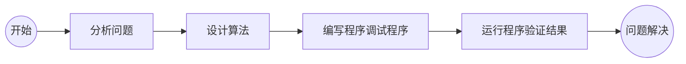

**例1 输入一个元的半径，输出该圆的周长和面积。**

> 步骤1： 分析问题<br>

> 步骤2： 设计算法<br>

> 步骤3： 编写和调试程序<br>

> 步骤4： 运行程序验证结果<br>


### 实践巩固
<P>
1. 以下编程语言中，面向对象的是（）。 <br>
A. QBasic B. ASM C. Smalltalk D.FORTRAN 
<P>
2.下列不属于面向对象程序设计语言的是（）。 <br>
A. C  B. C++  C. Java  D. C#
<p>
3. 下列表达的算法能在计算机中执行的是（）。 <br>
A. 流程图  B. N-S 结构图 C.  程序  D. 自然语言  E. 伪代码
<p>
4. 计算机界最高奖是（）。 <br>
A. 菲尔兹奖  B. 诺贝尔奖  C. 图灵奖  D. 普利策奖
<p>
5. 目前计算机芯片（集成电路）制造的主要原料是（），他是一种可以在沙子中提炼出的物质。 <br>
A. 硅  B. 铜  C. 锗 D. 铝 E. 锡
<p>
6. 计算机最早的应用领域是（）。 <br>
A. 数值计算  B. 人工智能  C. 机器人  D. 过程控制  E. 文字处理
<p>
7. 计算机病毒是认为制造的能沟侵入计算机系统并给计算机带来故障的程序或指令集合，其产然的必要条件是（）。 <br>
A. 在内存中运行病毒程序  B. 对磁盘进行读写操作  C. 在内存总运行含有病毒的可执行程序  D. 复制文件
<p>
8. 下列科学家中被称为“计算机之父”和“博弈论之父”的是（）。 <br>
A. 艾伦-麦西森-图灵（Alan Mathison Turing） B. 约翰-冯-诺伊曼（John von Neumann） C. 艾兹格-迪克斯彻（Edsger Wybe Dijkstra） D. 唐纳德-克努特（Donald Ervin Knuth）
E. 尼古拉斯-沃斯（Niklaus Wirth）
<p>
9. 第一个给计算机写程序的人是（）。 <br>
A. Alan Mathison Turing  B. Ada Lovelace  C. John vom Neumann D. John McCarthy E. Edsger Wybe Dijkstra
<p>

## 第四课 算法及其描述

### 学习目标

1. 理解算法的概念及其特征
2. 学会使用自然语言，流程图描述算法
3. 了解算法的三种基本结构，并尝试用流程图描述

>  算法概念

所谓算法就是解决一个实际问题的方法和具体步骤。算法是程序设计的灵魂，世界著名计算机科学家N.Wirth指出：程序=算法+数据结构。
<p>

>  算法特征

- 可行性

算法中的每一个操作都应该是计算机可以执行的。程序设计语言就是有一些基本操作（命令）和运算组成的，如输入操作（cin）、赋值运算（=）等。

- 确定性

算法中的每一步都必须有确切的含义，不能有二义性。如“增加X的值”，并没有说明增加多少，计算机无法执行。

- 有穷性

一个算法必须在执行有限次运算或操作后结束。

- 输入

算法执行前一般会有若干输入，但有时也可以没有输入。

- 输出

算法执行完毕，至少要有一个输出，几次判断算法的正确性。

>  算法描述

- 自然语言

就是日常使用的语言。用自然语言描述算法虽然比较自然和容易接受，但叙述繁琐冗长，荣日出现二义性。

- 流程图

使用一组几何图形表示计算机中各种类型的操作，在图形上用扼要的文字和符号表示具体的操作，并用带有箭头的流程线表示操作的先后顺序。用流程图描述算法，能够将解决问题的步骤清晰、直观的表示出来。

- N-S图【纳西-施奈德曼图（Nassi–Shneiderman diagram，NSD），简称NS图或盒图】

- 伪代码

>  算法的基本结构

任何一个算法都是可以表示三种基本结构：顺序结构、分支结构、循环结构。

- 顺序结构

顺序结构是一种最简单、最基本的控制结构。计算机从前往后，依次执行所有的操作步骤，不遗漏、不重复。

**例1 给变量x，y分别赋值，再交换x和y的值，最后重新输出x和y的值。**

**【问题分析】

算法已经很清楚，可以用自然语言描述如下：

1. 给x和y赋值；
2. 定义一个临时的变量m，将x中的数据赋值给m;
3. 将y中的数据赋值给x；
4. 将m中的数据复制给y；
5. 输出x和y的值。

流程图如下：

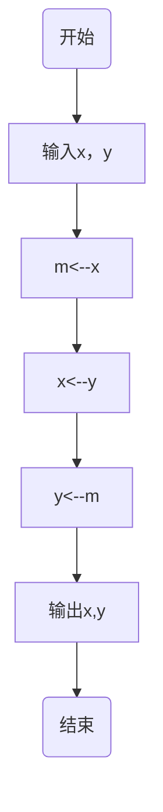

- 分支结构

分支结构有一个“判断条件”和两个“分支”构成，根据判断条件的成立与否，决定执行哪一条分支路径。如下图：

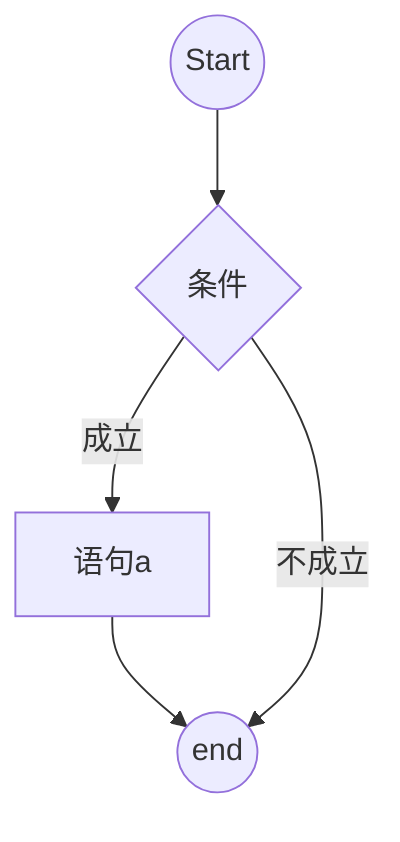

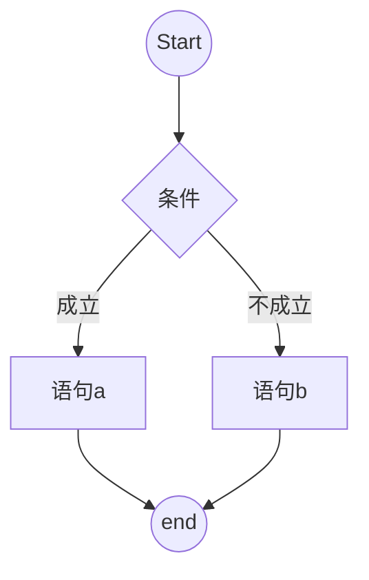

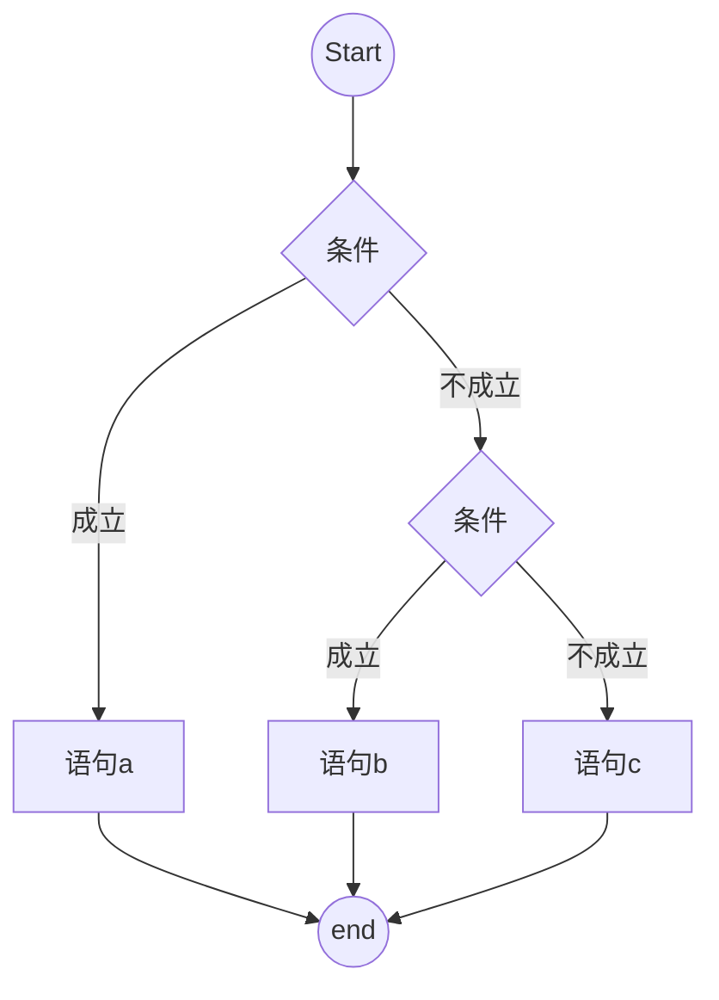

**例2 输入两个数，输出较大的一个。**

设置一个变量max，用存放较大数。输入a，b两个数后，将a与b进行比较，八角大的那个变量赋值max，最后输出max的值。

用自然语言描述如下：

	1) 输入a，b的值；
	2) 如果a>b，那么max赋值为a，否则max赋值为b；
	3) 输出max值。

流程图如下：

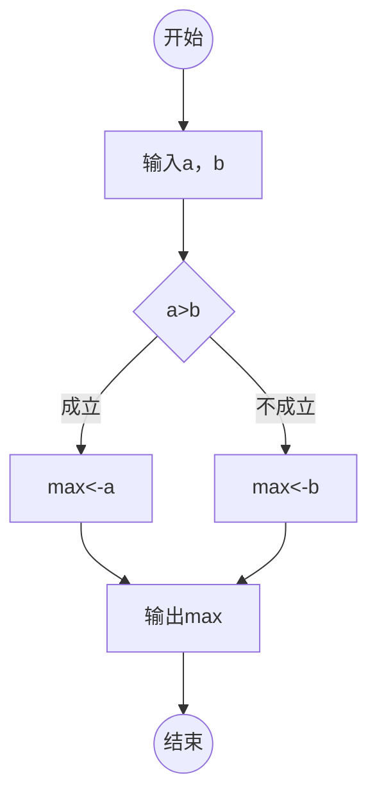

- 循环结构

循环结构又称重复结构，目的是将某一条或某一组语句重复执行若干次，其中的“某一条或某一组语句”称为循环体。循环结构一般有两种类型，一种是“当型”循环，是先判断条件是否成立，如果成立再执行循环体；另一种是“直到型”循环，先执行循环体，在判断条件是否成立，如果成立再执行循环体。其中“条件”称为循环控制条件。

流程图如下：

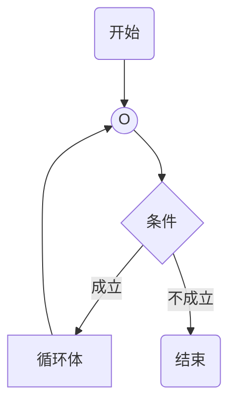

或

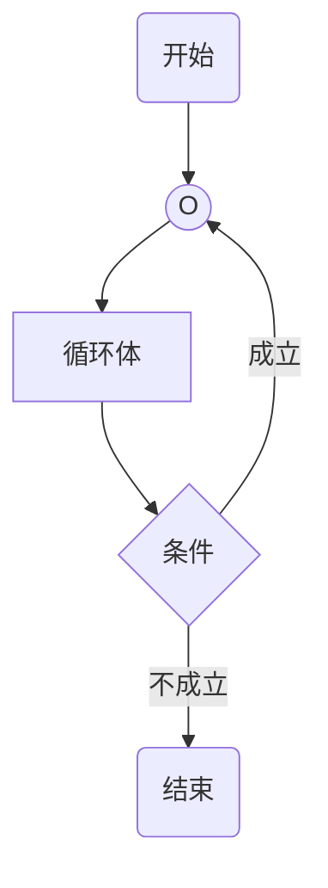

**例3 求1+2+3+4+～+100的值。**

流程图如下：

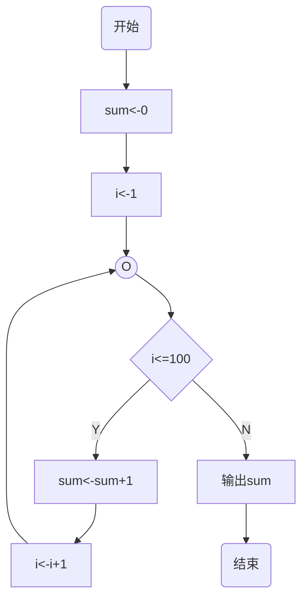

### 实践巩固

1. 已知梯形的上底a，下底b和高h，求梯形面积。请用自然语言和流程图分别描述求解算法。

2. 输入a，b，c三个整数，输出他们当中最大数。请用自然语言和流程图分别描述求解算法。

3. 输入m，n两个自然数，输出他们的最大公约数。请用自然语言和流程图分别描述求解算法。

4. 输入一个自然数n，判断他是否为素数（质数）。请用自然语言和流程图分别描述求解算法。

## 第五课 程序的基本结构

### 学习目标

1. 了解C++程序的基本结构。

2. 知晓标识符，关键字等基本概念。

**例题 输入a和b两个整数的值，输出表达式3a-2b+1的值。**

> **问题分析**

> 【示例程序】

```
#include<iostream>			//头文件
using namespace std;			//名字空间
int main(){				/* 主函数。。。*/
    int a,b,c;				//语句=标识符+变量标识符
    cin>>a>>b;				//。。。
    c=3*a-2*b+1;			//。。。
    cout<<c<<endl;			//。。。
    return 0;				//。。。
}					//。。。
```

> 【输入】

```
8 6
```

> 【输出】

```
13
```

* 头文件

语句`#include<iostream>`指示编译器对程序进行预处理时，嵌入一个名为 **iostream** 的C++标准头文件，此文件包含输入输出的相关信息，是变成的必写语句。<br>
头文件是C++程序对其他程序的引用，包括功能函数，数据接口声明的载体文件等。**include** 就是包括的意思，格式为 **#include<引用文件名>**。

* 名字空间

语句`using namespace std;`指定名字空间为 **std**。 **std** 是标准（standard）的意思。如果没有这个语句，那么下面程序中的语句`cout<<c<<endl;`就要改写成`std::cout<<c<<std::endl;`。<br>
C++ 提供的名字空间技术可以有效防止变量，函数，类同名问题。C++标准库中的所有组件都是在 **std** 名字空间中生命和定义的，也是编程的必写语句。

* 主函数

在C++程序中必须有且只能有一个名为 **main** 的函数，成为 **主函数**。函数是C++程序中的最小功能单位，函数体用一对大括号括住，`int`表示函数的返回值类型。main函数中必须要有一个语句`return 0;`，比赛哦是函数的返回值为0,目的是告诉操作系统程序正常结束并退出，是编程比赛的必写语句。

* 语句

程序是通过各种命令语句的有机组合完成一定功能的，每个语句都以`；`结尾。`int a, b,c;` 表示定义3个整形变量a，b和c。`cin>>a>>b;` 表示从键盘依次读入两个数给变量a和变量b。`c=3*a-2*b+1;`是赋值语句，表示先根据a和b的值计算出右边表达式的结果，然后再赋值给变量c， **=** 称为赋值号。`cout<<c<<endl;` 表示在屏幕上输出变量c的值并换行。<br>

* 注释

`//`后面或者`/*`到`*/`中间的语句表示注释，是为了增加程序的可读性，实际编译运行是是被编译器忽略的。

* 标识符

程序中的变量名`a` `b` `c`等称为标识符。标识符用来表示一个对象的名字。C++中的标识符由大小写字母，数字和下划线构成，中间不能有空格，长度不限，不能以数字开头。标识符是严格区分大小写的，a与A是不同的两个标识符。例如，`sum`,`average`,`Day`,`a1`,`_num`,`num_of_stu`都是合法的标识符，而 `Mr.Wang`,`234NUM`,`#34`,`a>=b`,`int`,`￥1234`都是不合法的标识符。

* 关键字

程序中的`int`,`return` 称为关键字。C++中预留了一些单词，这些单词具有特定的含义，不能被用来作为标识符，成为关键字或保留字。C++的常用关键字如下：

|  | C++|常|用|关|键|字|表 | | | 
| ---- | ---- | ---- | ---- | ---- | ---- | ---- | ---- | ---- | ---- | 
| asm | do | if | return | typedef | auto |double|inline|short|typeid|
|bool|dymamic_cast|int|signed|typename|break|else|long|sizeof|union|
|case|enum|mutable|static|unsigned|catch|explicit|namespace|static_cast|using|
|char|export|new|struct|virtual|class|extern|operator|switch|void|
|const|false|private|template|volatile|const_cast|float|protected|this|wchar_t|
|continue|for|public|throw|while|default|friend|register|true|delete|
|goto|reinterpret_cast|try||||||

### 实践巩固

1. 下列字符串中为合法标识符的是（）。 <br>
A. int  B. a(x)  C. _la  D. a+b

2. 阅读程序，写出程序的运行结果。（NOIP2014普及组初赛）

```
#include<iostream>
using namespace std;
int main(){
    int a,b,c,d,ans;
    cin>>a>>b>>c;
    d=a-b;
    a=d+c;
    ans=a*b;
    cout<<"Ans"<<ans<<endl;
    return 0;
}
```

键盘输入“ 2 3 4”，则屏幕输出（）。<br>
A. Ans=8  B. Ans=9   C. 9   D. 12

## 第六课 集成开发环境

### 学习目标

1. 学会一些IDE的安装，熟悉其集成开发环境【Windows/Linux环境】。<br>
Windows：VSCode，Dev-C++等<br>
Linux: Vim等

2. 学会编辑，保存，打开，编译，运行，调试C++程序【Windows/Linux环境】。<br>
Windows: 集成工具的使用<br>
Linux： gcc/g++ 命令的使用

### 简单介绍

1. 安装

2. 编辑程序

3. 保存程序

4. 打开程序

5. 编译程序

6. 运行程序

7. 调试程序

### 实践巩固

1. 下列关于计算机语言的说法中正确的是（）。<br>
A. C++和QBasic 都是编译执行的高级语言<br>
B. 高级语言程序比汇编语言程序更容易从一种计算机移植到另一台计算机上<br>
C. C++是历史上的第一个支持面向对象的计算机语言<br>
D. 高级语言比汇编语言更高级，是因为其他程序的运行效率高

2. 下列关于程序语言的叙述中不正确的是（）。<br>
A. 编写机器代码不比编写汇编代码容易<br>
B. 高级语言需要编译成目标代码或通过解释器解释后才能被CPU执行<br>
C. 同样一段高级语言程序通过不同的编译器可能产生不同的可执行程序<br>
D. 汇编代码可被CPU直接运行<br>
E. 不同的高级语言语法略有不同

3. 下列关于汇编语言的说法中错误的是（）。<br>
A. 汇编语言是一种与具体硬件相关的程序设计语言<br>
B. 在编写复杂程序时，相对于高级语言而言，汇编语言代码量较大，且不易调试<br>
C. 汇编语言可以直接访问寄存器，内存单元，以及I/O端口<br>
D. 随着高级语言的诞生，汇编语言如今已完全被淘汰，不再使用

# 第二单元 顺序结构程序设计

## 第一课 cout语句

### 学习目标

1. 理解C++中的标准输出流。

2. 掌握C++中cout语句的使用。

### 学习内容

在C++中，所有的数据输入，输出都是以“流（stream）”的形式。流是一个处于传输状态的字节序列，是字节在对象之间的“流动”。流的操作包括输入与输出。输出操作是从内存输出到外部设备，如显示器，打印机，磁盘，网络连接等，是字节从内存到外部设备的流动。<br>
使用输入/输出流，必须加上头文件：`#include<iostream>`。<br>
cout 语句是C++中实现输出共能的语句，其格式如下：<br>

```
cout<<项目1<<项目2<<...<<项目n；
```

如果项目是表达式，则输出表达式的值，如果项目加引号，则输出引号内的内容，如果项目是`endl`，则表示换行。

#### 例1 阅读并上机调试以下程序，体会cout语句的使用。

```
#include<iostream>
using namespace std;
int main(){
    cout<<2+4<<endl;
    cout<<"ABCD"<<endl;
    int a=10,b=5;
    cout<<a+b<<endl;
    return 0;
}
```

#### 例2 阅读并上机调试以下程序，观察程序运行的结果。

```
#include<bits/stdc++.h>
#include<iostream>
using namespace std;
int main(){
    cout<<"   *\n";
    cout<<"  ***\n";
    cout<<" *****\n";
    cout<<"*******\n";
    cout<<"    ***\n";
    cout<<"    ***\n";
    cout<<"    ***\n";
    cout<<"    ***\n";
    cout<<"    ***\n";
    return 0;
}
```

#### 例3 已知梯形的d上底长为15,下底长为20,高为12,编程输出该梯形的面积。

> 问题分析
>> 根据梯形面积公式直接计算并输出结果。

```
#include<iostream>
using namespace std;
int main(){
    int a,b,h,s;
    a=15;b=20;h=12;
    s=(a+b)*h/2;
    cout<<s<<endl;
    return 0;
}
```

### 实践巩固

1. 阅读程序，写出程序的运行结果。

```
#include<iostream>
using namespace std;
int main(){
    int a,b,c,d,ans;
    a=2;b=3;c=4;
    d=a-b;
    a=d+c;
    ans=a*b;
    cout<<"Ans="<<ans<<endl;
    return 0;
}
```

2. 阅读并上机调试程序，体会史书的输出格式（小数点）。

```
#include<iostream>
#include<iomanip>
using namespace std;
int main(){
    cout<<10.0/6.0<<endl;
    cout<<fixed<<setprecision(8)<<10.0/6.0<<endl;
    return 0;
}
```

3. 阅读并上机调试程序，体会把证书以不同进制的形式输出。

```
#include<iostream>
#include<iomanip>
using namespace std;
int main(){
    int a;
    cin>>a;
    cout<<"dec:"<<dec<<a<<endl;
    cout<<"hex:"<<hex<<a<<endl;
    cout<<"oct:"<<setbase(8)<<a<<endl;
    return 0;
}
```

## 第二课 数据类型

### 学习目标

1. 熟知C++中的常用数据类型。

2. 学会根据具体需求使用不同的数据类型。

### 知识点

计算机最早的应用就是数学计算，计算就会设计数据和数据类型。数据有数据类型，取值范围，晕眩类型三个要素。<br>
在C++程序中，使用各种变量都应 **”先声明，后使用“**。变量声明就会设计数据类型，初始值和作用域等。各种数据类型的字节长度（数），取值范围是不同的。<br>
C++中的主要数据类型包括整型，布尔型，字符型和实型（浮点型）。<br>

|类型|具体类型|字节长度|取值范围|
|----|----|----|----|
|整型|int|4（32位）|-2147483648~2147483647|
||short|2（16位）|-32768~32767|
||long|4（32位）|-2147483648~2147483647|
||long long| 8（64位）|-2<sup>63</sup>~2<sup>63</sup>-1|
|布尔型|bool|1（8位）|0或1|
|字符型|char|1（8位）|-128～127|
|实型（浮点型）|float|4（32位）|-3.4E+38-3.4E+38,6-7位有效数字|
||double|8（64位）|-1.79E+308-1.79E+308,15-16位有效数字|
||long double|不确定（与编译器有关）|-1.2E+4932-1.2E+4932,18-19位有效数字|
|无符号类型|||正数和0|

> 例1 阅读并上机调试以下程序，观察运行结果。

```
#include<iostream>
using namespace std;
int main(){
    int a,b,c;
    double d,e;
    a=5;b=6;
    d=2.53;
    c=a+b;
    e=c+d;
    cout<<a<<"+"<<b<<"="<<c<<endl;
    cout<<c<<"+"<<d<<"="<<e<<endl;
    return 0;
}
```
>> 分析

**整型数据和实型数据进行混合运算得到的结果是实型数据。**

> 例2 阅读并上级调试以下程序，观察运行结果，体会int类型数据范围。

```
#include<iostream>
using namespce std;
int main(){
    int a=2147483647;
    a=a+1;
    cout<<"a="<<a<<endl;
    return 0;
}
```
>> 分析

运行程序，输出 “a=-2147483648”。<br>
结果超出了int类型的数据范围，这种情况称之为 **”数据溢出“** 。C++程序中出现这类错误时，编译和运行过程中不会报错。所以需要特别留意，注意范围检查。

> 例3 阅读并上机调试以下程序，观察运行结果。

```
#include<iostream>
using namespace std;
int main(){
    int b=0,a=100;
    char ch='A';
    b=a+ch;
    cout<<ch<<" "<<int(ch)<<" "<<b<<endl;
    return 0;
}
```
>> 分析

输出结果： “A 65 165”<br>
程序中定义了2个整型变量和1个字符型变量，并进行了初始化。在C++中，字符型数据可以直接参与整型或者实型数据的运算，按照ASCII码值使用。  `int(ch)` 表示把ch字符型强制转换成int类型。

> 例4 阅读并上机调试以下程序，体会sizeof函数的使用。

```
#include<iostream>
using namespce std;
int main(){
    cout<<sizeof(char)<<" ";
    cout<<sizeof(int)<<" ";
    cout<<sizeof(unsigned int)<<" ";
    cout<<sizeof(long int)<<" ";
    cout<<sizeof(short int)<<" ";
    cout<<sizeof(float)<<" ";
    cout<<sizeof(double)<<endl;
    return 0;
}
```

>> 分析

输出结果： 1 4 4 4 2 4 8 <br>
`sizeof ` 函数的作用是获取各种数据类型的长度。

### 实践巩固

1. 已知直角三角形的两条边长度，编程求它的面积。

2. 一直一个普通三角形的三条边长，编程求它的面积。

3. 小名初一了，今年收到1000元压岁钱。他决定存到银行3年，等到高一时在作其他投资。不过他不想存3年定期，而是每次存1年，到期把本金和利息再全部存1年。已知1年期的利率是4.53%。编程求3年后他可以拿到手多少元钱，输出精确到分。

## 第三课 常量与变量

### 学习目标

1. 区分C++中的常量与变量。

2. 学会常量和变量的定义使用。

### 知识点

在程序中参与运算的量分为 **常量** 和 **变量**。<br>
例如：语句 `int a,b,h,s;s=(a+b)*h/2;` 中，2是常量，而a,b,h,s是变量。

> 常量

常量是在程序运行过程中其值保持不变的量。常量也有不同的类型。C++中定义一个符号常量的格式如下：<br>
`类型名 const 变量名 ;` <br>
或<br>
`const 类型名 变量名；`<br>

例如：

```
int const A=100;
const float PI=3.1415926;
```

使用符号常量是为了方便程序的修改，增强程序的可读性，为了更清晰的区别常量和变量，常量名通常全用大写字母表示。

> 变量

变量是指在程序运行过程中，其值可以改变的量。C++中定义一个变量的格式如下：

`类型名  变量名1,变量名2,...,变量名n；`

例如：

```
int sum,total;
double area;
```

>> 变量名

程序中的常量名，变量名，函数名等都称之为“标识符”。C++中的标识符命名规则如下：

- 标识符不能和系统里的**关键字**同名。

- 标识符只能包括 **字母**，**数字**，**下划线** ，并且以字母或下划线开头。

- 标识符必须先定义，后使用。

- 在同一作用域内，标识符不能重复定义。

- 标识符是区分大小写的。

- 标识符要尽量做到“见名知义”，增强程序的可读性。

**例1 找出符合C++规则的标识符。**

Mr.Wang sum Day school_name a>=b ￥1234 lotus_1_2 sum123_ _day 234NUM #34 int

>> 变量的初始化

变量在定义的同时，可以给他制定一个初始值，成为变量的初始化。例如：<br>

```
int a=3,b=4,c=5;
float s=2.5;
```

>> 变量的赋值

在C++中可以通过“赋值”语句来修改变量的值，赋值语句的格式如下：

```
变量名 = 值或者表达式；
```
其中， “=”称为“赋值号”，赋值号右边如果是表达式，则系统会先计算出表达式的值，再赋值给左边的变量。例如：

```
int a=3,b=4;
a=5;
b=a*2+1;
```

**例2 阅读并上机调试以下程序，观察运行结果，体会变量的含义。**<br>

```
#include<iostream>
using namespace std;
int main(){
    int a;
    a=3;
    cout<<a<<endl;
    a=10;
    cout<<a<<endl;
    a=a*5;
    cout<<a<<endl;
    return 0;
}
```

### 实践巩固

1. 下列为合法的标识符的是（）。<br>
A. a12345   B. 1_b   C. 3x    D. h(x)

2. 阅读程序，写出程序的运行结果。

```
#include<iostream>
using namespace std;
int a,b,c,ans=100;
int main(){
    a=1,b=2,c=5;
    a=a+b;
    b=a+b+c;
    ans=ans+a+b+c;
    cout<<ans<<endl;
    return 0;
}
```

3. 阅读并上机调试以下程序，比较 `#define` 与 `const` 的区别。

```
#include<iostream>
using namespace std;
#define PI 3.14159		//const double PI=3.14159;
int main(){
    double square=0,volume=0,radius=0;
    cin>>radius;
    square=4*3.14159*radius*radius;
    volume=4.3.14159*radius*radius*radius/3;
    cout<<"square"<<square<<"volume"<<volume<<endl;
    return 0;
}
```
**#define（宏常量）与const的比较：**
* const常量有数据类型，而宏常量没有数据类型。<br>
编译器对前者进行**类型安全检查**，对后者值进行**字符替换**，没有类型安全检查，并且在字符替换时可能会产生意料不到的错误（边际效应）。
* 有些集成化的调试工具可以对const常量进行调试，但是不能对宏常量进行调试。

## 第四课 字符与字符串

### 学习目标

1. 体会字符型变量的使用。

2. 体会字符串的含义和简单使用。

3. 理解转义字符的含义和使用。

### 知识点

存放但个字符的变量称为字符变量。字符变量的值用一对单引号括起来的一个字符。<br>
存放一串若干字符的变量称为字符串变量。字符串变量的值用一对双引号括起来的字符序列。如果双引号内什么都没有，称为空字符串，与双引号内有一个空格的字符串是不一样的。

> 字符变量

定义字符变量的格式如下<br>
`char 标识符1,标识符2,...,标识符n;`

例如：<br>
```
char c1,c2,ch='#';
c1='a';c2='9';
```
字符变量在内存中占用1个字节。在C++中，字符数据在内存中实际存储的是ASCII码值。例如，字符0的ASCII码值位(48)<sub>10</sub>，字符A的ASCII码值位(65)<sub>10</sub>，字符a的ASCII码值位(97)<sub>10</sub>，而且可以输出字符形式，也可以输出整数形式，甚至还可以进行算术运算。

**例1 阅读并上机调试以下程序，观察运行结果，体会字符变量的输入与输出。**

```
#include<iostream>
using namespace std;

int main(){
    char c1,c2,c3;
    c1=48;c2=65;c3=97;
    cout<<c1<<" "<<c2<< " "<<c3<<" ";
    cout<<int(c1)<< " "<<int(c2)<<" "<<int(c3)<<endl;
    return 0;
}
```

**【分析】**

运行程序输出：
```
0 A a 48 65 97
```

**例2 阅读并上机调试以下程序，观察运行结果，体会字符变量的运算。**
```
#include<iostream>
using namespace std;
int main(){
    char c1,c2,c3;
    c1='a';c2='Z';
    c1=c1-32;
    c2=c2+32;
    c3='0'+9;
    cout<<c1<<" "<<c2<<" "c3<<endl;
    return 0;
}
```
**【分析】**

运行程序输出：
```
A z 9
```

> 转义字符

C++中定义了一些字符前加"\"的特殊字符，称为转义字符。常见的转义字符见下表。<br>
在C++中，但个字符的输入、输出也可以通过字符输入、输出函数进行。<br>
字符输入函数：`getchar(输入字符),表示从终端输入1个字符。<br>
自付输出函数：`putchar(输出字符)，表示向终端输出1个字符。<br>

|字符形式|含义|ASCII码值（十进制）|
|----|----|----|
|\n|换行|10|
| \ \ |反斜杠字符\ |92|
|\ '|单撇号字符‘|39|
|\ "|双撇号字符"|34|
|\0|空操作字符|0|

**例3 阅读并上机调试以下程序，观察运行结果，体会 `getchar` 和 `putchar` 函数的使用方式。
```
#include<cstdio>
using namespace std;
int main(){
    char a='A';
    putchar(a);
    putchar('\\');
    putchar('\n');
    char c;
    c=getchar();
    putchar(c+1);
    return 0;
}
```

> 字符串变量

在C++中可以用字符数组`char s[]‵ 存放字符串，也可以用STL中的`string`类型，例如：
```
string s="1234 asdf";
```
每个字符串的结尾都要加一个”字符串结束标志“，而且是系统自动添加上去的，C++规定以转义字符”\0“作为字符串结束标志，所以字符串”hello“在计算机中占用6字节，如下所示：<br>

|h|e|l|l|o|\ 0|

所以，‘a’是不等于"a"的。`getchar` 和 `putchar` 是输入、输出一个字符，如果要输出一个字符串，可以用字符串输入、输出函数`gets` 和 `puts`。

**例4 阅读并上机调试以下程序，观察运行结果，体会 gets 和 puts 的使用方式。**

```
#include<cstdio>
using namespace std;
char s[20];
int main(){
    gets(s);
    puts(s);
    return 0;
}
```
**【分析】**

运行程序，若输入“abcd 123”，则输出：
```
abcd 123
```
### 实践巩固

1. 阅读程序，写出程序运行结果。

```
#include<iostream>
using namespace std;
int main(){
    char i,j;
    i='c';
    j='d';
    i=i-32;
    j=j-32;
    cout<<i<<' '<<j<<endl;
    return 0;
}
```
2. 远古时代，魔法师之间的通信曾经使用过这样一种加密术：对于信中的每个字母，会用ASCII码表中它后便的第t个字母代替。例如当t=4时，“China”加密的规则是用原来字母后面第4个字母代替原来的字母，如字母“A”后面第4个字母是“E”，则用“E”代替“A”。因此“China”应该译为“Glmre”。清编写一个程序输入任意一个字符，加密后输出。

3. 读入一个字符串，长度不小于3。要求把前三位的字符全改称“a”，然后在输出改完后的字符串。

## 第五课 算术运算符

### 学习目标

1. 熟知算术运算符

2. 熟练掌握算术表达式的书写。

3. 了解一些常用的数学函数。

### 知识点

C++中的常用算术运算符有 `+  -  *  / %  () `，具体见下表：

|运算符|含义|说明|举例|
|----|----|----|----|
| + | 加法 | 加法运算 | 1+2=3,1.5+2=3.5 |
| - | 减法 | 减法运算| 5-4=1,5.12-8=-2.88|
| * | 乘法 | 乘法运算 | 4 * 5=20,0.125 * 8=1.0|
| / | 除法 | 除法运算 | 6/5=1,5/2.0=2.5|
| % | 模（取余） | 取余运算| 7%5=2,-7%5=-2,-7%-5=-2|
| () | 括号 | 改变运算的顺序 | 2*(5+1)=12,100/(8*2)=6|

将常量、变量、算术运算符、括号以及函数连接在一起的计算式，称为算术表达式。当一个算术表达式中包含多个运算符时，遵循的计算顺序（运算优先级）为：先括号里的，再算乘法、除法、模，最后算加法、减法，同一级别的按照类型从左往右依次计算。表达式的计算结果称为表达式的值。

> 例1 输入长方形的长和宽（整形数据），计算并输出长方形的周长和面积。例如，输入“8 3”，输出“22 24”。

```
#include<iostream>
using namespace std;

int main(){
    int a,b,c,s;
    c=2*(a+b);
    s=a*b;
    cout<<c<<" "<<s<<endl;
    return 0;
}
```
> 例2 求任意一个三位数的三个数字字和。例如，输入“897”，输出“24”。

```
#include<iostream>
using namespace std;

int main(){
    int n,a,b,c;
    cin>>n;
    a=n%10;
    b=n/10%10;
    c=n/100;
    cout<<a+b+c<<endl;
    return 0;
}
```
C++还提供了一些简单的数学函数，方便计算。常用的数学函数如下表：

|函数格式|含义|举例|
|----|----|----|
|int abs(int i)| 返回整形参数i的绝对值|abs(-5)=5|
|double fabs(double x)|返回双精度参数x的绝对值|fabs(-2.5)=2.5|
|double ceil(double x) |返回不小于x的最小整数（上取整）|ceil(2.5)=3.0,ceil(-2.5)=-2.0|
|double floor(double x)|返回不大于x的最大整数（下取整）|floor(2.5)=2.0,floor(-2.5)=-3.0|
|double pow(double x,double y)|返回x的y次幂的值|pow(2,3)=8|
|double sqrt(double x)|返回x的平方根|sqrt(9)=3|
|double log(double x)|返回ln(x)的值（以e为底）|log(2.71)=1|
|double log10(double x) | 返回lg(x)的值（以10为底）|log10（100）=2|

**但是，在使用这些数学函数前，必须添加`cmath`或者`math.h`头文件。**

> 例3 在一个直角坐标系中存在两个点。输入两个点的坐标（整数），输出他们连城的线段长度。例如，输入“ 39 22 11 5” ，输出“32.7567“。

```
#include<iostream>
#include<cmath>
using namespace std;
int main(){
    double x1,y1,x2,y2;
    cin>>x1>>y1>>x2>>y2;
    cout<<sqrt(pow(x1-x2,2)+pow(y1-y2,2));
    return 0;
}
```

### 实践巩固
1. 计算以下表达式的值。

   （1） 17/3=		
   （2） 18.0/4=
   （3） 4567%1000=
   （4） 17%3=
   （5） -17%4=
   （6） 4567%100=   

2. 当a=2、b=3、c=4时，求以下算术表达式的值。

   （1） a * b+c
   （2） a * (b+c)
   （3） (1+b) * c
   （4） a * a * b * b

3. 阅读程序，写出程序的运行结果。

```
#include<iostream>
#include<cmath>
int main(){
    cout<<ceil(-5.01)<<endl;
    cout<<floor(-5.99)<<endl;
    cout<<pow(3.5,2.0)<<endl;
    cout<<pow(-5,3)<<endl;
    cout<<sqrt(100.0)<<endl;
    return 0;
}
```

4. 超市里有香蕉、苹果、葡萄三种水果，单价分别为5元/斤、8元/斤、12元/斤，计算并输出三种水果的平均价格（实型）。如果只有39元，并且只能购买某一种水果整数斤，请计算并输出可以分别买几斤、各剩余多少钱。

5. 小林同学在操场跑步，他共跑了x秒，清编程将其拆解为小时、分钟、秒输出。例如，输入”1245“，输出“0 20 45”。

6. 输入一个四位数，将这个数的各位数字倒序合成一个新数，输出原数和新数的差。例如，输入”4321“，输出“3087”。

## 第六课 cin语句

### 学习目标

1. 掌握cin语句的格式和应用。

### 知识点

cin是C++中实现输入功能的语句，其格式一般为：

```
cin>>项目1>>项目2>>...>>项目n；
```

在使用cin语句从键盘输入多个数据项的时候，一定要注意三个一致：<br>
* 数据个数一致
* 输入顺序一致
* 数据类型一致

> 例1 阅读下列程序，体会cin语句的使用。

```
#include<iostream>
using namespace std;
int main(){
    int a,b,c;
    cin>>a>>b>>c;
    char d,e;
    cin>>d>>e;
    float f;
    cin>>f;
    cout<<"a="<<a<< " b="<<b<<" c="<<c<<endl;
    cout<< "d="<<d<<" e="<<e<< " f="<<f<<endl;
    return 0;
}
```
>> 【问题分析】
运行程序，输入：
```
1 23 456 A # 789.012
```
则输出：
```
a=1 b=23 c=456
d=A e=# f=789.012
```
> 例2 编程从键盘输入一个小写字母，将它转换成大写字母输出。
>> 【问题分析】
```
#include<iostream>
using namespace std;
int main(){
    char ch1,ch2;
    cin>>ch1;
    ch2=ch1-32;
    cout<<ch2<<endl;
    //cout<<ch1-32<<endl;
    return 0;
}
```
> 例3 从键盘输入一个梯形的上底、下底和高（整形数据），输出该梯形的面积（保留小数点后2位）。例如，输入“5 8 7”，则输出“45.50”。
>> 【问题分析】
```
#include<iostream>
#include<iomanip>
using namespace std;
int main(){
    int a,b,h;
    float area;
    cin>>a>>b>>h;
    area=(a+b)*h/2.0;
    cout<<setprecision(2)<<fixed<<area<<endl;
    return 0;
}
```

### 实践巩固

1. 编程从键盘输入5位同学的成绩（整形数据），输出他们的平均分，保留小数点后1位。例如，输入“94 99 100 100 97”，则输出“98.0”。

2. 小名从零花钱中那了n张10元的纸币去文具店买铅笔，铅笔每支0.45元。请问：他最多能买多少支铅笔，还剩下多少钱？例如，输入n的值为4,则输出“buy=88 left=0.4”。

## 第七课 赋值语句

### 学习目标

1. 掌握赋值语句的使用方法。

### 知识点

在C++中，可以通过“赋值语句”来修改变量的值。赋值语句的格式如下：

```
变量名=值或表达式；
```
其中，“=”称为“赋值号”。例如，`int a,b;a=12;b=a+3;`表示定义了2个整数变量a和b，给a赋值为12,给b赋值位a+3,即b=15。需要注意的是：a=b与a==b是完全不同的意义，“==”是关系运算符。

> 例1 阅读程序，写出程序运行结果。

```
#include<iostream>
using namespace std;
int main(){
    int a,b,s,d;
    bool l,e;
    a=3;
    b=3;
    s=a+b;
    d=a/b;
    l=a<b;
    e=a==b;
    cout<<s<<' '<<d<<' '<<l<<' '<<e<<endl;
    return 0;
}
```
>> 【问题分析】

运行程序，输出：
```
6 1 0 1
```
计算是，“a<b”和“a==b”的结果分别是bool类型的值0和1。<br>

在C++中，赋值语句非常灵活，有多钟复合写法。

* 算术复合

例如，“a=a+x;“可以写成`”a+=x;”`，其他类似的还有`"a-=x;" "a*=x;" "a/=x;" "a%=x;"`等。

> 例2 阅读程序，写出程序运行结果。

```
#include<iostream>
using namespace std;
int a,b;
int main(){
    cin>>a>>b;
    a+=b;
    b-=1;
    cout<<a<<" "<<b<<endl;
    a/=2;
    b*=b;
    cout<<a<<" "<<b<<endl;
    a%=b;
    b%=10;
    cout<<a<<" "<<b<<endl;
    return 0;
}
```
>> 【问题分析】

运行程序，输入：
```
100 56
```
输出：
```
156 55
78 3025
78 5
```

* 赋值复合

C++支持在一个表达式里出现连续的赋值号，即一次给几个变量赋同一个值。此时计算顺序是从右到左，有括号存在的，先计算括号内的表达式。

> 例3 阅读程序，写出程序的运行结果。

```
#include<iostream>
using namespace std;
int a,b;
int main(){
    a=b=5;
    cout<<a<<' '<<b<<endl;
    (a=b)=10;
    cout<<a<<' '<<b<<endl;
    (a+=b)=20;
    cout<<a<<' '<<b<<endl;
    return 0;
}
```
>> 【问题分析】

运行程序，输出
```
5 5
10 5
20 5
```
* 逗号表达式

在C++中，允许用逗号连接几个表达式，构成一个更大的表达式，称为 **“逗号表达式”**。其格式如下：
```
表达式1,表达式2,...,表达式n;
```
各个表达式的计算顺序是从左到右，最终整个表达式的值是 **”表达式n“** 的值。

> 例4 阅读程序，写出程序运行结果。

```
#include<iostream>
using namespace std;
int main(){
    int j=10,k=1000;
    int i=(k+1,j+100,999+j);
    cout<<i<<endl;
    return 0;
}
```
>> 【问题分析】

运行程序输出：
```
1009
```
给i赋值的语句中赋值号右边的括号是必须要加的，因为逗号运算符的优先级低于赋值号的优先级。

### 实践巩固

1. 阅读程序写出程序的运行结果。
```
#include<iostream>
using namespace std;
int main(){
    int a,b,c,d;
    cin>>a>>b;
    a*=b;
    b--;
    (c=d=a)=b;
    d=(a++,b+10,c--);
    cout<<a<<" "<<b<<" "<<c<<" "<<d<<endl;
    return 0;
}
```
2. 输入一个不含有数字0的四位正整数a，计算并输出b、c、d的值。其中b表示把这个数倒过来，c表示把高两位和低两位交换，d表示把它的各位数求和。例如，输入“1234”，则输出“4321 3412 10”。

3. 班主任给小玉一个任务：到文具店里买尽量多的签字笔。已知一支签字笔的价格是1元9角，而班主任给小玉的钱是a元b角，0<=a<=10000,0<=b<=9。小玉想知道，他最多能买多少支签字笔。例如，输入“10 3”，输出“5”。

4. 成绩（NOIP2017普及组复赛，score，1s，256MB）

*【问题描述】

牛牛最近学习了C++入门课程，这门课程的总成绩计算方法是：总成绩=作业成绩*20%+小测成绩*30%+期末成绩*50%。牛牛想知道，这门课程自己最终能得多少分。

* 【输入格式】

输入一行包含三个非负整数A、B、C，分别表示牛牛的作业成绩、小测成绩和期末成绩。相邻两个数之间用一个空格隔开，三项成绩满分都是100分。

* 【输出格式】

输出一行一个整数，即牛牛这门课程的总成绩，满分也是100分。

* 【输入样例】

```
60 90 80
```
* 【输出样例】
```
79
```
* 【样例说明】

牛牛的作业成绩是60分，小测成绩是90分，期末成绩是80分，总成绩是：60*20%+90*30%+80*50%=12+27+40=79。

* 【数据说明】

对于30%的数据满足：A=B=0；
对于另外的30%的数据满足：A=B=100。
对于100%的数据满足：0<=A、B、C<=100 且A、B、C都是10的整数倍。


## 第八课 复合运算符

### 学习目标

1. 理解并学会使用C++中的复合运算符。

### 知识点

在C++中，符合运算符实际上是赋值语句的一种缩写形式，是的修改变量值的操作更加简洁。

> 自加运算符和自减运算符

自加运算符“++”有两种，即`i++`和`++i`。在单独使用时，其作用相同，都相当于`i=i+1`。自减运算符“--”也有两种，即`i--`和`--i`。在单独使用时，其作用相同，都相当于`i=i-1`。但是在赋值语句中使用时，两种写法结果不一样。`++i`和`--i`是在使用i前，先把i的值加1和减1；而`i++`和`i--`是在使用i后，再把i的值加1和减1。<br>
需要注意的是，`++`和`--`只能用于变量，不能出现类似于`5++`或者（a+b）++的情况。另外，在遇到多个++和--时，计算的结合方向（结合律）是按照表达式自右向左进行。例如：
```
int a,b=5;		
b++;			//b=6
++b;			//b=7
a=b++;			//a=7,b=8
a=++b;			//b=9,a=9
```
>> 例1 阅读程序，写出程序的运行结果。

```
#include<iostream>
using namespace std;
int main(){
    int =i=3,j;
    j=++i;
    cout<<j<<i<<endl;
    j=i++;
    cout<<j<<i<<endl;
    return 0;
}
```
**【问题分析】**

运行程序，输出：
```
4 4
4 5
```

>> 例2 阅读并上级调试程序,结合程序的运行结果，体会自加、自减运算符。

```
#include<iostream>
#include<cstdio>
using namespace std;

int main(){
    int a=5,b,c,i=10;
    b=a++;
    printf("no.1:a= %d,b= %d\n",a,b);
    c=++b;
    printf("no.2:a=%d,b=%d,c=%d\n",a,b,c);
    printf("no.3:i,i++,i++ =%d,%d,%d\n",i,i++,i++);
    printf("no.4:i=%d\n",++i);
    printf("no.5:i=%d\n",--i);
    printf("no.6:i=%d\n",i++);
    printf("no.7:i=%d\n",i--);
    printf("no.8:i=%d\n",-i++);
    printf("no.9:i=%d\n",-i--);
    printf("no.10:i=%d\n",i);
    getchar();
    return 0;
}
```

**【问题分析】**

运行程序输出：

```
no.1:a=6,b=5
no.2:a=6,b=6,c=6
no.3:i,i++,i++=12,11,10
no.4:i=13
no.5:i=12
no.6:i=12
no.7:i=13
no.8:i=-12
no.9:i=-13
no.10:i=12
```

> 复合算术赋值

上一课初步学习了复合算术赋值，如`+=`、`-=`、`*=`、`/=`、`%=`。对于复合算术运算符的用法以`+=`为例，`a+=b`等效于`a=a+b`。例如：
```
int a,b;
a=b=5;			//a=5,b=5
a+=b;			//a=10
a-=b;			//a=5
a*=b;			//a=25
a/=b;			//a=5
a%=b;			//a=0
```
需要注意的是，`a*=b+8`等价于`a=a*(b+8)`。复合算术赋值运算的优点时程序更精炼，编译效率高。

>> 例3 阅读程序写出程序的运行结果。

```
#include<iostream>
using namespace std;
int main(){
    int a=10,b,c,t=0,s=100;
    a+=20;
    c=b*=b=a;
    (s/=c)%=a;
    t+=(a+b)*c;
    cout<<a<<' '<<b<<' '<<c<<' '<<s<<' '<<t<<endl;
    return 0;
}
```

**【问题分析】**

运行程序，输出：

```
30 900 900 0 837000
```

### 实践巩固

1. 下列表达式中整型变量a的值均为10,且表达式互不影响，求a和b的值。

|表达式|a变量的值|表达式|a，b变量的值|
|----|----|----|----|
|++a||b=a++||
|--a||b=--a||
|a++| |b=2*a++||
|a--||b=a--*2||

2. 阅读程序，写出程序运行结果。
```
#include<iostream>
using namespace std;
int main(){
    int i=1;
    i=(++i)+(++i);
    cout<<i<<endl;
    return 0;
}
```
3. 阅读程序写出程序的运行结果。
```
#include<iostream>
using namespace std;
int main(){
    int b=13,a=10;
    (a=(b*=b))+=4;
    printf("%d %d",a,b);
    return 0;
}
```

## 第九课 运算规则

### 学习目标

1. 掌握C++的运算规则（优先级和结合性）。

2. 掌握数据类型的自动转换和强制转换。

### 知识点

在C++中，整型数据和实型数据可以混合运算，字符型数据可以和整形数据通用。因此，`13+'a'+3.14+4.5*'b'`是合法的表达式。但是再具体的计算时，编译系统会自动将不同类型的数据转换成同一类型，再进行运算，称为数据类型的“自动转换”，其转换规则如下所示：

`char->int->unsigned->long->double<-float`

例如，求抽象表达式`int+char+int*float-double/long`的值，起计算顺序如下：

* 1. 计算“*”，系统先将`int`类型的数自动转换成`float`类型，结果为`float`类型；
* 2. 计算“/”，系统先将`long`类型的数转换成`double`类型，结果为`double`类型；
* 3. 计算最左边的“+”，系统先将`char`类型的数据转换成`int`类型，结果为`int`类型；
* 4. 计算第2个“+”，系统先将`int`类型的数转换成`double`类型结果为`double`类型；
* 5. 计算“-”，两个`double`类型的数据相减，结果为`double`类型。

C++语言还规定了运算符的优先级和结合性。在表达式求值时，先按运算符的优先级别高低依次序执行，例如先乘除后加减。如果一个运算对象两侧的运算符的优先级别相同，如`a-b+c`，则按规定的“结合方向”处理。算术运算符的结合方向为“先左后右”，又称之为“左结合性”。有些运算符的结合方向为“自右向左”，即右结合性，例如赋值运算符。部分运算符的优先级和结合性见下表：

|优先级|运算符|结合性||优先级|运算符|结合性|
|----|----|----|-|----|----|----|
|1|( )  [ ]|从左往右||8|&（按位与）|从左往右|
|2|! +(正) -(负) ~ ++ --|从右往左||9|^|从左往右|
|3| * / %|从左往右||10|\||从左往右|
|4|+(加) -(减)|从左往右||11|&&|从左往右|
|5|<< >> >>>|从左往右||12|\|\||从左往右|
|6|< <= > >= instanceof|从左往右||13|?:|从右往左|
|7|== != |从左到右||14|= += -= *= /= %= &=  \|= ^= ~= <<= >>= >>>=|从右往左|

在赋值运算中，赋值号两边的数据的类型不同时，赋值号右边量或者表达是值的类型将自动转换为左边量的类型。如果右侧数据类型长度比左边长，将丢失一部分数据，这样会降低精度，丢失的副分按照四舍五入的规则向前舍入。<br>
在C++中，除了“自动转换”外，还可以“强制类型转换”。格式为：

```
(类型名)(表达式);
(类型名)变量;
```
例如：
```
(double)a		//将a强制转换成double型
(int)(x+y)		//将x+y的值强制转换为int型
(float)(4%3)		//将4%3的值强制转换为float型
```
> 例1 阅读并上级调试程序，观察运行结果，体会赋值语句中的自动类型转换。

```
#include<iostream>
using namespace std;

int main(){
    float pi=3.14159;
    int s,r=4;
    s=r*r*pi;
    cout<<s<<endl;
    return 0;
}
```
**【问题分析】**

运行程序，输出：

```
50
```

> 例2 阅读并上机调试程序，观察运行结果，体会强制类型转换的应用。

```
#include<iostream>
using namespace std;

int main(){
    int x;
    float a=15.75;
    double b=323.01;
    cout<<(int)a<<endl;
    cout<<(int)(b+0.5)%10<<endl;
    cout<<(int)b%(int)a+1<<endl;
    return 0;
}
```
**【问题分析】**

运行程序，输出：

```
15
3
9
```

### 实践巩固

1. 阅读程序，写出程序的运行结果。
 ```
#include<iostream>
using namespace std;
int main(){
    int a,b,c;
    long long s;
    a=1532646572;
    b=1458679433;
    c=1253467832;
    s=(long long )a+b+c;
    cout<<"s="<<s<<endl;
    return 0;
}
```
2. 假设如下程序运行后输出“-32768-32768”。请问下划线处定义a和b要使用那种数据类型？为什么？
```
#include<iostream>
using namespace std;
int main(){
    _______ a,b;
    a=32768;
    b=a;
    printf("%d %d\n",a,b);
    return 0;
}
```
**【分析】**

数据类型的溢出现象，short、int，分别是16位和32位，有符号位。

3. 阅读程序，写出程序运行的结果。

```
#include<iostream>
using namespace std;

int main(){
    int a=12,b=3;
    char c='a';
    float d=3.51;
    long long e=1000000000;
    double f=999999999.99,x,y,z;
    x=a+c+b*d-f/e;
    z=(double)102+'9';
    cout<<x<<' '<<y<<' '<<z<<endl;
    return 0;
}
```
4. 销往在物理实验室看到了一个感兴趣的试验设备“电阻”。于是，他自学了一些书籍，发现了一个公式：对于阻抗位r<sub>1</sub>和r<sub>2</sub>的电阻，其并联电阻阻抗值的计算公式为 **R=1/(1/r<sub>1</sub>+1/r<sub>2</sub>)**。<br>
现在，请编程输入两个电阻阻抗的大小（浮点型），输出并联之后的阻抗值大小（结果保留小数点后2位）。例如，输入“1 2”，输出“0.67”。

## 第十课 格式控制

### 学习目标

1. 了解C++的格式控制。
2. 学会`scanf`和`printf`函数的使用。
3. 知晓`scanf`、`printf`与`cin`、`cout`的区别。

### 知识点

C++语言兼容C语言中的基本语句语法。`scanf`和`printf`是C语言中的输入输出函数（语句），在C++语言环境中也可以使用。“f”是`format`（格式）之意，就是要按照制定的格式输入输出值，所以又称为格式输入输出函数。对于大多数输入、输出，使用`scanf	`和`printf`，比C++中的输入输出流语句（`cin`和`cout`）效率更高、数度更快。<br>
`scanf`和`printf`是标准库函数，使用前需要加上`cstdio`头文件。

> printf函数

printf 函数的格式为：
```
printf(格式控制字符串，输出列表);
```
例如：

```
printf("%d,%c\n",i,c);
```

表示将变量i以整型输出，变量c以字符型输出，两个输出之间用一个逗号隔开。

个是控制字符串是用双引号括起来的字符串。包括两种信息：一种是普通字符，按原样输出；另一种是格式说明，由 **%** 和格式字符组成，如 **%d** ，作用是将输出的数据转换成指定的格式输出，格式包括数据的类型、形式、长度、小数位数等。常用的格式字符如下表：

|格式字符 |说明|
|----|----|
|%d|以十进制形式输出带符号整数，正号（+）不输出|
|%o|以八进制形式输出无符号整数，不输出前缀0|
|%x,%X|以十六进制形式输出无符号所整数，不输出前缀0x|
|%u|以十进制形式输出无符号整数|
|%c|以字符形式输出一个字符|
|%s|输出字符串|
|%f,%lf|以小树形式输出单、双精度数，隐含输出6位小数|
|%e,%E|以指数形式输出实数|
|%l|加在格式符 d、o、x、u前，用于长整型数据|
|%ll|一般用于 **long long** 长整型数据|

实际使用时，要注意数据类型与上述格式说明匹配，否则会发生错误。以下是一些使用说明：

1. 输出整数形式可以用`%d`或`%md`，m为制定的输出字符的宽度，输出数据右对齐。例如：

```
printf("a=%d,a=%4d",a,a);
```
若a=1,结果为：

```
a=1,a=    1
```
2. 输出长整型可以用`%d`或`%ld`格式输出。

3. 输出字符串用`%s`，例如：
```
printf("%s","hello");
```
4. `%ms`，输出的字符串占m列，如字符串本身长度大于m，则突破m的限制，将字符串全部输出；若串的长度小于m，则左补充空格。
5. `%-ms`，若串长小于m，则在m列范围内，字符串向左靠，右补充空格。
6. `%m.ns`，输出占m列，但只取字符串中左端n个字符。这n个字符输出在m列的右侧，左补充空格。
7. `%-m.ns`，m、n含义同上，n个字符输出在m列的左侧，右补充空格，如果n>m，则m自动取n值，即保证n个字符的正常输出。
8. `%m.nf`，输出浮点数，占m列，其中有n为小数，如果数值长度小于m，则左侧补充空格。
9. `%-m.nf`，同上，知识使输出的数值向左端靠齐，右端补空格。

**例1 阅读并上级调试程序，体会`printf`函数的使用。**
```
#include<cstdio>
using namespace std;

int main(){
    printf("%d",1);
    printf("%o",8);
    printf("%X",17);
    printf("%u",12);
    printf("%c",49);
    printf("%s",1ab11);
    printf("%f",0.14);
    printf("%e",0.1);
    printf("%lld",21473648);
    return 0;
}
```

> scanf函数

scanf 函数的格式为：

```
scanf(格式控制字符串，地质列表);
```
`scanf`的作用时输入指定形式的数据。其中地址列表可以时变量的地址，也可以是字符串的首地址。例如：
```
int a,b;
scanf("%d,%d",&a,&b);
```
表示先在内存中个开辟4字节的空间给a和b，当遇到`scanf`语句时，就把键盘上输入的两个数一次存入a、b所在的空间（及地址中）。`&a`表示取a变量的地址，`&`称为取地址符。简而言之，就是先找到地址后取值。<br>
使用`scanf`函数时，需要注意以下问题：

* 如果在格式控制字符串中有其他字符，则运行程序输入数据时，对应的位置也要输入这些相同的字符。例如：
```
scanf("%d,%d",&a,&b);
```
键盘输入应该是：
```
3,4
```
* `scanf`函数输入时可以过滤掉不想读入的字符。例如：
```
scanf("%d+%d+%d",&a,&b,&c);
```
键盘输入`1+2+3`，则`scanf`可以无视“+”，使得a、b、c的值分别为1、2、3。再如：
```
scanf("%3d %*3d %2d",&m,&n);
```
键盘输入：
```
113 118 69
```
则m、n的值分别为113、69，因为`*`表示跳过相应数据。

**例2 阅读并上机调试程序，体会`scanf`函数的使用。

```
#include<cstdio>
using namespace std;
int main(){
    double x1,y1,x2,y2,q;
    scanf("%lf %lf %lf %lf",&x1,&y1,&x2,&y2);
    q=sqrt((x1-x2)*(x1-x2)+(y1-y2)*(y1-y2));
    //q=sqrt(pow((x1-x2),2)+pow((y1-y2),2));
    printf("%.3f\n",q);
    return 0;
}
```
**【问题分析】

运行程序，输入：
```
1.5 2.5 9.3 8.1
```
输出：
```
9.602
```

> scanf、printf与cin、cout的比较

`cin`是输入流，`cout`是输出流，重载了 **>>** **<<**运算符，包含在头文件`<iostream`中。<br>
`cin`代表标准输入设备，使用提取运算符 **>>** 从键盘取得数据，送到输入流对象`cin`中，然后送到内存。`cin`是自动判断变量类型，比如一个`char`数据只能用默认的`char`方法取数据。<br>
`cout`先把要输出的内容存入缓冲区，遇到`endl`或者`return 0`再输出并刷新缓冲区，导致效率降低。<br>
`scanf`是格式化输入，`printf`是格式化输出，包含在头文件`<cstdio>`中。
因为`scanf`是用指针操作的，没有类型安全机制，比如对于一个`char`类型数据，就可以用`%f`获得输入，而不会报错，但在运行时会出现异常。`scanf`函数取数据时遇到回车、空格、TAB就会停止。<br>
`printf`输出效率比较高，但是编写代码相对而言麻烦一些。

**例3 阅读并上机调试以下2个程序，观察程序的运行时间，分析比较`cin`和`scanf`的效率。

```
#include<iostream>
#include<ctime>
#include<windows.h>
#include<cstdio>
using namespace std;
const int num=1000000;
int main(){
    freopen("data.in","r",stdin);
    int i,n,start,end;
    start=clock();
    for(i=0;i<num-2;i++)
	cin>>n;
    end=clock();
    cout<<double(end-start)/CLOCKS_PER_SEC<<endl;
    Sleep(5000);
    system("pause");
    return 0;
}
```
与
```
#include<ctime>
#include<cstdio>
#include<stdlib.h>
#include<windows.h>
#include<iostream>
using namespace std;
const int num=1000000;
int main(){
    freopen("data.in","r",stdin);
    int i,n,start,end;
    start=clock();
    for(i=0;i<num;i++)
	scanf("%d",&n);
    end=clock();
    printf("%f\n",double(end-start)/CLOCKS_PER_SEC);
    system("pause");
    Sleep(5000);
    return 0;
}
```

### 实践巩固

1. 阅读程序，写出程序的运行结果。
```
#include<iostream>
#include<cstdio>
using namespace std;
int main(){
    int a=100;
    double b=246.343;
    printf("a= %d\n",a);
    printf("2*a= %d\n",2*a);
    printf("a= %2d\n",a);
    printf("%3f\n",b);
    printf("%20.2lf\n",b);
    printf("%-20.21lf\n",b);
    printf("%.2lf\n",b);
    return 0;
}
```
2. 求三角形面积。

**【问题描述】**

输入一个三角形的三条边长，求此三角形的面积。

**【输入格式】**

一行三个整数a、b、c，中间用一个空格隔开，表示三条边的边长。

**【输出格式】**

一行一个实数，表示三角形的面积。结果保留小数后两位。

**【输入样例】**
```
3 4 5
```
**【输出样例】**
```
6.00
```
3. 求等差数列

**【问题描述】**

给出n个整数a<sub>1</sub>,a<sub>2</sub>,a<sub>3</sub>,...,a<sub>n</sub>，如果对于人以的i(a<=i<=n)，a<sub>i</sub>-a<sub>i-1</sub>都相等，称这列数为“等差数列”。现在给出一个等差数列的前两项a<sub>1</sub>,a<sub>2</sub>，求第n项的值是多少。

**【输入格式】**

一行三个整数a<sub>1</sub>,a<sub>2</sub>和n，之间用一个空格隔开。其中，-100<=a<sub>1</sub>,a<sub>2</sub><=100,1<=n<=1000。

**【输出格式】**

一行一个整数，即第n项的值。

**【输入样例】**
```
1 4 100
```
**【输出样例】**
```
298
```

# 第三单元 分支结构程序设计

## 第一课 关系运算符

### 学习目标

1. 熟练掌握C++中的关系运算符。
2. 熟知关系运算符和算术运算符的优先级。
3. 学会正确书写关系运算符。

### 知识点

前面了解算术运算符即算术表达式。在程序设计中还会用到关系运算符和逻辑运算符。

> 关系运算符

在数学中，用>、>=、<、<=、=、！=来表示数值即算术表达式之间的关系。在C++中同样提供了六种关系运算符，包括>（大于）、>=（大于等于）、<（小于）、<=（小于等于）、==（等于）、！=（不等于）。<br>
由于关系运算符连接起来的表达式称为关系表达式。关系表达式的结果是一个逻辑值“真”或“假”。“真”表示关系成立，“假”表示关系不成立。在C++中通常用0表示假，用非0值（通常用1）表示真。关系运算符举例如下：

|关系运算符|含义|应用举例|表达式结果|
|----|----|----|----|
|==|等于|1==2|0|
|!=|不等于|1!=2|1|
|<|小于|1<2|1|
|>|大于|1>2|0|
|<=|小于或等于|1<=2|1|
|>=|大于或等于|1>=2|0|

使用关系运算符需要注意以下问题：

* “等于”与“赋值“的区别

”==“表示关系运算”等于“，例如`a==5`，表示判断变量a与5是否相等，结果为一个逻辑值，a的值保持不变。<br>
”=“表示”赋值“操作，例如`a=5`，表示将常量5赋值给变量a。

* 实型数据（浮点数）的关系运算

整型数据的关系运算按照数值大小进行比较，字符型数据按照ASCII码值大小进行比较。但是实型数据（浮点数）在计算机中是近似存储的，直接比较大下会出现问题。比如：0.666666是否等于0.666667呢？这个结果不一定，若要求误差在0.001范围内，则相等；若要求在0.00000001范围内，则不等。所以，在C++中，一般用两个数值的差与要求的精度进行比较，判断它们是否相等，或者判断一个数是否等于0。例如：
```
float const zero=1e-3;
//const float zero=1e-3;
```
判断`fabs(x-y)<zero`或者`fabs(x)<zero`。

* 运算符的优先级

运算符的优先级就是在一个表达式中，既有各种嗯算术运算符，又有各种关系运算符时，按照什么先后顺序进行计算。在C++中， **算术运算符、关系运算符、赋值运算符的计算顺序如下表：

||||
|-|-|-|
|算术运算符|*  /  %|高|
| |+  -|\||
|关系运算符| < > <= >=|\||
||== !=|\||
|赋值运算符|=|低|

> 关系运算符的应用举例

**例1 假设变量定义为`int x=6,y=4,z=5;`，请分别写出下类表达式的值。**

* x+y>x+z
* 'x'<'z'
* x==x>=y
* (x<y)>(y<=z)

**【问题分析】**

- 先执行“>”两边的加法运算，因为x+y=10,y+z=9，大于关系成立，表达式值为1。
- 因为字符‘x’的ASCII码值小于字符‘z’的ASCII码值，小于关系成立，表达式值为1。
- 先执行“>=”运算其值为1。再执行“==”运算，6不等于1,所以表达式值为0。
- 先执行两个括号中的关系运算。左边的小于关系不成立，所以值为0。右边小于等于关系成立，所以值为1.再执行值嗯间的大于运算符，所以整个表达式的值为0。

**例2 阅读程序，写出程序的运行结果。**

```
#include<iostream>
using namespace std;
int main(){
    int n1=4,n2=5,n3;
    n3=(n1>n2);
    cout<<n3<<",";
    n3=(n1<n2);
    cout<<n3<<",";
    n3=(n1==n4);
    cout<<n3<<",";
    n3=(n1==5);
    cout<<n3<<endl;
    return 0;
}
```
**【分析】

运行程序输出：
```
0,1,1,0
```

**例3 阅读程序，写出程序运行的结果。**

```
#include<iostream>
using namespace std;
int main(){
    char x,y;
    x='m';
    y='n';
    int n;
    n=x<y;
    cout<<n<<endl;
    n=x==y-1;
    cout<<n<,endl;
    n=('y'!='Y')+(5>3)+(y-x==1);
    cout<<n<<endl;
    return 0;
}
```
**【分析】

运行程序输出
```
1
1
3
```

### 实践巩固

1. 假设变脸定义为`int a=2,b=3,c=4;`，请分别写出下列表达式的值。

|表达式|值|表达式|值|表达式|值|表达式|值|
|---|---|---|---|---|---|---|---|
|a>2||a>b+c||a==2||a=='a'|
|b=a==2||'a'>'A'||b=='a'+1||c-a==a||

2. 下列选项中，不符合C++语法的表达式为（）。

A. 0<=x<100   B. i=j==0   C. (char)(65+3)   D. x+1=x+1

3. 小写字母转换（change，1s，128MB）

**【问题描述】**

编写一个程序，将键盘输入的小写字母转换成大写字母输出到屏幕。

**【输入格式】**

一行一个小写英文字母。

**【输出格式】**

一行一个对应的大写英文字母。

**【样例输入】**
```
y
```
**【样例输出】**
```
Y
```

## 第二课 逻辑运算符

### 学习目标

1. 熟练掌握C++中的逻辑运算符。
2. 熟知逻辑运算符的优先级。
3. 学会正确书写逻辑表达式。

### 知识点

在数学中，经常需要表示一个0～100之间（包含0和100）的整数，或者x大于y且x大于z这样的关系，可以写成0<=x<=100，或者x>y且x>z。在C++中如何表示呢？这就要用到逻辑运算符。<br>
C++提供了&&（逻辑与）、||（逻辑或）和！（逻辑非）三种逻辑运算符。其中&&和||时双目运算符，而！是单目运算符。<br>
有逻辑运算符连接起来的表达式，称为逻辑表达式，其运算结果也是一个逻辑值“真”或“假”。三种运算的规则如下表：

* 逻辑非运算规则

|||||
|-|-|-|-|
|A|!A|A|!A
|0|1|1|0|

* 逻辑与运算规则

|||||||
|-|-|-|-|-|-|
|A|B|A&&B|A|B|A&&B|
|0|0|0|1|0|0|
|0|1|0|1|1|1|

* 逻辑或运算规则

|||||||
|-|-|-|-|-|-|
|A|B|A\|\|B|A|B|A\|\|B|
|0|0|0|1|0|1|
|0|1|1|1|1|1|

**使用逻辑运算符需要注意这样几个问题。**

> 逻辑运算符的优先级问题

逻辑运算符的优先级见下表：

|优先级|运算符|结合性|优先级|运算符|结合性|
|-|-|-|-|-|-|
|1|（ ）|从左到右|6|== !=|从左向右|
|2|! +(正) -(负) ++ --|从右到左|7|&&|从左向右|
|3|* / %|从左向右|8|\|\||从左向右|
|4|+(加) -(减)|从左向右|9|= += *= /= %=|从左向右|
|5|< <= > >=|从左向右||||

* 例1 写出下列语义的C++表达式。

1).  一个0～100之间（不包括0和100）的数a。

2).  x大于y且x大于z。

3).  x是英文字母。

**【问题分析】**

1).  a>0 && a<100

2).  x>y && x>z

3).  x>='a' && x<='z' || x>='A' && x<='Z'

>  整形数据也可以参与逻辑运算

整形书局在参与逻辑运算时，根据其值是0或非0,分别当作逻辑值“假”或“真”进行处理。

* 例2 假设变量定义为`int a=0,b=0,c=1,d=1;`，请写出表达式`a&&b||c&&d`的结果**

**【问题分析】**

根据运算符的优先级，`a&&b`的值为0,`c&&d`的值为1,`0||1`的值为1,所以整个表达式的值为1。

* 例3 阅读程序，写出程序的运行结果。
```
#include<iostream>
using namespace std;
int main(){
    int a,b,c,d;
    a=2;b=3;c=0;
    d=(a+b||c);
    cout<<d<<endl;
    return 0;
}
```
**【问题分析】**

运行程序输出：
```
1
```
> 逻辑表达式是“短路计算”

在逻辑表达式的计算过程中，一旦能够确定整个表达式的值，就会立刻停止计算。例如，对于A&&B，如果已经计算出表达式A为假，那么整个表达式的值肯定为假，于是表达式B就不需要在计算下去。同理，对于A||B，如果已经计算出表达式A为真，那么整个表达式必定为真，于是表达式B也不必计算下去了。

* 例4 阅读程序，写出程序的运行结果。
```
#include<iostream>
using namespace std;
int main(){
    int a,b,c,d;
    a=2;b=3;c=0;
    d=(a>b)&&(c=4);
    cout<<d<<" "<<c<<endl;
    return 0;
}
```
**【问题分析】**

因为a>b不成立，按照逻辑表达式“短路计算“的原则，可以确定d为0,而且不会去执行c=4的赋值运算，所以c的值还是0。<br>
程序输出：
```
0 0
```

* 例5 写出判断某一年份x是否是”闰年“的表达式。

**【问题分析】**

判断”闰年“的口诀是：四年一闰，百年不闰。2016年是闰年，因为2016能被4正处；2100年不是闰年，因为它能被100整除；但2000年是闰年，因为他能被400整除。<br>
所以，判断某一年份是否是闰年有两种情况：一种是能被400整除；另一种是能被4整除但不能被100整除的。所以可以表示为：`(x%400==0)||((x%4==0)&&(x%100!=0))`。

### 实践巩固

1. 假设变量定义如下为`int A=1,B=0,C=0,D=1;`，以下逻辑运算表达式的值为真（1）的有（）。

A . (A&&B)||(C&&D)	  B. ((A&&B)||C)&&D	C. A&&((B||C)||D)
D. (A&&B(B||C))||D	  E. (A||B)&&(C||D)

2. 阅读程序，写出程序运行结果。

```
#include<iostream>
using namespace std;
int main(){
    int a,b,c,d;
    a=2;b=3;c=0;
    d=(a<b||(c=4));
    cout<<d<<" "<<c<<endl;
    return 0;
}
```
3. 阅读程序，写出程序运行结果。
```
#include<iostream>
using namespace std;
int main(){
    int a=0,b=1;
    bool flag=(a++)&&(b++);
    cout<<a<<","<<b<<endl;
    flag=a++ && b++;
    cout<<a<<","<<b<<endl;
    flag=a++||b++;
    cout<<a<<","<<b<<endl;
    return 0;
}
```

## 第三课 if语句

### 学习目标

1. 掌握if语句的两种格式。
2. 理解分支结构和复合语句。
3. 熟练应用if语句解决一些实际问题。

### 知识点

在日常生活中，经常碰到这样的情况：如果一个条件成立，去做A这件事；否则去做B这件事情。例如：明天不下雨，学校就组织去郊游；否则就组织去看电影。在程序设计中，这种情况称为”分支结构“或者“选择结构”。在C++中，分支结构可以用if语句或者switch语句实现。

> if语句

if语句有两种格式，第一种格式为：

```
if（表达式）
	语句1；
else
	语句2；
```

表示如果“表达式”的值为真（条件成立），那么执行“语句1”；否则执行“语句2”。流程图如下：

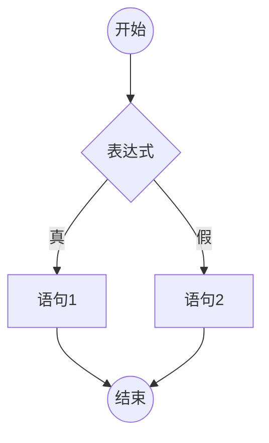

if语句的第二种格式为：

```
if（表达式）
	语句；
```

表示如果“表达式”的值为真（条件成立），那么执行“语句”；否则什么也不做（else机器后面省略）。其流程图如下：

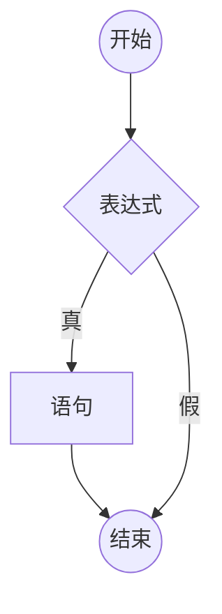

**例1 旅游费用**

* 【问题描述】

风华公司“南京一日游”的收费标准为：5人以内（含5人）按散客标准，每人300元；超过5人，按团体标准，每人280元。请根据输入的人数，输出其旅游费用。

* 【输入格式】

一行一个正整数n，表示人数，1<=n<=5000000。

* 【输出格式】

一行一个正整数，表示需要的总旅游费用。

* 【输入样例】

```
9
```

* 【输出样例】

```
2520
```

这是一个选择性问题，根据人数n来选择不同的收费标准。条件就是n<=5，如果成立，那么收费为n*300；否则，收费为n*280。

自然语言：

1. 输入人数n；
2. 判断n<=5是否成立，成立收费为s=n*300；否则收费为s=n*280；
3. 输出s。

流程图如下：

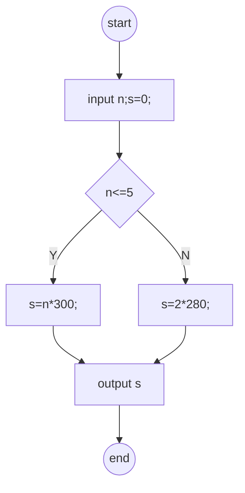

代码如下：

```
#include<iostream>
using namespace std;
int main(){
    int n,s;
    cin>>n;
    if(n<=5)
	s=n*300;
    else
	s=n*280;
    cout<<n<<endl;
    return 0;
}
```

也可以：

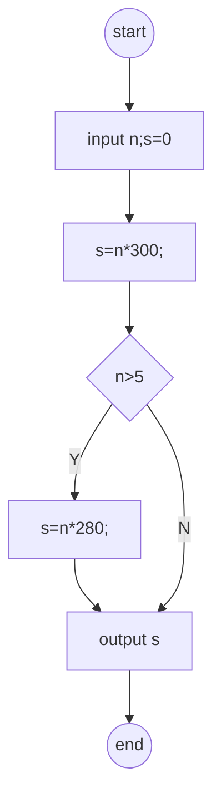

代码如下：

```
#include<iostream>
using namespace std;
int main(){
    int n,s;
    cin>>n;
    s=n*300;
    if(n>5)
	s=n*280;
    cout<<n<<endl;
    return 0;
}
```

**例2 三个数的大小比较。**

* 【问题描述】

输入三个数x，y，z，判断是否满足x<=y<=z。若满足，这输出YES；否则输出NO。

* 【输入格式】

一行三个整数x，y，z，int范围以内。

* 【输出格式】

一行一个单词表示答案。

* 【输入样例】

```
3 6 7
```

* 【输出样例】

```
YES
```

* 【分析】

算法描述：

1. 输入x，y，z；
2. 判断条件是否成立；
3. 条件成立输出YES，否则输出NO。

画出流程图：

```mermaid

```

代码如下：

```
#include<iostream>
using namespace std;
int main(){
    int x,y,z;
    cin>>x>>y>>z;
    if(x<=y&&y<=z)
	cout<<"YES"<<endl;
    else
	cout<<"NO"<<endl;
    return 0;
}
```

**例3 数据交换**

* 【问题描述】

输入a，b两个整数，如果a大于b，则交换a与b的值，再输出a和b的值。

* 【输入格式】

一行两个整数a，b，int范围以内。

* 【输出格式】

一行两个整数，a，b，中间空一格。

* 【输入样例】

```
7 6
```

* 【输出样例】

```
6 7
```

* 【问题分析】

交换a与b的值需要用到3条语句。所以当判断条件`a>b`成立时，需要依次执行完这三条语句，这时需要用`{ }`将这三条语句括起来，这些括起来的语句组合称为“复合语句”，流程图如下：

流程图：

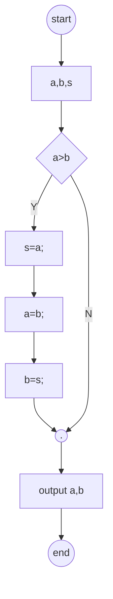

代码如下：

```
#include<iostream>
using namespace std;

int main(){
    int a,b,s;
    cin>>a>>b;
    if(a>b){
	s=a;
	a=b;
	b=s;
    }
    cout<<a<<' '<<endl;
    return 0;
}
```

### 实践巩固

1. 阅读程序回答问题。

```
#include<iostream>
using namespace std;
int main(){
    int a,b;
    cin>>a>>b;
    if(a==b)
	cout<<"Equal"<<endl;
    else
	cout<<"Unequal"<<endl;
    return 0;
}
```
	(1). 输入“5 6”，输出什么？
	(2). 输入“5 5”，输出什么？
	(3). 将程序中的（a==b）修改成（a=b），再分别输入“5 6”和“5 5”呢？

2. 阅读程序回答问题。

```
#include<iostream>
using namespace std;

int main(){
    int a,b,c=0,d=0;
    cin>>a>>b;
    if(a>b){
	c=a/b;
	d=a%b;
    }
    cout<<c<<" "<<d<<endl;
    return 0;
}
```

	(1). 输入“10 3”，输出什么？
	(2). 输入“3 10“，输出什么？
	(3). 如果将`if(a>b)`后面的彝族大括号去掉，再分别输入”10 3“和”3 10“，则输出什么？

3. 求绝对值（abs，1s，128MB）。

* 【问题描述】

输入一个整数，输出其绝对值。

* 【输入格式】

一行一个整数，int范围内。

* 【输出格式】

一行一个整数，int范围内。

* 【输入样例】

```
-5
```

* 【输出样例】

```
5
```

4. 判断闰年（leap，1s，128MB）

* 【问题描述】

输入某一年份x，判断该年是否为闰年。是则输出“YES”，否输出“NO”。

* 【输入格式】

一行一个正整数x，int范围内。

* 【输出格式】

一行一个单词，表示判断结果。

* 【输入样例】

```
2000
```

* 【输出样例】

```
YES
```

5. 判断正负（judgepn，1s，128MB）

* 【问题描述】

输入一个整数N，判断并输出其正负。

* 【输入格式】

一行一个整数N，-10<sup>9</sup><=N<=10<sup>9</sup>。

* 【输出格式】

如果N>0，输出“Positive”；<br>
如果N=0，输出“Zero”；<br>
如果N<0，输出“Negative”。

* 【输入样例】

```
1
```
* 【输出样例】

```
Positive
```

6. 整除问题（divide，1s，128MB）

* 【问题描述】

输入一个整数N，判断它能否同时被3和5整除。

* 【输入格式】

一行一个整数N，-10<sup>9</sup><=N<=10<sup>9</sup>。

* 【输出格式】

一样一个单词，如果能同时被3和5整除输出“YES”，否则输出“NO”。

* 【样例输入】

```
15
```
* 【样例输出】

```
YES
```

## 第四课 if语句的嵌套

### 学习目标

1. 理解if语句嵌套的含义。
2. 熟练应用if语句及其嵌套解决一些实际问题。

### 知识点

在分支结构中经常遇到这样的情况：如果条件1成立，就去做A事情，否则去做B事情，但是，在做A事情（或者B事情）时，还要根据条件2是否成立，决定是做A1（或者B1）这件子事情，还是去做A2（或者B2）这件子事情。在程序设计中，把这种情况称为分支结构的“嵌套”，一般用来解决三种及以上的分支情况。

* 例1 三个数的大小比较。

* 【问题描述】

输入三个数x、y、z，判断其是否满足x<=y<=z。若满足，输出“YES”；否则输出“NO”。

* 【输入格式】

一行三个整数x、y、z，int范围以内。

* 【输出格式】

一行一个单词，表示答案。

* 【输入样例】

```
3 6 7
```
* 【输出样例】

```
YES
```
* 【分析】

前面已经介绍过用逻辑表达式`x<=y && x<=z`来表示”YES“的条件，本题也可以用if语句的嵌套来解决。

* 流程图如下：

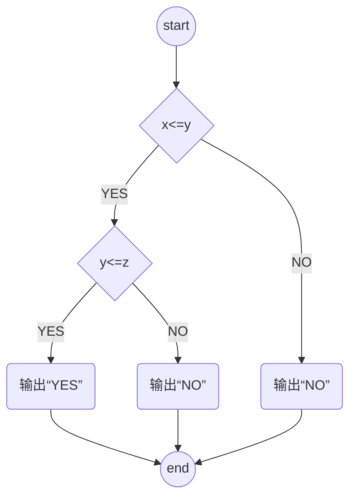
* 代码如下：

```
#include<iostream>
using namespace std;

int main(){
  int x,y,z;
  cin>>x>>y>>z;
  if(x<=y)
    if(y<=z)
      cout<<"YES"<<endl;
    else
      cout<<"NO"<<endl;
  else
    cout<<"NO"<<endl;
  return 0;
}
```

在上述程序中，`if...else...`语句的if字句里又套了一个`if...else...`语句。使用if语句的嵌套要注意以下几个问题：<br>

> (1). 分支结构可以嵌套很多层
	上面程序中，在第一层的if子句里嵌套了一个if语句（第二层），也就是嵌套一层。有时，情况分类很多，也可以根据需要，在第一层的else子句里嵌套，还可以在第二层的if里继续嵌套第三层，以此类推...
> (2). if与else的配对关系
	一个程序中可能会出现很多的if和else子句，那么，如何匹配呢？一句话，程序中的else字句总是与里他最近的前面的if子句配对。

* 例题2 阅读程序，写出程序的运行结果。

```
#include<iostream>
using namespace std;
int main(){
  int x=4,y=3,z=2;
  if(x<=y)
    if(y<=z)
      cout<<"YES"<<endl;
    else
      cout<<"NO"<<endl;
  return 0;
}
```

* 【问题分析】

程序不会输出任何结果，因为其中的else自己从书写格式上看，与外层`if(x<=y)`语句配对，但其实是与内层的`if(y<=z)`配对，而外层的`if(x<=y)`是不成立的，又没有else子句，所以直接执行后面的`return 0`语句。

> (3). 编程要形成练好的代码风格

为了增强程序的可读性，`if...else...`语句及其嵌套采用“缩进”对其的格式，让同层的if字句与else子句对齐。如下所示代码：
```
#include<iostream>
using namespace std;
int main(){
  int x=4,y=3,z=2;
  if(x<=y)
    if(y<=z)
      cout<<"YES"<<endl;
    else
      cout<<"NO"<<endl;
  return 0;
}
```

* 例3 判断闰年

* 【问题描述】

输入某一年份x，判断该年份是否闰年。是则输出"YES"，否则输出"NO"。

* 【输入格式】

一行一个正整数x，int范围以内。

* 【输出格式】

一行一个单词，表示判断结果。

* 【输入样例】

```
2000
```

* 【输出样例】

```
YES
```

* 【分析】

前面已经介绍过判断闰年的条件表达式。对于如年的判断，也可以采用嵌套的方法来实现。流程图如下：
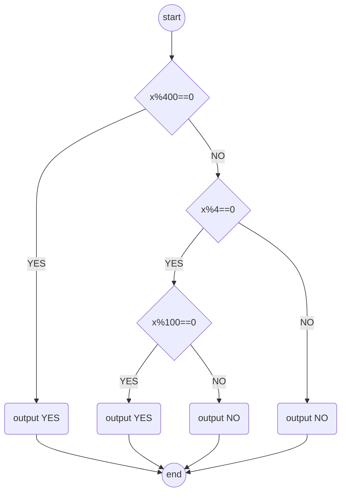

代码如下：

```
#include<iostream>
using namespace std;
int main(){
  int x;
  cin>>x;
  if(x%400==0)
    cout<<"YES"<<endl;
  else
    if(x%4==0)
      if(x%100==0)
	cout<<"YES"<<endl;
      else
	cout<<"NO"<<endl;
    else
      cout<<"NO"<<endl;
  return 0;
}
```

* 例4 优惠购物

* 【问题描述】

某商场为迎接即将到来的六一儿童节，推出了一系列优惠活动。

（1）如果是该商场的VIP客户，那么：<br>
如果购买的商品价值在500元以下（含500元），将享受8.5折优惠；<br>
如果购买的商品价值在500元以上，1000元以下（含1000元），将享受8折优惠；<br>
如果购买商品价值在1000元以上，除了享受7.5折优惠，还将获得一个惊喜大礼包。<br>
（2）如果不是VIP客户，那么：<br>
如果购买商品价值在500元以下（含500元），将享受9折优惠；<br>
如果购买商品价值在500元以上，除了享受9折优惠，同时还将获得一个惊喜大礼包。<br>
本题的任务是根据顾客的身份和购买商品的价值，给出一个应付金额，以及在付款时，是否可以领取大礼包。

* 【输入格式】

第一行一个字符V或C，V表示该顾客是VIP客户，C表示普通客户。<br>
第二行一个整数，int范围内，表示该顾客购买的商品的价值。

* 【输出格式】

第一行表示是否可以领取大礼包，如果可以输出YES，否则输出NO。<br>
第二行一个实数，保留2位小数，表示顾客应付金额。

* 【样例输入】

```
V
580
```

* 【样例输出】

```
NO
464.00
```
* 【分析】

设id表示顾客的身份，price表示顾客购买商品的价值，flag=0表示无大礼包，flag=1表示有大礼包，discount表示顾客享受的折扣，则计算流程如下：

  ```
flag=0；
如果id=‘V’
  如果price<=500,则discount=0.85；
  否则，如果price<=1000,则discount=0.8；
  否则，discount=0.75,flag=1；
否则
  discount=0.9；
  如果price>500，则flag=1；
```
流程图如下：
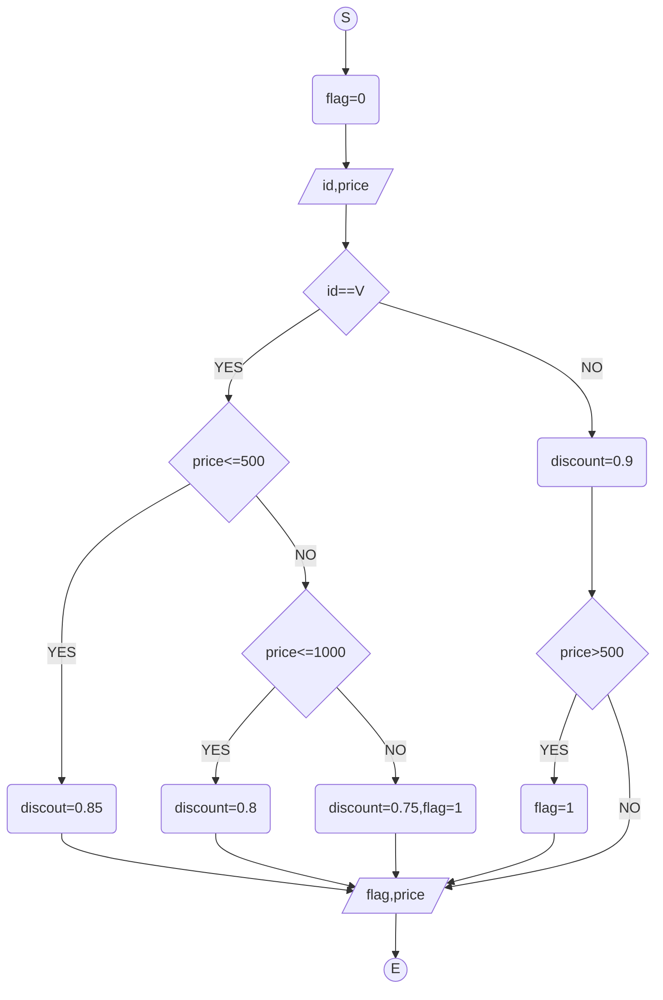

代码如下：

```
#include<cstdio>
using namespace std;
int main(){
    char id;
    int flag=0;
    float price,discount;
    scanf("%c",&id);
    scanf("%f",&price);
    if(id=='V')
      if(price<=500)
	discount=0.85;
      else
	if(price<=1000)
	  discount=0.8;
	else{
	  discount=0.75;
	  flag=1;
	}
    else{
      discount=0.9;
      if(price>500)
	flag=1;
    }
    if(flag)
      printf("YES");
    else
      printf("NO");
    printf("%.2f\n",price*discount);
    return 0;
}
```

### 实践巩固

1. 阅读程序，写出程序的运行结果。

```
#include<iostream>
using namespce std;

int main(){
    int a,b,c;
    a=1;b=2;c=3;
    if(a>b){
	if(a>c)
	   cout<<a<<' ';
	else
	   cout<<b<<' ';
    }
    cout<<c<<endl;
    return 0;
}
```

2. 成绩问题。（score,1s,128MB）

* 【问题描述】

给出一名学生的语文和数学成绩，判断其是否恰好有一门课程不及格（成绩小于60分）。

* 【输入格式】

一行两个整数，1～100之间（包含0和100），分别表示语文和数学成绩。

* 【输出格式】

若该生恰好有一门课程不及格，输出“1”；否则，输出“0”。

* 【样例输入】

```
50 80
```

* 【样例输出】

```
1
```

3. 骑车与走路。（bikewalk,1s,128MB）

* 【问题描述】

在大学校园里，没有自行车，上课、办事会很不方便。但实际上，并非去办任何事情都是骑车快，因为骑车总要找车、开锁、锁车等，这要耽误一些时间。假设找到自行车，开锁并骑上自行车的时间是27秒；停车锁车的时间是23秒；不幸每秒行走1.2米，骑车美妙行走3.0米。请判断走不同的距离去办事，是骑车快还是走路快。

* 【输入格式】

一行一个整数，int范围内，表示一次办事要行走的距离，单位米。

* 【输出格式】

一行一个单词，如果骑车快，则输出一行“Bike”；如果走路快，则输出一行“Walk”；如果一样快，输出一行“All”。（说明：时间误差在0.0001范围内，则认为一样快。）

* 【样例输入】

120

* 【样例输出】

Bike

4. 计算邮资。（postage,1s,128MB）

* 【问题描述】

请根据邮件的重量和用户选择是否加急计算邮费。计算规则：重量在1000克以内（包括），基本费8元；超过1000克的部分，每500克加收超重费4元，不足500克部分按500克计算；如果用户选择加急，多收5元。

* 【输入格式】

一行包含一个大于0的整数和一个字符“y”或“n”，之间用一个空格隔开，分别表示重量（int范围内，单位为克）和是否加急。如果字符是“y”，说明加急；如果字符时“n”，说明不加急。

* 【输出格式】

输出一样一个正整数，表示邮费。

* 【样例输入】

1200 y

* 【样例输出】

17

## 第五课 条件表达式

### 学习目标

学会书写和使用条件表达式解决一些实际问题。

### 知识点

C++语言表达能力强，表达式类型丰富。其中就有一个“条件表达式”，通过它可以来实现有选择的取值。条件表达式的格式为：

```
<表达式1> ? <表达式2> : <表达式3>
```

其运算规则为：首先计算表达式1的值，若表达式1的值为真（非0），则只计算表达式2,并将其结果作为整个表达式的值；否则只计算表达式3的值，并将其记过作为整个表达式的值。

> 例1 阅读程序，写出程序运行的结果。

```
#include<iostream>
using namespace std;
int main(){
    int x=5;y=10,z;
    z=x>y?x:y;
    cout<<z<<endl;
    z=x>0?1: -1;
    cout<<z<<endl;
    cout<<(x%2==0 ? "x is even" : "x is odd")<<endl;
    return 0;
}
```

* 【分析】

条件表达式 `x>y?x:y` 中的条件 `x>y` 不成立，按照运算规则，其表达式的值为y，所以z为10,第一行输出10。条件表达式`x>0 ？ 1 : -1`中的条件 `x>0` 成立，所以其表达式的值为1,所以z为1,第二行输出1。条件表达式 `x%2==0 ? "x is even" : "x is odd"` 中的条件 `x%2==0` 不成立，其表达式的值为 `x is odd`，所以第三行输出`x is odd`。

> 例2 旅游费用

* 【问题描述】

风华公司“南京一日游”的收费标准为：5人以内（含5人）按散客标准，每人300元。超过5人，按团体标准，每人280元。请根据输入的人数，输出其旅游费用。

* 【输入格式】

一行一个正整数n，表示人数， $1\leqslant n \leqslant 5000000$ 。

* 【输出格式】

一行一个正整数，表示需要的总旅游费用。

* 【输入样例】

9

* 【输出样例】

2520

* 【分析】

```
#include<istream>
using namespace std;
int main(){
    int n;
    cin>>n;
    cout<<(n<=5 ? n*300 : n*280)<<endl;
    return 0;
}
```

> 例3 判断闰年

* 【问题描述】

输入某一年份x，判断该年份是否湿润年。是则输出“YES”，否则输出“NO”。

* 【输入格式】

一行一个正整数x，int范围内。

* 【输出格式】

一行一个单词，表示判断结果。

* 【输入样例】

2000

* 【输出样例】

YES

```
#include<iostream>
using namespace std;
int main(){
    int x;
    cin>>x;
    cout<<(x%400==0?"YES":(x%4==0 ?(x%100!=0?"YES":"NO"):"NO"))<<endl;
    return 0;
}
```

### 实践巩固

1. 小写字母转换。（lowercase，1s，128MB）

* 【问题描述】

输入一个字符，判断其是否为小写字母，如果是就将他转换成对应的大写字母；如果不是则不转换。输出最后得到的字符。

* 【输入格式】

一行一个字符。

* 【输出格式】

一行一个字符，表示答案。

* 【样例输入】

y

* 【样例输出】

Y

2. 输出最大数。（maxmum，1s，128MB）

* 【问题描述】

输入三个整数，int范围内，输出这三个数中的最大数。

* 【输入格式】

一行三个整数，int范围内，每两个数之间用一个空格隔开。

* 【输出格式】

一行一个整数，表示答案。

* 【样例输入】

50 38 -9

* 【样例输出】

50

3. 分段函数 （function，1s，128MB）

* 【问题描述】

编写程序，计算下列分段函数`y=f(x)`的值：

	(1)如果x>0,则y=1；
	(2)如果x=0,则y=0；
	(3)如果x<0,则y=1。

* 【输入格式】

一行一个整数x，int范围以内。

* 【输出格式】

输出x对应的分段函数值y。

* 【样例输入】

500

* 【样例输出】

1

## 第六课 switch语句

### 学习目标

1. 掌握switch语句的格式和含义。
2. 学会应用switch语句解决一些实际问题。

### 知识点

在一些实际问题中，分类情况特别多，如果用if语句嵌套实现，层数太多，容易出错。为此C++提供了一种多分支语句——switch。`switch`语句的一般格式为：

```
switch(表达式){
	case 常量表达式1：语句组1；[break；]
	case 常量表达式2：语句组2；[break；]
	...
	case 常量表达式n：语句组n；[break；]
	[default:语句组n+1]
}
```

执行过程为：先计算表达式的值，然后从前往后一次与case字句中所列出的各个常量表达式的值进行比较，若表达式的值与常量中的值相等，就开始进入相应的case子句的语句组执行，遇到后续的case也不再进行判断（默认匹配），直到遇到break语句或switch语句结束。default表示表达式与所有常量表达式的值都不匹配，那么就执行其后面的语句组，通常将default放在最后。如果表达式与各分支常量表达式的值都部匹配时，不需要执行任何语句，则default可以省略。

> 例1 阅读下面程序，思考输入“-”，则输出结果是什么？

```
#include<iostream>
using namespace std;

int main(){
    char symbol;
    cin>>symbol;
    switch(symbol){
	case '+':cout<<"+"<<endl;break;
	case '-':cout<<"-"<<endl;break;
	case '*':cout<<"*"<<endl;break;
	case '/':cout<<"/"<<endl;break;
	default:cout<<"Input Invalid"<<endl;
    }
    return 0;
}
```

> 例2 阅读下面程序，思考输入“-”，输出结果是什么？

```
#include<iostream>
using namespace std;
int main(){
    char symbol;
    cin>>symbol;
    switch(symbol){
	case '+':cout<<"+"<<endl;
	case '-':cout<<"-"<<endl;
	case '*':cout<<"*"<<endl;
	case '/':cout<<"/"<<endl;
	default:cout<<"Input Invalid!"<<endl;
    }
    return 0;
}
```
* 【分析】

例1和例2相比，每个case字句的语句组后例2没有`break;`语句，也就不能即使跳出switch语句，所以例1和例2输出内容不一样，自行比较。

**使用switch语句要注意以下几点：**

	1). switch 后面的表达式，取值只能是整型数据、字符型、布尔型、枚举型。case后面的常量表达式，其值类型要与switch后面表达式的类型一致。
	2). 任意两个case语句后的表达式值必须各不相同，否则将引起歧义。
	3). 与剧组可以是一条语句，也可以是复合语句。
	4). 多个case语句可以公用一组程序。（例3）

> 例3 阅读程序，思考分别输入“A”，“B”，“C”，则程序输出结果是什么。

```
#include<iostream>
using namespace std;
int main(){
    char ch;
    cin>>ch;
    switch(ch){
	case 'A':
	case 'B':
	case 'C':cout<<"Pass"<<endl;break;
    }
    return 0;
}
```

> 例4 优惠购物。

* 【问题描述】

某商场的客户分为白金卡会员、金卡会员、银卡会员和普通客户。为了回馈广大客户，现推出以下优惠活动：
	(1). 如果客户是白金会会员，将享受7折优惠；
	(2). 如果客户是白金会会员，将享受8折优惠；
	(3). 如果客户是白金会会员，将享受9折优惠；
	(4). 如果客户是普通客户，将享受9.5折优惠；
本体的任务是根据客户的身份和购买商品的价格，给出应付金额。

* 【输入格式】

第一行一个字符。“P”表示白金会员，“G”表示金卡会员，“S”表示银卡会员，其他字符表示普通客户。第二行一个整数，int范围内，表示该顾客购买商品的金额。

* 【输出格式】

一行一个实数，保留2为小数，表示顾客应付金额。

* 【输入样例】

```
G
580
```

* 【输出样例】

```
464.00
```

* 【分析】

设id表示顾客的身份，price表示顾客购买的商品金额，根据id的值来计算顾客应付金额。因为情况比较多，所以switch语句实现如下：

```
#include<cstdio>
using namespace std;
int main(){
    char id;
    float price,discount;
    scanf("%c\n",&id);
    scanf("%f",&price);
    switch(id){
	case 'P':discount=0.7;break;
	case 'G':discount=0.8;break;
	case 'S':discount=0.9;break;
	default: discount=0.95;
    }
    printf("%f",price*discount);
    return 0;
}
```

> 例5 某年某月的天数。

* 【问题描述】

输入x和y，输出x年y月有多少天。

* 【输入格式】

一行两个正整数x和y，分别表示年份和月份。x在int范围内，y为 $1\sim 12$。

* 【样例输入】

```
2000 3
```

* 【样例输出】

```
31
```

* 【分析】

略。

代码如下：

```
#include<iostream>
using namespace std;
int main(){
    int x,y,day;
    cin>>x>>y;
    switch(y){
	case 1:	case 3:	case 5:	case 7:	case 8:	case 10:
	case 12:day=31;break;
	case 4:	case 6:	case 9:
	case 11: day=30;break;
	case 2:{
	     day=(x%400==0?29:(x%4==0?(x%100!=0?29:28):28));
	     break;
	}
    }
    cout<<day<<endl;
    return 0;
}
```

### 实践巩固

1. 单词转换（numword，1s，128MB）

* 【问题描述】

输入十个数 $1\sim 10$ ，输出其对应的英文单词。

* 【输入格式】

一行一个正整数， $1\sim 10$ 之间。

* 【样例输入】

1

* 【样例输出】

One

2. 小江赴约会（appointment，1s，128MB）

* 【问题描述】

小江的朋友小谢约他下周一起去看展览，但小江每周的1、3、5必须上课。请帮小江判断它能否接受小谢的邀请，如果能，输出“YES”；如果不能，输出“NO”。

* 【输入格式】

输入一行，小谢邀请小江去看展览的日期，用数字 $1\sim 7$ 表示从星期一 $\sim$ 星期日。

* 【输出格式】

输出一行，如果小江可以接受小谢的邀请输出“YES”，否则输出“NO”。

* 【样例输入】

2

* 【样例输出】

YES

3. 简单计算器（cal，1s，128MB）

* 【问题描述】

一个最简单的计算器，支持 $+, -, *, /$ 这四种运算。仅须考虑输入、输出为整数的情况，数据和运算结果不会超过int范围。

* 【输入格式】

输入一行3个参数，3个参数之间以一个空格隔开。其中，第1、2个参数为整数，int范围以内，第3个参数为操作符（+、-、*、/）。

* 【输出格式】

输出一行一个整数，为运算结果。然而：
	(1).如果出现除数为0的情况，则输出“Divided by zero”；
	(2).如果出现无效操作符（即不是+、-、*、/），则输出“Invalid Operator”。

* 【样例输入】

1 2 +

* 【样例输出】

3

## 第七课 分支结构应用举例

# 第四单元 循环结构程序设计

## 第一课 while 语句
## 第二课 do-while 语句
## 第三课 for 语句
## 第四课 循环嵌套
## 第五课 break 和 continue语句
## 第六课 程序的调试与跟踪
## 第七课 循环结构应用举例

# 第五单元 数组

## 第一课 一维数组的定义
## 第二课 一维数组的输入与输出
## 第三课 一维数组的插入删除
## 第四课 一维数组的查找统计
## 第五课 一维数组的元素排序
## 第六课 一维数组的应用举例
## 第七课 二维数组的定义和操作
## 第八课 二维数组应用举例
## 第九课 数字方阵
## 第十课 字符数组

# 第六单元 函数

## 第一课 模块化编程思维
## 第二课 函数的定义和调用
## 第三课 函数的参数
## 第四课 变量的作用域
## 第五课 函数的递归调用
## 第六课 函数应用举例

# 第七单元 基本数据结构

## 第一课 结构体的引入和应用
## 第二课 结构体的扩展
## 第三课 共同体的引入和应用
## 第四课 文件
## 第五课 队列
## 第六课 队列的应用
## 第七课 栈
## 第八课 栈的应用
## 第九课 哈希表

# 第八单元 指针

## 第一课 指针的概念
## 第二课 指针的引用与运算
## 第三课 指针与数组
## 第四课 函数指针及扩展
## 第五课指针应用举例

# 第九单元 基本算法

## 第一课 进制转换
## 第二课 高精度运算
## 第三课 模拟
## 第四课 递推
## 第五课 分治与递归
## 第六课 贪心
## 第七课 穷举
## 第八课 算法评价
## 第九课 宽度优先搜索
## 第十课 深度优先搜索
## 第十一课 回溯法
## 第十二课 动态规划
## 第十三课 0-1背包

# 第十单元 位运算及便准模板库

## 第一课 位运算
## 第二课 vector
## 第三课 stack
## 第四课 queue 和 priority_queue
## 第五课 map 和 pair
## 第六课 set
## 第七课 string
## 第八课 algorithm
